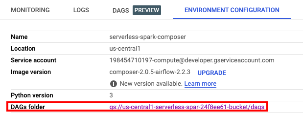
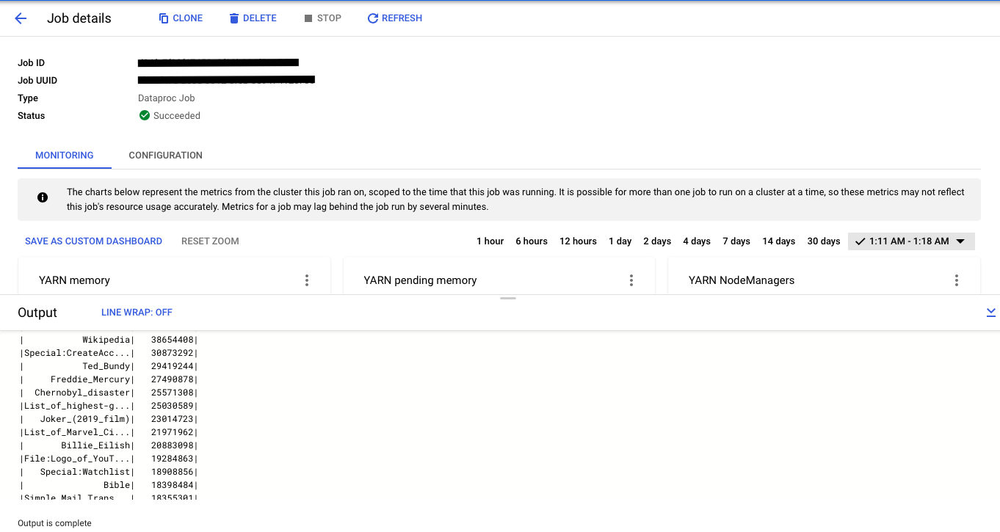
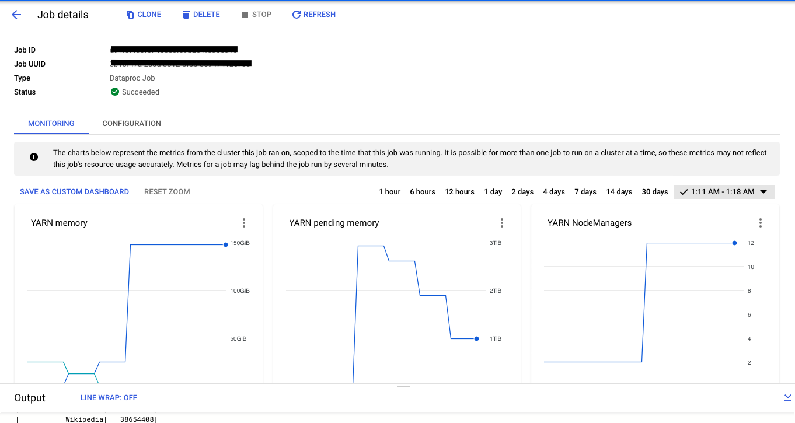
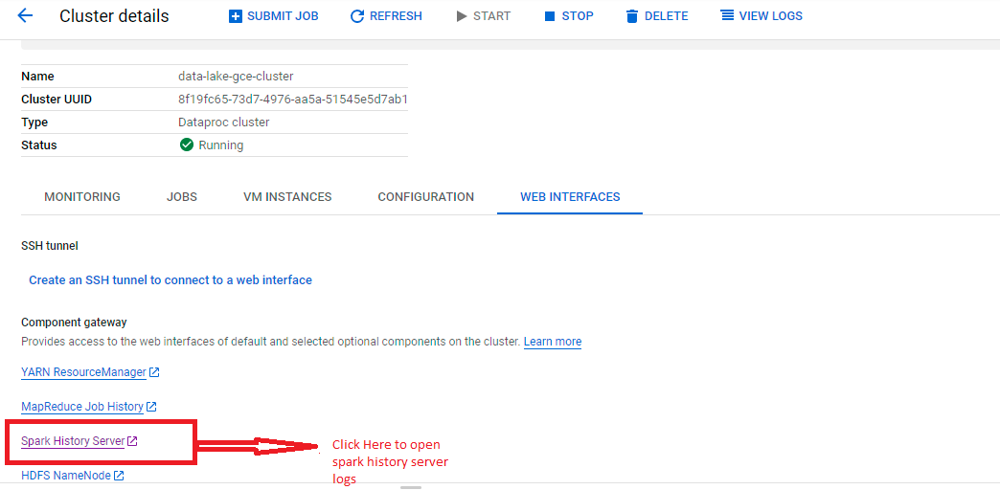
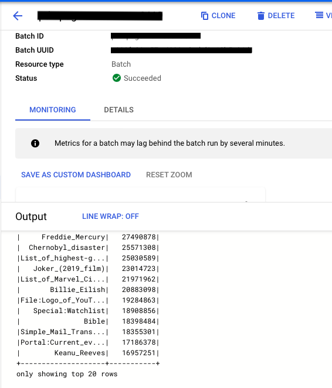
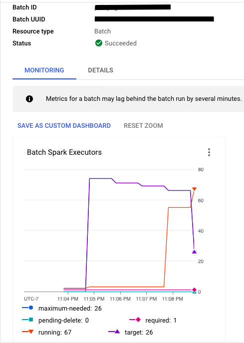
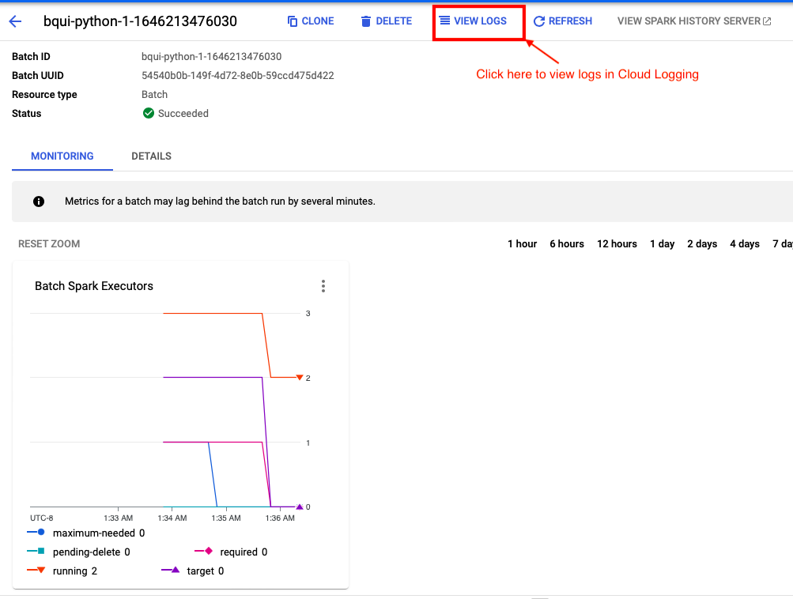
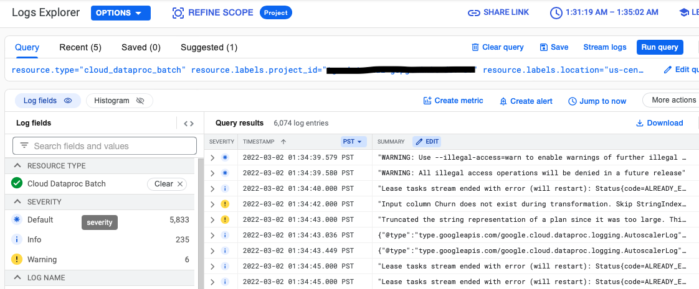

<!---->
  Copyright 2022 Google LLC
 
  Licensed under the Apache License, Version 2.0 (the "License");
  you may not use this file except in compliance with the License.
  You may obtain a copy of the License at
 
       http://www.apache.org/licenses/LICENSE-2.0
 
  Unless required by applicable law or agreed to in writing, software
  distributed under the License is distributed on an "AS IS" BASIS,
  WITHOUT WARRANTIES OR CONDITIONS OF ANY KIND, either express or implied.
  See the License for the specific language governing permissions and
  limitations under the License.
 <!---->

# Autoscaling on Dataproc though GCP Cloud Composer/Airflow

Following are the lab modules:

[1. Understanding Data](airflow-execution.md#1-understanding-the-data) 
[2. Solution Architecture](airflow-execution.md#2-solution-diagram) 
[3. Uploading DAG files to DAGs folder](airflow-execution.md#3-uploading-dag-files-to-dags-folder) 
[4. Running the job on Dataproc Cluster on GCE](airflow-execution.md#4-running-the-job-on-dataproc-cluster-on-gce) 
[5. Viewing the output](airflow-execution.md#5-viewing-the-output) 
[6. Logging](airflow-execution.md#6-logging) 
[7. Running the job as a serverless batch on Dataproc](airflow-execution.md#7-running-the-job-as-a-serverless-batch-on-dataproc) 
[8. Viewing the output](airflow-execution.md#8-viewing-the-output) 
[9. Logging](airflow-execution.md#9-logging) 

## 1. Understanding the data

The dataset used for this project is Shakespeare dataset from Bigquery public data

#### 1. **Shakespeare data** 
   Contains a word index of the works of Shakespeare, giving the number of times each word appears in each corpus. 

## 2. Solution Architecture

<kbd>

</kbd>

 

**Data Pipeline**

The data pipeline involves the following steps:  
	- Create buckets in GCS  
	- Create Dataproc and Persistent History Server Cluster  
	- Create a Composer Environment 
	- Executing the code through Cloud Composer  
	- Viewing the output in the Dataproc UI

## 3. Uploading DAG files to DAGs folder (Execute this step only if the environment was setup through cloud shell)

* From the code repository, download the file located at: **01-scripts-and-config**>**composer**>**pipeline_cluster.py** and **01-scripts-and-config**>**composer**>**pipeline.py**
* Rename files to <your_name_here>_pipeline_cluster.py and <your_name_here>_pipeline.py
* Open the files <your_name_here>_pipeline_cluster.py and <your_name_here>_pipeline.py and replace your name on row 22 and row 24 respectively
* Navigate to **Composer**>**<composer_environment>**
* Next, navigate to **Environment Configuration**>**DAGs folder URI**
* Next, upload the DAG file to the GCS bucket corresponding to the **DAGs folder URI**

## 4. Running the job on Dataproc Cluster on GCE

* Navigate to **Composer**>**<your_environment>**>**Open Airflow UI**

* Once the Airflow UI opens, navigate to **DAGs** and open your respective DAG
* Next, trigger your DAG by clicking on the **Trigger DAG** button

* Once the DAG is triggered, the DAG can be monitored directly through the Airflow UI as well as the Dataproc>Jobs window

## 5. Viewing the output

## 6. Logging

#### 6.1 Airflow logging

* To view the logs of any step of the DAG execution, click on the **<DAG step>**>**Log** button  

#### 6.2 Persistent History Server logs

To view the Persistent History server logs, click the 'View History Server' button on the Dataproc batches monitoring page and the logs will be shown as below:

## 7. Running the job as a serverless batch on Dataproc

* Navigate to **Composer**>**<your_environment>**>**Open Airflow UI**

* Once the Airflow UI opens, navigate to **DAGs** and open your respective DAG
* Next, trigger your DAG by clicking on the **Trigger DAG** button

* Once the DAG is triggered, the DAG can be monitored directly through the Airflow UI as well as the Dataproc>Serverless>Batches window

## 8. Viewing the output

Once the batch completes executing successfully, the output can be viewed in the Dataproc batches UI as shown below: 

## 9. Logging

#### 9.1 Airflow logging

* To view the logs of any step of the DAG execution, click on the **<DAG step>**>**Log** button  

#### 9.2 Serverless Batch logs

Logs associated with the application can be found in the logging console under
**Dataproc > Serverless > Batches > <batch_name>**.
  You can also click on “View Logs” button on the Dataproc batches monitoring page to get to the logging page for the specific Spark job.

#### 9.3 Persistent History Server logs

To view the Persistent History server logs, click the 'View History Server' button on the Dataproc batches monitoring page and the logs will be shown as below:

