<!---->
  Copyright 2022 Google LLC
 
  Licensed under the Apache License, Version 2.0 (the "License");
  you may not use this file except in compliance with the License.
  You may obtain a copy of the License at
 
       http://www.apache.org/licenses/LICENSE-2.0
 
  Unless required by applicable law or agreed to in writing, software
  distributed under the License is distributed on an "AS IS" BASIS,
  WITHOUT WARRANTIES OR CONDITIONS OF ANY KIND, either express or implied.
  See the License for the specific language governing permissions and
  limitations under the License.
 <!---->

# Autoscaling on Dataproc though GCP Cloud Console

Following are the lab modules:

[1. Understanding Data](console-execution.md#1-understanding-the-data) 
[2. Solution Architecture](console-execution.md#2-solution-diagram) 
[3. Running the job on Dataproc Cluster on GCE](console-execution.md#3-running-the-job-on-dataproc-cluster-on-gce) 
[4. Viewing the output](console-execution.md#4-viewing-the-output) 
[5. Logging](console-execution.md#5-logging) 
[6. Running the job as a serverless batch on Dataproc](console-execution.md#6-running-the-job-as-a-serverless-batch-on-dataproc) 
[7. Viewing the output](console-execution.md#7-viewing-the-output) 
[8. Logging](console-execution.md#8-logging) 

## 1. Understanding the data 

The dataset used for this project is Shakespeare dataset from Bigquery public data

#### 1. **Shakespeare data** 
   Contains a word index of the works of Shakespeare, giving the number of times each word appears in each corpus. 

## 2. Solution Architecture

<kbd>

</kbd>

 

**Data Pipeline**

The data pipeline involves the following steps:  
	- Create buckets in GCS  
	- Create Dataproc and Persistent History Server Cluster  
	- Create a Composer Environment 
	- Executing the code through Cloud Console  
	- Viewing the output in the Dataproc UI
	
## 3. Running the job on Dataproc Cluster on GCE

Navigate to Dataproc > Clusters > Select the cluster created  and click on **+SUBMIT JOB**

Next, fill in the following values in the job creation window :

- **Job ID** : A unique identifier for your batch
- **Job Type** : PySpark
- **Main Python File** : gs://<your_code_bucket_name>/wikipedia-page-view/01-scripts-and-config/pyspark/page_view_autoscaling.py
- **JAR Files** - gs://spark-lib/bigquery/spark-bigquery-with-dependencies_2.12-0.22.2.jar

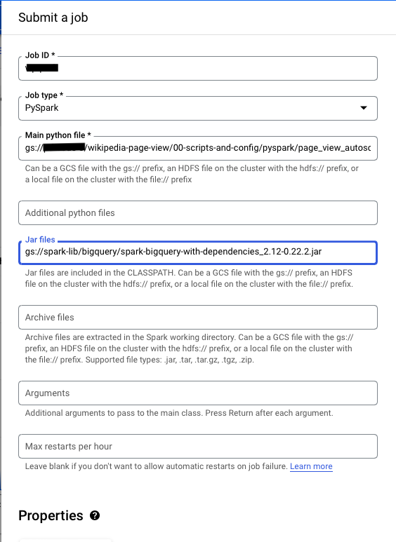

Once all the details are in, you can submit the job. As the job starts, you can see the execution details and logs on the console.

## 4. Viewing the output

Once the job completes executing successfully, the output can be viewed in the Dataproc jobs UI as shown below: 

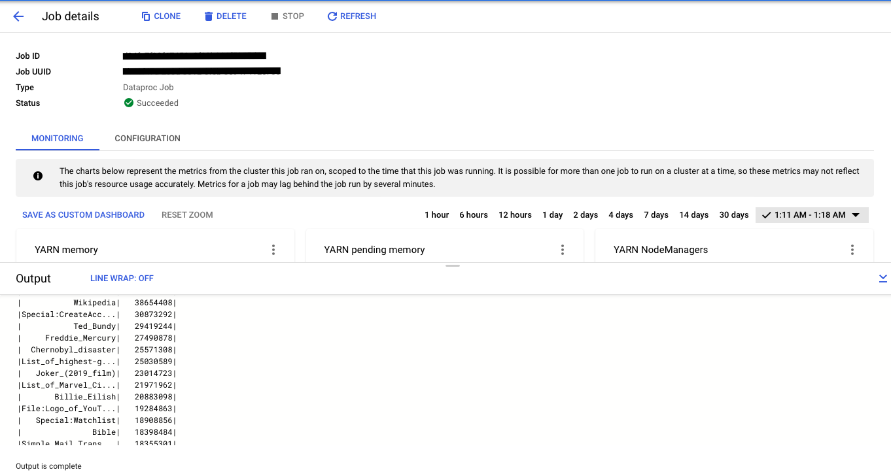

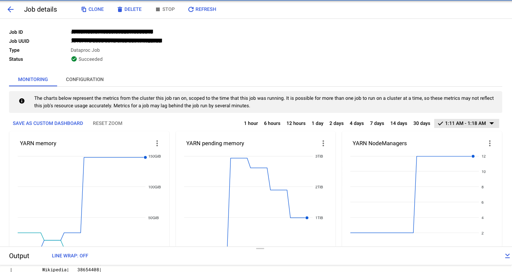

## 5. Logging

#### 5.1 Persistent History Server logs

To view the Persistent History server logs, Navigate to the cluster and open web interfaces and navigate to spark history server.

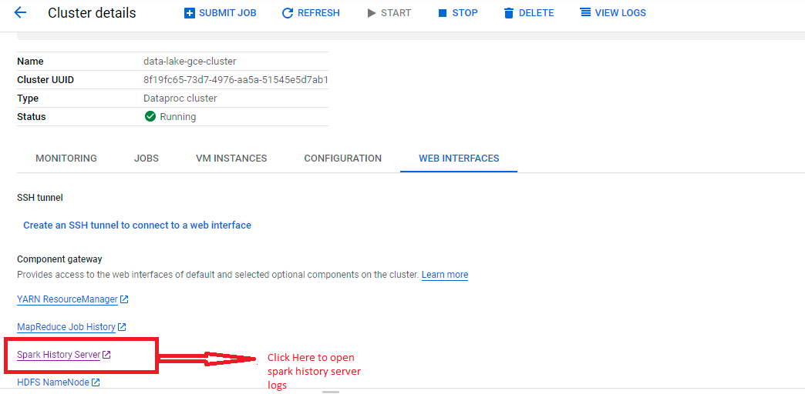

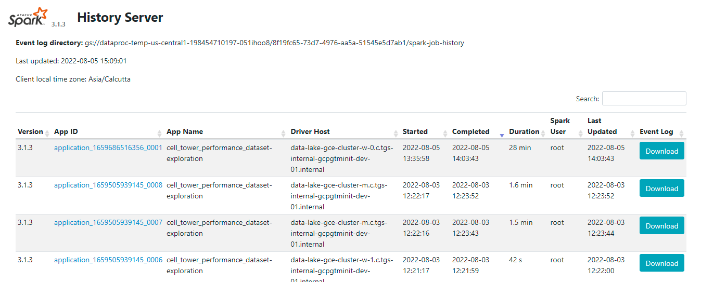
	
## 6. Running the job as a serverless batch on Dataproc

Navigate to Dataproc > Serverless > Batches and click on **+CREATE**

Next, fill in the following values in the batch creation window :

- **Batch ID** : A unique identifier for your batch
- **Region** : Your preferred GCP region
- **Batch Type** : PySpark
- **Main Python File** : gs://<your_code_bucket_name>/wikipedia-page-view/01-scripts-and-config/pyspark/page_view_autoscaling.py
- **JAR Files** - gs://spark-lib/bigquery/spark-bigquery-with-dependencies_2.12-0.22.2.jar

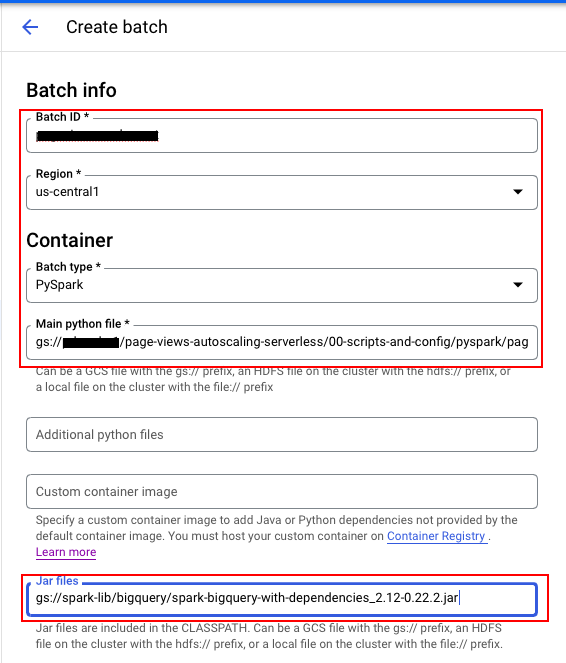

- **Service Account** : <UMSA_NAME>@<PROJECT_ID>.iam.gserviceaccount.com
- **Network Configuration** : Select the network and subnetwork with Private Google Access Enabled

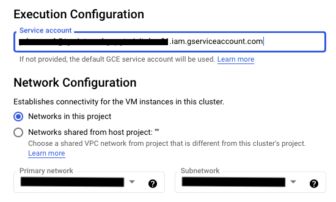

- **History Server Cluster** : <your_phs_cluster_name>

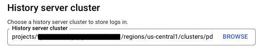

Once all the details are in, you can submit the batch. As the batch starts, you can see the execution details and logs on the console.

## 7. Viewing the output

Once the batch completes executing successfully, the output can be viewed in the Dataproc batches UI as shown below: 

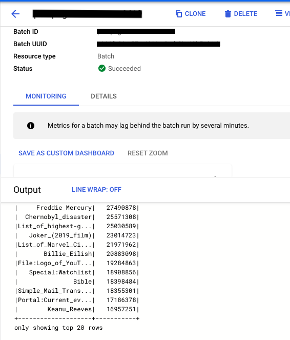

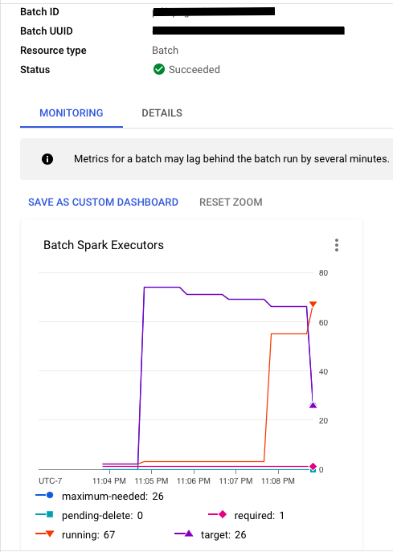

## 8. Logging

### 8.1 Serverless Batch logs

Logs associated with the application can be found in the logging console under
**Dataproc > Serverless > Batches > <batch_name>**.
  You can also click on “View Logs” button on the Dataproc batches monitoring page to get to the logging page for the specific Spark job.

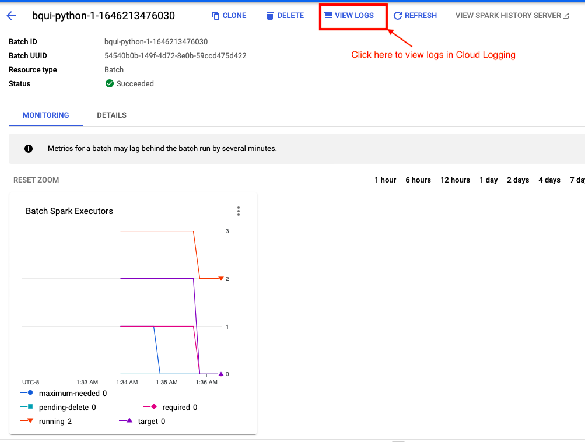

### 8.2 Persistent History Server logs

To view the Persistent History server logs, click the 'View History Server' button on the Dataproc batches monitoring page and the logs will be shown as below:

