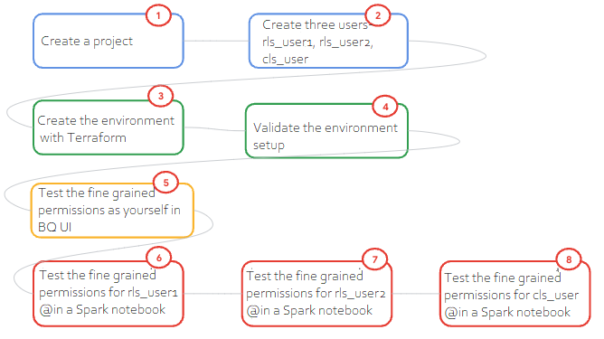
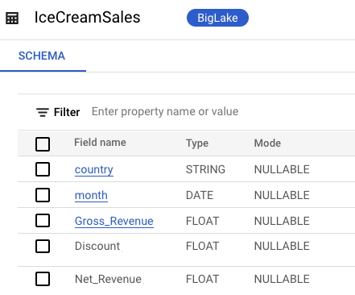
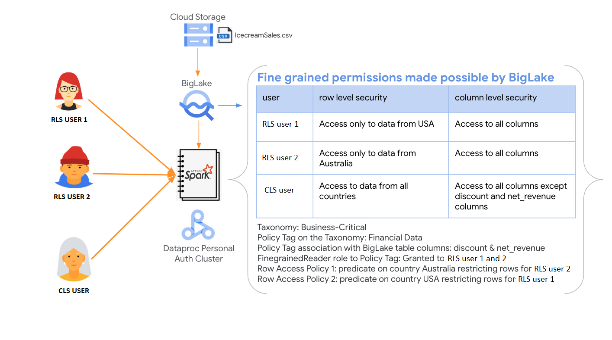
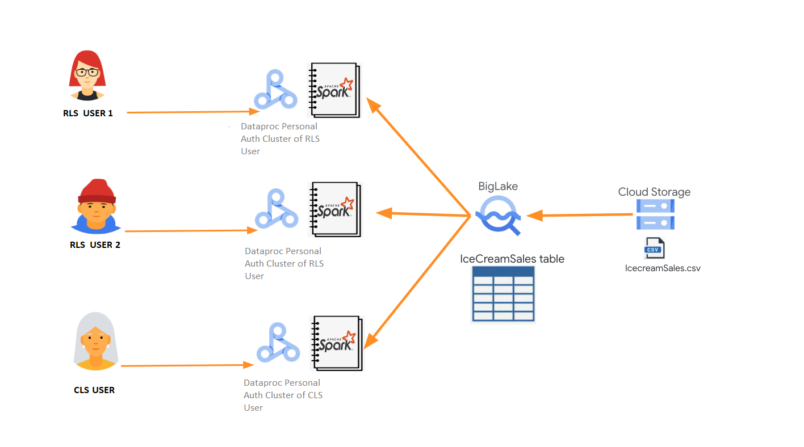
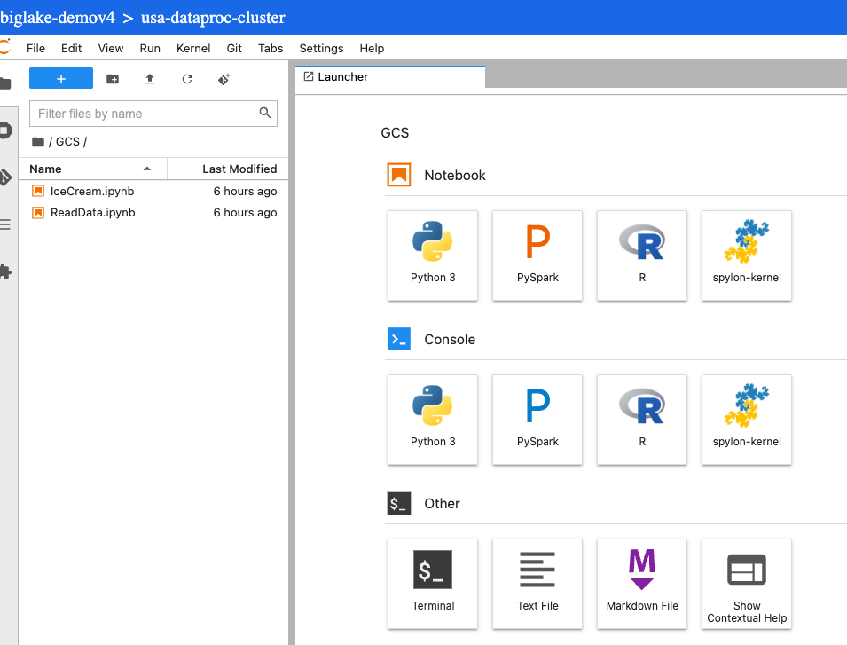
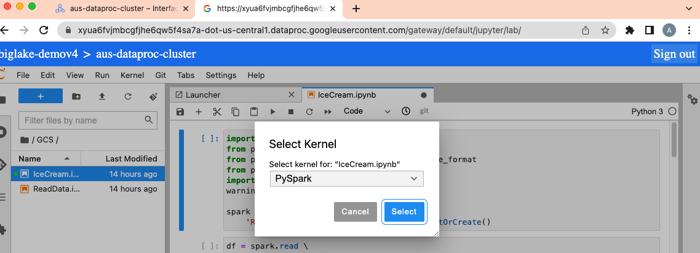
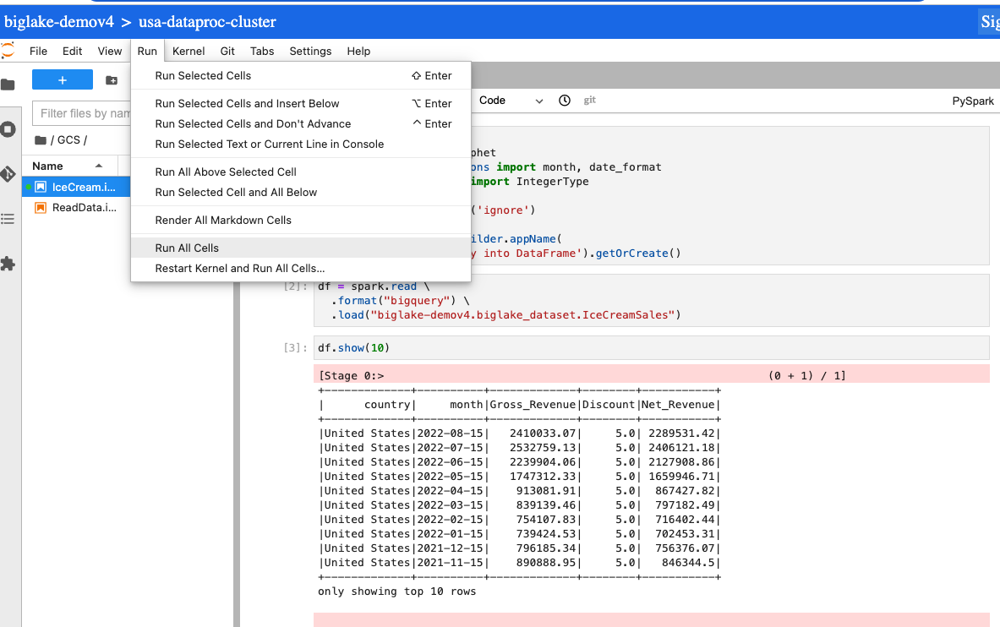

<!---->
  Copyright 2022 Google LLC
 
  Licensed under the Apache License, Version 2.0 (the "License");
  you may not use this file except in compliance with the License.
  You may obtain a copy of the License at
 
       http://www.apache.org/licenses/LICENSE-2.0
 
  Unless required by applicable law or agreed to in writing, software
  distributed under the License is distributed on an "AS IS" BASIS,
  WITHOUT WARRANTIES OR CONDITIONS OF ANY KIND, either express or implied.
  See the License for the specific language governing permissions and
  limitations under the License.
 <!---->

This lab showcases fine-grained access control made possible by [BigLake](https://cloud.google.com/bigquery/docs/biglake-intro) with a minimum viable example of Icecream sales forecasting on a Spark notebook hosted on a personal auth [Cloud Dataproc](https://cloud.google.com/dataproc) cluster. 

### Use Case
Sales forecasting with Prophet

### Goals
1. Just enough knowledge of creating and using BigLake tables on files in Cloud Storage
2. Just enough knowledge of Row and Column Level Security setup with BigLake
3. Introduction to notebooks on Dataproc in case you are new to Dataproc
4. Accessing BigLake through PySpark with the BigQuery Spark connector from Google Cloud
5. Running shell script

### Lab Flow
 

### Dataset
Kaggle dataset for Icecream Sales

 

### Solution Architecture
This lab features Dataproc Personal Auth Clusters as the Spark infrastructure, and JupyterLab on Dataproc as the notebook infrastructure.

 


**About Cloud Dataproc personal auth clusters:**
<br>
- Dataproc Personal Cluster Authentication is intended for interactive jobs run by an individual (human) user. Long-running jobs and operations should configure and use an appropriate service account identity.
- When you create a cluster with Personal Cluster Authentication enabled, the cluster will only be usable by a single identity. Other users will not be able to run jobs on the cluster or access Component Gateway endpoints on the cluster.
- Clusters with Personal Cluster Authentication enabled automatically enable and configure Kerberos on the cluster for secure intra-cluster communication. However, all Kerberos identities on the cluster will interact with Google Cloud resources as the same user. (identity propagation, fine grained auditability)

<br>
So effectively, the architecture is as depicted below-

 

### Key Products
1. Cloud IAM - Users, groups, group memberships, roles
2. Cloud Storage - raw data & notebook, Dataproc temp bucket and staging bucket
3. Dataplex Data Catalog - policy tag taxonomy, policy tag
4. Biglake - finegrained row level and column level security on CSV in Cloud Storage
5. Cloud Dataproc - Spark on JupyterLab for forecasting icecream sales

### Technology & Libraries
1. Data preprocessing at scale: Spark, specifically PySpark
2. Forecasting: Prophet with Python

### Duration to run through the lab
~ 90 minutes

### Lab format
Fully scripted, with detailed instructions intended for learning, not necessarily challenging

### Credits

| # | Google Cloud Collaborators | Contribution  | 
| -- | :--- | :--- |
| 1. | Dataproc Product Management and Engineering (Antonio Scaramuzzino and Pedro Melendez) | Inspiration, vision and sample |
| 2. | Jay O' Leary, Customer Engineer | Automation of lab |
| 3. | Anagha Khanolkar, Customer Engineer | Contributor |

### Contributions welcome
Community contribution to improve the lab is very much appreciated. <br>

### Getting help
If you have any questions or if you found any problems with this repository, please report through GitHub issues.

<hr>


# BigLake Finegrained Permissions Lab

## Prerequisites

### 1.1. Uploading scripts and datasets to cloud shell

Run the following commands in Cloud Shell to clone the repository to your cloud shell instance:

```
cd ~
git clone https://github.com/GoogleCloudPlatform/datalake-modernization-workshops
cd datalake-modernization-workshops/
mv biglake-finegrained-lab/ ~/
cd ..
```

### 1.2. Navigate to the Cloud Shell provisioning directory
```
cd ~/biglake-finegrained-lab/
```

### 1.3. Declaring Variables
```
PROJECT_ID=`gcloud config list --format "value(core.project)" 2>/dev/null`
PROJECT_NBR=`gcloud projects describe $PROJECT_ID | grep projectNumber | cut -d':' -f2 |  tr -d "'" | xargs`
GCP_ACCOUNT_NAME=`gcloud auth list --filter=status:ACTIVE --format="value(account)"`
LOCATION="us-central1"
```

#### 1.4.1. Initialize Terraform

Needs to run in cloud shell from ~/biglake-finegrained-lab/00-scripts-and-config/terraform-user
```
cd ~/biglake-finegrained-lab/00-scripts-and-config/terraform-user
terraform init
```

#### 1.4.2. Review the Terraform deployment plan

Needs to run in cloud shell from ~/biglake-finegrained-lab/00-scripts-and-config/terraform user

```
terraform plan \
  -var="project_id=${PROJECT_ID}" \
  -var="project_nbr=${PROJECT_NBR}" \
  -var="gcp_account_name=${GCP_ACCOUNT_NAME}" \
  -var="location=${LOCATION}" 
```

#### 1.4.3. Terraform provision the data analytics services & dependencies

Needs to run in cloud shell from ~/biglake-finegrained-lab/00-scripts-and-config/terraform user
 <br>

**Time taken to complete:** <10 minutes

```
terraform apply \
  -var="project_id=${PROJECT_ID}" \
  -var="project_nbr=${PROJECT_NBR}" \
  -var="gcp_account_name=${GCP_ACCOUNT_NAME}" \
  -var="location=${LOCATION}" \
  --auto-approve
```


### 1.5. Principle of Least Privilege: Administrators should not have access to data

In your current default user login, navigate to BigQuery on the Cloud Console. You should see a dataset biglake_dataset and a table called "biglake_dataset.IceCreamSales".
<br>
Run the query below in the BQ query UI-

```
SELECT * FROM `biglake_dataset.IceCreamSales` LIMIT 1000
```
If the query shows error, you may have not given access and you may be a cls user.Then run the below query in the BQ query UI-

```
SELECT Month,Country,Gross_Revenue FROM `biglake_dataset.IceCreamSales` LIMIT 1000
```

### 1.6. Principle of Least Privilege:

This section demonstrates how you can use BigLake to restrict access based on policies from a PySpark notebook. You can also run a query against the table in BigQuery directly and see the same security enforced. <br>

**What to expect:**

1. First, you will launch Cloud Shell in the Cloud Console and create a personal authentication session that you will keep running for the duration of this lab section
2. Next, you will go to the Dataproc UI on the Cloud Console, go to "WEB INTERFACES" and launch JupyterLab
3. In JupyterLab, you will first launch a terminal session and authenticate yourself and get a Kerberos ticket by running 'kinit'
4. Then you will run through the notebook


#### 1.6.1. Create a personal authentication session...

1. Go to console.cloud.google.com
2. Launch cloud shell
3. Paste the below to create a personal authentication session

```
user_id=`whoami`
PROJECT_ID=`gcloud config list --format "value(core.project)" 2>/dev/null`
USER_PREFIX=${user_id}
gcloud dataproc clusters enable-personal-auth-session \
    --project=${PROJECT_ID} \
    --region=us-central1 \
    --access-boundary=<(echo -n "{}") \
   ${USER_PREFIX}-dataproc-cluster
```

4. You will be prompted with the below; Respond with a 'Y', followed by enter
```
A personal authentication session will propagate your personal credentials to the cluster, so make sure you trust the cluster and the user who created it.

Do you want to continue (Y/n)?
```

5. You will see the following text
```
Injecting initial credentials into the cluster user_id-dataproc-cluster...done.     
Periodically refreshing credentials for cluster user_id-dataproc-cluster. This will continue running until the command is interrupted...working.  
```

6. **LEAVE** this Cloud Shell **RUNNING** while you complete the next steps, **DO NOT SHUT DOWN**

#### 1.6.2. Initiate the kerberos session on the Personal Auth Dataproc Cluster...


1. Click on the user_id-dataproc-cluster link 
<br>

2. Then click on the 'WEB INTERFACES' link 
<br>

3. Scroll to the bottom of the page and you should see a link for 'Jupyter Lab' 
<br>

4. Click on the 'JupyterLab' link (not to be confused with Jupyter) and this should bring up a new tab as shown below: <br>

<br>

5. In Jupyter, Click on "File"->New Launcher and then ->Terminal (at bottom of screen under 'Other' 
<br>

6. In terminal screen, we will authenticate, by running kinit; Copy-paste the below into the terminal window: 
<br>

```
kinit -kt /etc/security/keytab/dataproc.service.keytab dataproc/$(hostname -f)
```

<br>

7. Next validate the creation of the Kerberos ticket by running the below command-

```
klist
```

Author's output-

```
Ticket cache: FILE:/tmp/krb5cc_1001
Default principal: dataproc/gdpsc-usa-dataproc-cluster-m.us-central1-a.c.biglake-dataproc-spark-lab.internal@US-CENTRAL1-A.C.BIGLAKE-DATAPROC-SPARK-LAB.INTERNAL

Valid starting     Expires            Service principal
10/18/22 14:44:05  10/19/22 00:44:05  krbtgt/US-CENTRAL1-A.C.BIGLAKE-DATAPROC-SPARK-LAB.INTERNAL@US-CENTRAL1-A.C.BIGLAKE-DATAPROC-SPARK-LAB.INTERNAL
        renew until 10/25/22 14:44:05
```
<br>
8. You can then close the the terminal screen.

#### 1.6.3. Run the 'IceCream.ipynb' Notebook...

**About the notebook:** <br>
This notebook demonstrates finegrained BigLake powered permissions, with a Icecream Sales Forecasting forecasting, with PySpark for preprocessing and Python with Prophet for forecasting, with the source data in a BigLake table. <br>

1. From the Jupyter Lab tab you created above, double click on the 'IceCream.ipynb' file as shown below...<br>

2. Then click on the icon on the right that says 'Python 3' with a circle next to it...

3. A dialog box that says 'Select Kernel' will appear, choose 'PySpark' and hit select

<br>

4. You can now run all cells.  
* From the 'Run->Run all Cells' menu.   <br>
* Below cell 13, you should see data only for the 'United States' as shown below:

<br><br>


This concludes the exercise of row and column level security powered by Biglake. Lets repeat the same with the user rls_user2@

If you are a CLS_USER ,This section demonstrates how you can use BigLake to restrict access based on policies. <br>
1. Row Level Security: cls_user@ can access data for any country in the IceCreamSales table (unlike rls_user1@ and rls_user2@ that could see data only for their country)
2. Column Level Security: cls_user@ can see all the columns except sensitive data columns Discount and Net_Revenue for which the user does not have permissions
3.  In the jupyter notebook,Cell 6 will throw an error, because cls_user does not have access to all the columns -> specifically does not have access to Discount and Net_Revenue. <br>
Edit cell 5 as follows and run the rest of the cells. They shoudl execute file.
```
rawDF = spark.read \
  .format("bigquery") \
  .load(f"{PROJECT_ID}.biglake_dataset.IceCreamSales") \
  .select("Month", "Country", "Gross_Revenue")
```

To run the rest of the notebook from cell 5, go to the menu and click on "Run"->"Run Selected Cell And All Below" 

6. **What's different is-**
cls_user@
- Cannot see discount and net_revenue
- Can see data for both australia and united states

This concludes the validation of column level security with BigLake for the user, cls_user@.

<hr>


### 2. To destroy the deployment

Congratulations on completing the lab!<br>

You can (a) shutdown the project altogether in GCP Cloud Console or (b) use Terraform to destroy. Use (b) at your own risk as its a little glitchy while (a) is guaranteed to stop the billing meter pronto.
<br>
Needs to run in cloud shell from ~/biglake-finegrained-lab/00-scripts-and-config/terraform user
```
cd ~/biglake-finegrained-lab/00-scripts-and-config/terraform-user
terraform destroy \
  -var="project_id=${PROJECT_ID}" \
  -var="project_nbr=${PROJECT_NBR}" \
  -var="gcp_account_name=${GCP_ACCOUNT_NAME}" \
  -var="location=${LOCATION}" \
  --auto-approve
 ```

<hr>

This concludes the lab. 

<hr>

