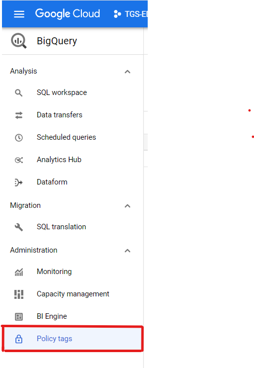
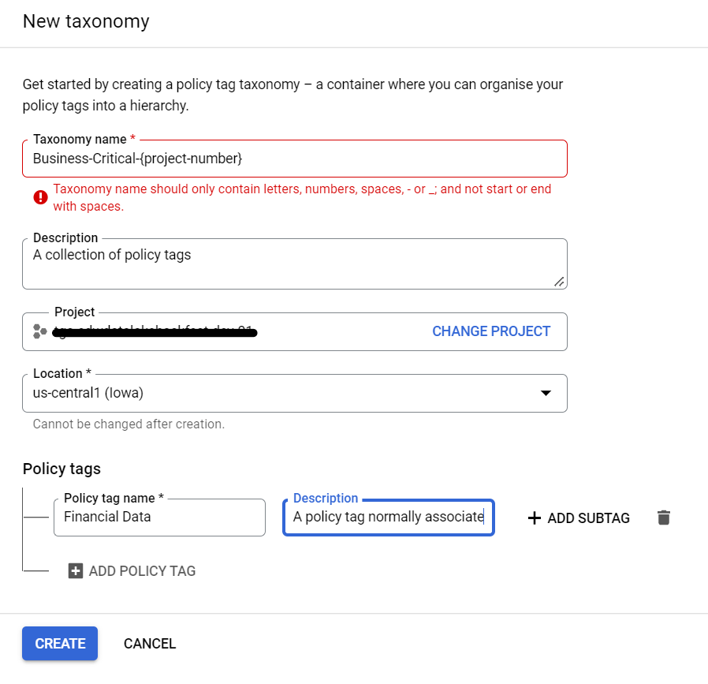
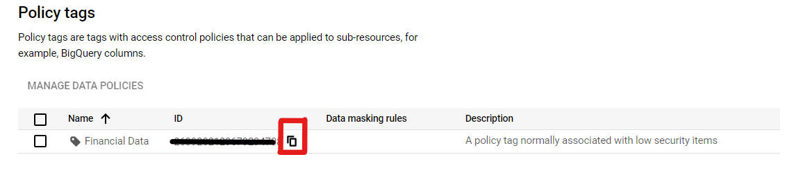
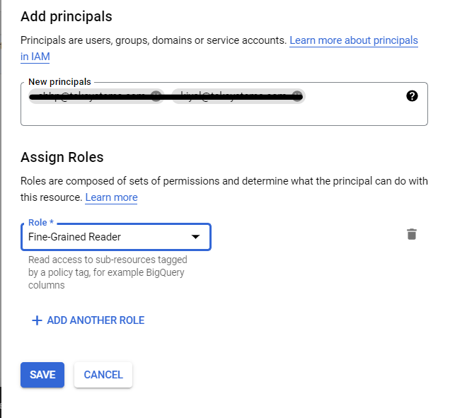
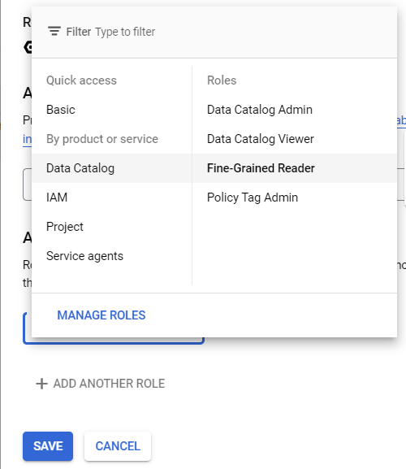
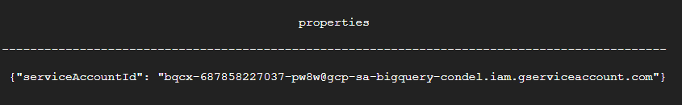
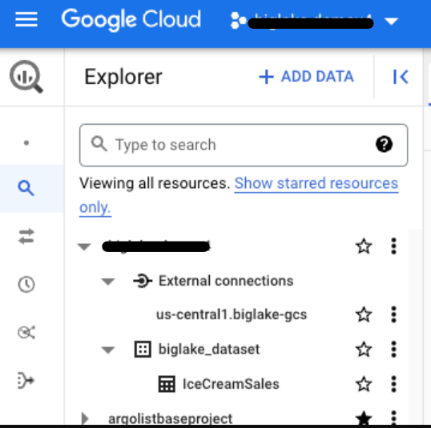

<!---->
  Copyright 2022 Google LLC
 
  Licensed under the Apache License, Version 2.0 (the "License");
  you may not use this file except in compliance with the License.
  You may obtain a copy of the License at
 
       http://www.apache.org/licenses/LICENSE-2.0
 
  Unless required by applicable law or agreed to in writing, software
  distributed under the License is distributed on an "AS IS" BASIS,
  WITHOUT WARRANTIES OR CONDITIONS OF ANY KIND, either express or implied.
  See the License for the specific language governing permissions and
  limitations under the License.
 <!---->
 
## 1. Create the environment

### 1.1. Products/services used in the lab
The following services and resources will be created via Terraform scripts:

1. VPC, Subnetwork and NAT rules
2. IAM groups for USA and Australia
3. IAM permissions for user principals and Google Managed default service accounts
4. GCS buckets, for each user principal and for Dataproc temp bucket
5. Dataplex Policy for Column level Access
6. BigQuery Dataset, Table and Row Level Policies

### 1.2. Uploading Terraform scripts, PySpark scripts and datasets to cloud shell

```
cd ~
git clone https://github.com/GoogleCloudPlatform/datalake-modernization-workshops
cd datalake-modernization-workshops/
mv biglake-finegrained-lab/ ~/
cd ..
```

### 1.3. Navigate to the Cloud Shell provisioning directory
```
cd ~/biglake-finegrained-lab/
```

### 2. Provision the environment

### 2.1. Admin Roles

To setup the infrastructure, please ensure you have the following GCP roles: Project IAM Admin, Policy Tag Admin, Compute Network Admin, Compute Admin, Storage Admin, BigQuery Admin, Service Usage Admin

### 2.2. Enabling the APIs

 - Please ensure the following APIs are enabled before you proceed: 

```
dataproc.googleapis.com
bigqueryconnection.googleapis.com
bigquerydatapolicy.googleapis.com
storage-component.googleapis.com
bigquerystorage.googleapis.com
datacatalog.googleapis.com
dataplex.googleapis.com
bigquery.googleapis.com
cloudresourcemanager.googleapis.com
cloudidentity.googleapis.com
```

### 2.3. Create the policy tag

Go to cloud console and open BigQuery and click on the Policy tag section. 

 

### 2.4. Create Taxonomy by filling in the details as shown below

```
Taxonomy name: Business-critical-{insert project number}
Description: A collection of policy tags
Project: <Select your project>
Location: us-central1

Policy tag name: Financial Data
Description: A policy tag normally associated with low security items
```



* Copy the ID of the policy tag after it's created, for example: projects/<PROJECT-ID>/locations/<LOCATION>/taxonomies/<POLICY-NUMBER>/policyTags/<POLICY-TAG-ID>




### 2.5. Granting of fine grained reader permisions to RLS users ONLY

Go to Policy tag section of BigQuery console and click on the 'Show Info Panel' on the right top corner.
Once the panel opens, select the Taxonomy you just created and in Add principals section add the usernames of RLS user only.



After that assign the role of Fine Grained Reader to those users and click on Save



### 2.6. Define variables for use

Modify the below as appropriate for your deployment.<br>
For Cloud Scheduler timezone, use the Cloud Scheduler UI and see available options for you.<br>

## 3. Running the Shell Script

#### 3.1. Customizing the shell script

From the '00-scripts-and-config\cloud-shell' folder, edit the 'cloud-shell-resource-creation.sh' script by updating the values for the following variables:<br>

```
RLS_USERNAME1=<user_with_access_to_us_data>          # Please insert the whole username for eg: username@example.com
RLS_USERNAME2=<user_with_access_to_australia_data>   # Please insert the whole username for eg: username@example.com
CLS_USERNAME=<user_with_no_access_to_finanical_data> # Please insert the whole username for eg: username@example.com
```

Once these values have been entered, please save the file.

## 4. Shell Script Execution

### 4.1. Resource creation

Next, run the following commands in cloud shell to execute the shell script: <br>

```
cd 00-scripts-and-config/cloud-shell
bash cloud-shell-resource-creation.sh
```

Once the shell script completes execution successfully, all resources mentioned in the script will be successfully created.

### 4.2. BigLake table creation 

Change the variables accordingly and run the below code to get the service account id
```
bq show --connection <YOUR_PROJECT_ID>.<LOCATION>.<CONNECTION_ID> 
```


* only copy the Service account Id from the results after running the above code 
* Open the big_lake_table.json from 00-scripts-and-config/cloud-shell/big_lake_table.json add the policy tag id (projects/<PROJECT-ID>/locations/<LOCATION>/taxonomies/<POLICY-NUMBER>/policyTags/<POLICY-TAG-ID>) and the bucket name where dataset is stored, then
* Open the biglake_table_creation file from 00-scripts-and-config/cloud-shell/biglake_table_creation.sh, then edit the $BQ_SA and add the service account ID
* Run the below bash code to create the BigLake table

```
bash biglake_table_creation.sh
```

### 4.3. Creation of Row Access Policy for United States

```
bq query --use_legacy_sql=false \
'CREATE ROW ACCESS POLICY United_States_filter
ON biglake_dataset.IceCreamSales
GRANT TO ("user:<INSERT_RLS_USERNAME1>", "user:<INSERT_CLS_USERNAME>")
FILTER USING (Country="United States")'
```

### 4.4. Creation of Row Access Policy for Australia

```
bq query --use_legacy_sql=false \
'CREATE ROW ACCESS POLICY Australia_filter
ON biglake_dataset.IceCreamSales
GRANT TO ("user:<INSERT_RLS_USERNAME2>", "user:<INSERT_CLS_USERNAME>")
FILTER USING (Country="Australia")'
```

## 5. Validate the Cloud-Shell deployment

From your default GCP account (NOT to be confused with the three users we created), go to the Cloud Console, and validate the creation of the following resources-

### 5.1. IAM users

Validate IAM users in the project, by navigating on Cloud Console to -
1. Youself
2. rls_user1
3. rls_user2
4. cls_user


### 5.2. IAM roles

a) User Principles:<br>
1. rls_user1: Viewer, Service Account User, Storage Object Admin, and Dataproc Editor
2. rls_user2: Viewer, Service Account User, Storage Object Admin, and Dataproc Editor
3. cls_user: Viewer, Service Account User, Storage Object Admin, and Dataproc Editor
<br>

b) Google Managed Compute Engine Default Service Account:<br>
4. YOUR_PROJECT_NUMBER-compute@developer.gserviceaccount.com: Dataproc Worker
<br>

c) BigQuery Connection Default Service Account:<br>
Covered below

### 5.3. GCS buckets
1. dataproc-bucket-YOUR_PROJECT_NUMBER

### 5.4. GCS bucket permissions
1. dataproc-bucket-YOUR_PROJECT_NUMBER: Storage Admin to all three users created

### 5.5. Network resources
Validate the creation of-
1. VPC called vpc-biglake
2. Subnet called snet-biglake
3. Firewall called subnet-firewall
4. Cloud Router called nat-router
5. Cloud NAT gateway called nat-config


### 5.6. Policy Tag Taxonomies
Navigate to Dataplex->Policy Tag Taxonomies and you should see a policy tag called -
1. Business-Critical-YOUR_PROJECT_NUMBER

### 5.7. Policy Tag
Click on the Policy Tag Taxonomy in Dataplex and you should see a Policy Tag called -
1. Financial Data

### 5.8. User association with Policy Tag
Each of the two users rls_user1 & rls_user2 are granted datacatalog.categoryFineGrainedReader tied to the Policy Tag created

### 5.9. BigLake Connection
Navigate to BigQuery in the Cloud Console and you should see, under "External Connections" -
1. An external connection called 'us-central1.biglake.gcs'

### 5.10. BigQuery Dataset
In the BigQuery console, you should see a dataset called-
1. biglake_dataset

### 5.11. IAM role to BigQuery External Connection Default Service Account
bqcx-YOUR_PROJECT_NUMBER@gcp-sa-bigquery-condel.iam.gserviceaccount.com: Storage Object Viewer	

### 5.12. BigLake Table
A BigLake table called IceCreamSales -
1. That uses the Biglake connection 'us-central1.biglake.gcs'
2. With CSV configuration 
3. On CSV file at - gs://dataproc-bucket-YOUR_PROJECT_NUMBER/IceCreamSales.csv
4. With a set schema
5. With column 'Discount' tied to the Policy Tag created -'Financial Data'
6. With column 'Net_Revenue' tied to the Policy Tag created -'Financial Data'

 

### 5.13. Row Access Policies
Create Row Access Policies, one for each user - rls_user1 and rls_user2 -
1. Row Access Policy for the BigLake table IceCreamSales called 'Australia_filter' associated with the user rls_user1 on filter Country="Australia"
2. Row Access Policy for the BigLake table IceCreamSales called 'US_filter' associated with the IAM group rls_user2 on filter Country="United States"

## 6. Fine-grained Access Control Lab powered by BigLake

So far, you completed the environment setup and validation. In this sub-module, you will learn the fine grained access control made possible by BigLake.

### 6.1. Principle of Least Privilege: Administrators should not have access to data
In your current default user login, navigate to BigQuery on the Cloud Console. You should see a dataset biglake_dataset and a table called "biglake_dataset.IceCreamSales".
<br>
Run the query below in the BQ query UI-

```
SELECT * FROM `biglake_dataset.IceCreamSales` LIMIT 1000
```

You should not see any results, infact your should see the following error-
```
Access Denied: BigQuery BigQuery: User has neither fine-grained reader nor masked get permission to get data protected by policy tag "Business-Critical-225879788342 : Financial Data" on columns biglake_dataset.IceCreamSales.Discount, biglake_dataset.IceCreamSales.Net_Revenue.
```

This is a demonstration of applying **principle of least privilege** - administrators should not have access to data with in the IceCreamSales table.
