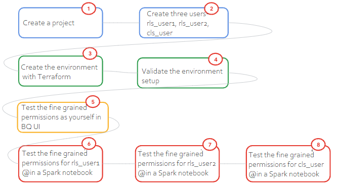
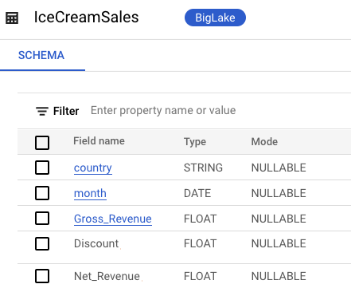
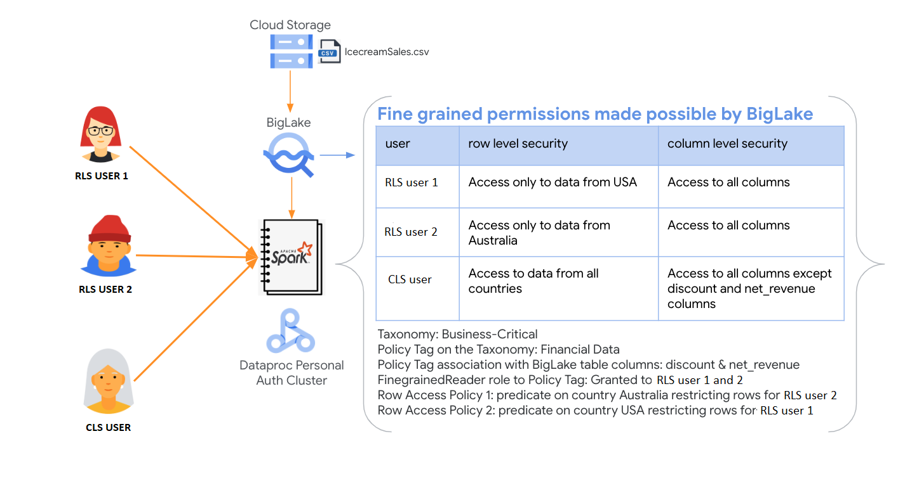
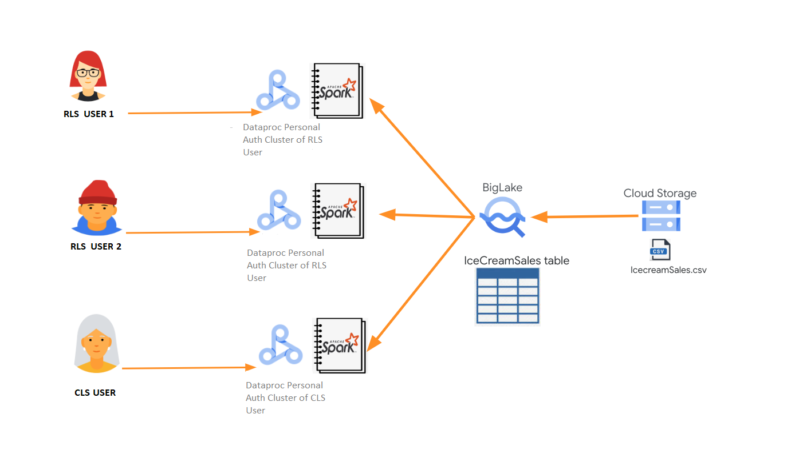

<!---->
  Copyright 2022 Google LLC
 
  Licensed under the Apache License, Version 2.0 (the "License");
  you may not use this file except in compliance with the License.
  You may obtain a copy of the License at
 
       http://www.apache.org/licenses/LICENSE-2.0
 
  Unless required by applicable law or agreed to in writing, software
  distributed under the License is distributed on an "AS IS" BASIS,
  WITHOUT WARRANTIES OR CONDITIONS OF ANY KIND, either express or implied.
  See the License for the specific language governing permissions and
  limitations under the License.
 <!---->

# About the lab 
This lab showcases fine-grained access control made possible by [BigLake](https://cloud.google.com/bigquery/docs/biglake-intro) with a minimum viable example of Icecream sales forecasting on a Spark notebook hosted on a personal auth [Cloud Dataproc](https://cloud.google.com/dataproc) cluster. 

### Use Case
Sales forecasting with Prophet

### Goals
1. Just enough knowledge of creating and using BigLake tables on files in Cloud Storage
2. Just enough knowledge of Row and Column Level Security setup with BigLake
3. Introduction to notebooks on Dataproc in case you are new to Dataproc
4. Accessing BigLake through PySpark with the BigQuery Spark connector from Google Cloud
5. Just enough Terraform for automating provisioning, that can be repurposed for your workloads

### Lab Flow
 

### Dataset
Kaggle dataset for Icecream Sales

 

### Design
Row Level Security (RLS) and Column Level Security (CLS) is showcased.  

Three users are created as part of the lab, with finegrained access implemented-
1. RLS_user1@ - RLS & CLS: has access to all columns of data with Country in USA
2. RLS_user2@ - RLS & CLS: has access to all columns of data with Country in Australia
3. CLS_user@ - CLS: has access to all columns but Discount and Net_Revenue, but to data from all countries

Through a PySpark notebook that is run for each of the three user personas, we will learn how access varies based on finegrained permissions.

### Solution Architecture
This lab features Dataproc Personal Auth Clusters as the Spark infrastructure, and JupyterLab on Dataproc as the notebook infrastructure.

 

**About Cloud Dataproc personal auth clusters:**
 
- Dataproc Personal Cluster Authentication is intended for interactive jobs run by an individual (human) user. Long-running jobs and operations should configure and use an appropriate service account identity.
- When you create a cluster with Personal Cluster Authentication enabled, the cluster will only be usable by a single identity. Other users will not be able to run jobs on the cluster or access Component Gateway endpoints on the cluster.
- Clusters with Personal Cluster Authentication enabled automatically enable and configure Kerberos on the cluster for secure intra-cluster communication. However, all Kerberos identities on the cluster will interact with Google Cloud resources as the same user. (identity propagation, fine grained auditability)

 
So effectively, the architecture is as depicted below-

 

### Column Level Security 
The section covers Column Level Security setup. 

**1. What's involved**  

 

Effectively, only the users, RLS_user1@ and RLS_user2@ have access to columns IcecreamSales.Discount and IcecreamSales.Net_Revenue
 

**2. Taxonomy:**  

 

 

**3. Policy Tag:** 

 

 

**4. Table:**

 

 

**5. Grants:**

 

### Row Level Security 

The section covers Row Level Security setup. 

**1. What's involved**  

 

**2. Example**  

 

 

 

 

 

### Key Products
1. Cloud IAM - Users, groups, group memberships, roles
2. Cloud Storage - raw data & notebook, Dataproc temp bucket and staging bucket
3. Dataplex Data Catalog - policy tag taxonomy, policy tag
4. Biglake - finegrained row level and column level security on CSV in Cloud Storage
5. Cloud Dataproc - Spark on JupyterLab for forecasting icecream sales

### Technology & Libraries
1. Data preprocessing at scale: Spark, specifically PySpark
2. Forecasting: Prophet with Python

### Duration to run through the lab
~ 90 minutes

### Lab format
Fully scripted, with detailed instructions intended for learning, not necessarily challenging

### Credits

| # | Google Cloud Collaborators | Contribution  | 
| -- | :--- | :--- |
| 1. | Dataproc Product Management and Engineering (Antonio Scaramuzzino and Pedro Melendez) | Inspiration, vision and sample |
| 2. | Jay O' Leary, Customer Engineer | Automation of lab |
| 3. | Anagha Khanolkar, Customer Engineer | Contributor |

### Contributions welcome
Community contribution to improve the lab is very much appreciated.  

### Getting help
If you have any questions or if you found any problems with this repository, please report through GitHub issues.

## 1. Lab Modules
The lab consists of the following modules.

1. Setting up the GCP Environment (Admin Step)
    - There are 2 ways of setting up the prerequisites:
        - Using [Terraform Scripts](03-prerequisites/gcp-prerequisites-terraform.md)
        - Using [Cloud shell](03-prerequisites/gcp-prerequisites-cloudshell.md)

2. Accessing the Biglake table data (User Step)
    - There are 2 ways of executing the lab:
        - Using [Terraform Scripts](02-execution-instructions/user-exec-instructions-terraform.md)
        - Using [Cloud shell](02-execution-instructions/user-exec-instructions-cloud-shell.md)
            
