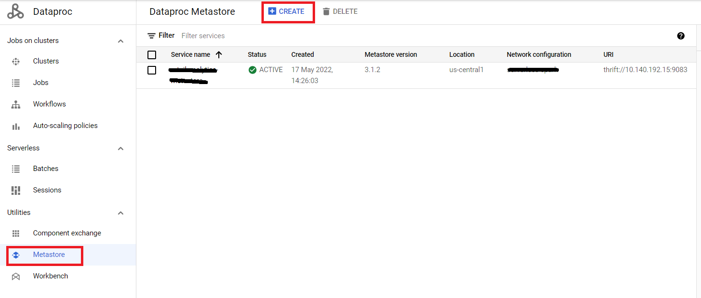
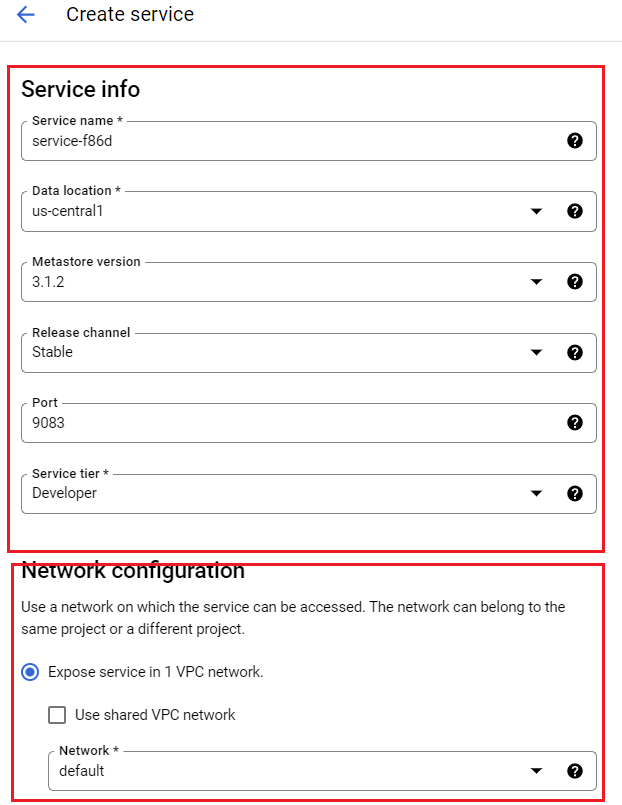
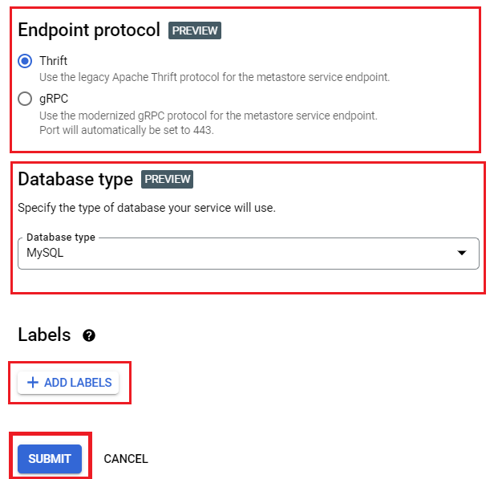
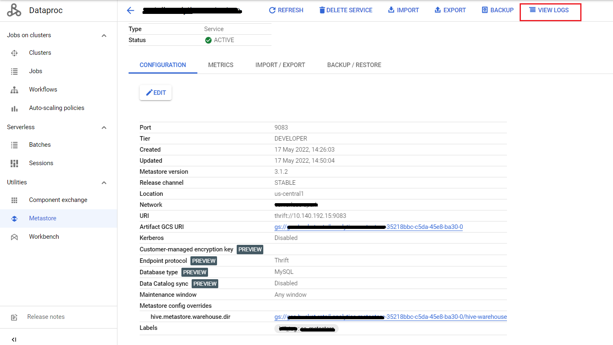
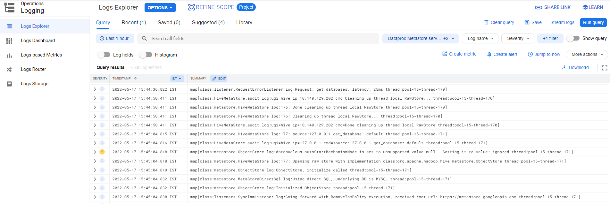

<!---->
  Copyright 2022 Google LLC
 
  Licensed under the Apache License, Version 2.0 (the "License");
  you may not use this file except in compliance with the License.
  You may obtain a copy of the License at
 
       http://www.apache.org/licenses/LICENSE-2.0
 
  Unless required by applicable law or agreed to in writing, software
  distributed under the License is distributed on an "AS IS" BASIS,
  WITHOUT WARRANTIES OR CONDITIONS OF ANY KIND, either express or implied.
  See the License for the specific language governing permissions and
  limitations under the License.
 <!---->

# Creating a Cloud Metastore

This module includes all prerequisites for setting up the Cloud Metastore for running the Data Engineer usecase

[1. Declare Variables](04-metastore-creation-cloud-shell.md#1-declare-variables)<br>
[2. Create a Metastore](04-metastore-creation-cloud-shell.md#2-create-a-metastore)<br>
[3. Logging](04-metastore-creation-cloud-shell.md#3-metastore-logs)

## 0. Prerequisites

#### 1. GCP Project Details

Note the project number and project ID as we will need this for the rest of the lab

#### 2. Attach cloud shell to your project

Open Cloud shell or navigate to [shell.cloud.google.com](https://shell.cloud.google.com) <br>
Run the below command to set the project in the cloud shell terminal:

```
gcloud config set project $PROJECT_ID

```

## 1. Declare variables

We will use these throughout the lab. <br>
Run the below in cloud shells against the project you selected-

```
METASTORE_NAME=<your_dataproc-metastore_name>
REGION=<region_where_resources_will_be_created>
VPC=<your_vpc_name>
PORT=9083 # Change the port number as per the Requirement.
TIER=Developer # Change the tier as per the Requirement.
METASTORE_VERSION=3.1.2 # Change the metastore version as per the Requirement.
```

## 2. Create a metastore 

#### 2.1. Create a metastore through the google cloud shell

```
gcloud metastore services create $METASTORE_NAME \
    --location=$REGION \
    --network=$VPC \
    --port=$PORT \
    --tier=$TIER \
    --hive-metastore-version=$METASTORE_VERSION
```

#### 2.2. Create a metastore through the GCP console

Navigate to the Dataproc Service in your GCP project and click on Metastore 
Click **+CREATE**>**Composer 2**





Next, fill in the following values in the metastore creation window :

- **Service name**   - A unique identifier for your environment
- **Data location**     - The region where you want to create the metastore
- **Metastore Version**    - #default
- **Release channel** - #default
- **Port** - #default
- **Service tier** - #default
- **Network Configuration** - select the network and subnetwork with Private Google Access Enabled

- Next under **Endpoint protocol** select one of the below options: <br>
**Thrift** 
**gRPC**

- Click on **ADD LABELS** to attach the labels.
- Next, click on **Create** to create the Metastore.

## 3. Metastore logs

To view the metastore logs, click the 'View Logs' button on the metastore page and the logs will be shown as below:



