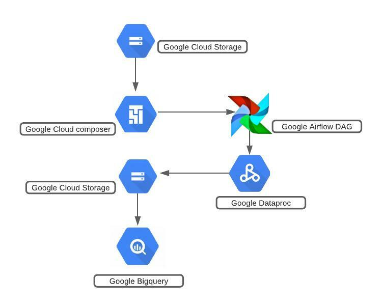
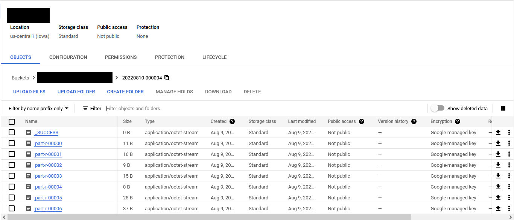
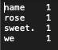

<!---->
  Copyright 2022 Google LLC
 
  Licensed under the Apache License, Version 2.0 (the "License");
  you may not use this file except in compliance with the License.
  You may obtain a copy of the License at
 
       http://www.apache.org/licenses/LICENSE-2.0
 
  Unless required by applicable law or agreed to in writing, software
  distributed under the License is distributed on an "AS IS" BASIS,
  WITHOUT WARRANTIES OR CONDITIONS OF ANY KIND, either express or implied.
  See the License for the specific language governing permissions and
  limitations under the License.
 <!---->

# Cell Tower Anomaly Detection with PySpark and Map Reduce Word Count on Dataproc

Following are the lab modules:

[1. Understanding Data](console-execution.md#1-understanding-the-data)<br>
[2. Solution Architecture](console-execution.md#2-solution-diagram)<br>
[3. Running the cell tower anomaly detection jobs on Dataproc Cluster](console-execution.md#3-running-the-cell-tower-anomaly-detection-jobs-on-dataproc-cluster)<br>
[4. BQ output tables](console-execution.md#4-bq-output-tables)<br>
[5. Logging](console-execution.md#5-logging)<br>
[6. Running the cell tower anomaly detection jobs on Serverless Spark](console-execution.md#6-running-the-cell-tower-anomaly-detection-jobs-on-serverless-spark)<br>
[7. BQ output tables](console-execution.md#7-bq-output-tables)<br>
[8. Logging](console-execution.md#8-logging)<br>
[9. Running a Map Reduce wordcount job through Cloud Console](console-execution.md#9-running-a-map-reduce-wordcount-job-through-cloud-console)<br>
[10. Examine the wordcount output](console-execution.md#10-examine-the-wordcount-output)<br>

## 1. Understanding the data

The datasets used for this project are

1.[telecom_customer_churn_data.csv](01-datasets/telecom_customer_churn_data.csv) <br>
2.[service_threshold_data.csv](01-datasets/service_threshold_data.csv) <br>
3.[customer_data](01-datasets/cust_raw_data/L1_Customer_details_raw_part-00000-fc7d6e20-dbda-4143-91b5-d9414310dfd1-c000.snappy.parquet) <br>

- Telecom Customer Churn Data   - This dataset contains information of services provided to the customers by the celltowers.
- Service Threshold Data -  This dataset contains the performance metrics thresold information of the celltowers.
- Cust Raw Data - This is a folder which contains the files which are in parquet format and holds the information of the customer data.

## 2. Solution Diagram



**Model Pipeline**

The model pipeline involves the following steps: <br>
	- Create buckets in GCS <br>
	- Create Dataproc and Persistent History Server Cluster <br>
	- Copy the raw data files, pyspark and notebook files into GCS <br>
	- Create a Cloud Composer environment and Airflow job to run the workloads against a Dataproc GCE cluster <br>
	- Create external tables in a Dataproc Metastore environment <br>
	- Reading data from the above external tables, processing it and creating external tables on GCS bucket data in Google BigQuery

## 3. Running the cell tower anomaly detection jobs on Dataproc Cluster

#### 3.1 Cleaning and Joining Customer with Services Threshold Data

Navigate to Dataproc > Clusters > Select the cluster created  and click on **+SUBMIT JOB**

Next, fill in the following values in the job creation window :

- **Job ID** : A unique identifier for your batch
- **Job Type** : PySpark
- **Main Python File** : gs://de-code-and-data-bucket-YOUR_PROJECT_NUMBER/cell-tower-anomaly-detection/00-scripts-and-config/pyspark/curate_customer_data.py
- **JAR Files** - gs://spark-lib/bigquery/spark-bigquery-with-dependencies_2.12-0.22.2.jar

- **Arguments** : There are 3 arguments to provide here:<br>
    de-code-and-data-bucket-YOUR_PROJECT_NUMBER<br>
    de_metastore_db<br>
    YOUR_NAME<br>

  **Note:** Press RETURN after each argument <br>
  **Note:** The arguments must be passed in the same order as mentioned as they are extracted in the order they are provided


Once all the details are in, you can submit the job. As the job starts, you can see the execution details and logs on the console.

#### 3.2 Cleaning and Joining Customer Services with Telecom Data

Navigate to Dataproc > Clusters > Select the cluster created  and click on **+SUBMIT JOB**

Next, fill in the following values in the job creation window :

- **Job ID** : A unique identifier for your batch
- **Job Type** : PySpark
- **Main Python File** : gs://de-code-and-data-bucket-YOUR_PROJECT_NUMBER/cell-tower-anomaly-detection/00-scripts-and-config/pyspark/curate_telco_performance_data.py
- **JAR Files** : gs://spark-lib/bigquery/spark-bigquery-with-dependencies_2.12-0.22.2.jar

- **Arguments** : There are 3 arguments to provide here:<br>
    de-code-and-data-bucket-YOUR_PROJECT_NUMBER<br>
    de_metastore_db<br>
    YOUR_NAME<br>

  **Note:** Press RETURN after each argument <br>
  **Note:** The arguments must be passed in the same order as mentioned as they are extracted in the order they are provided


Once all the details are in, you can submit the job. As the job starts, you can see the execution details and logs on the console.

#### 3.3 Customer Service Data Aggregation Workflow

Navigate to Dataproc > Clusters > Select the cluster created  and click on **+SUBMIT JOB**

Next, fill in the following values in the job creation window :

- **Job ID** : A unique identifier for your batch
- **Job Type** : PySpark
- **Main Python File** : gs://de-code-and-data-bucket-YOUR_PROJECT_NUMBER/cell-tower-anomaly-detection/00-scripts-and-config/pyspark/kpis_by_customer.py
- **JAR Files** : gs://spark-lib/bigquery/spark-bigquery-with-dependencies_2.12-0.22.2.jar

- **Arguments** : There are 5 arguments to provide here:<br>
    YOUR_PROJECT_ID<br>                                                                
    de_bq_dataset<br>
    de-code-and-data-bucket-YOUR_PROJECT_NUMBER<br>
    de_metastore_db<br>
    YOUR_NAME<br>

  **Note:** Press RETURN after each argument <br>
  **Note:** The arguments must be passed in the same order as mentioned as they are extracted in the order they are provided


Once all the details are in, you can submit the job. As the job starts, you can see the execution details and logs on the console.

#### 3.4 Cell Tower Performance Metrics Aggregation Workflow

Navigate to Dataproc > Clusters > Select the cluster created  and click on **+SUBMIT JOB**

Next, fill in the following values in the batch creation window as shown in the images below:

- **Job ID** : A unique identifier for your batch
- **Job Type** : PySpark
- **Main Python File** : gs://de-code-and-data-bucket-YOUR_PROJECT_NUMBER/cell-tower-anomaly-detection/00-scripts-and-config/pyspark/kpis_by_cell_tower.py
- **JAR Files** : gs://spark-lib/bigquery/spark-bigquery-with-dependencies_2.12-0.22.2.jar


- **Arguments** : There are 5 arguments to provide here:<br>
		YOUR_PROJECT_ID<br>                                                                
		de_bq_dataset<br>
		de-code-and-data-bucket-YOUR_PROJECT_NUMBER<br>
		de_metastore_db<br>
		YOUR_NAME<br>

  **Note:** Press RETURN after each argument <br>
  **Note:** The arguments must be passed in the same order as mentioned as they are extracted in the order they are provided


Once all the details are in, you can submit the job. As the job starts, you can see the execution details and logs on the console.

## 4. BQ output tables

Navigate to BigQuery Console, and check the **cell_tower_anomaly_detection** dataset. <br>
Once all jobs execute successfully, two new tables 'YOUR_NAME_kpis_by_cell_tower' and 'YOUR_NAME_kpis_by_customer' will be created:


To view the data in these tables -

* Select the table from BigQuery Explorer by navigating 'project_id' **>** 'dataset' **>** 'table_name'
* Click on the **Preview** button to see the data in the table


**Note:** If the **Preview** button is not visible, run the below queries to view the data. However, these queries will be charged for the full table scan.

```
  SELECT * FROM `YOUR_PROJECT_ID.de_bq_dataset.YOUR_NAME_kpis_by_cell_tower` LIMIT 1000;
  SELECT * FROM `YOUR_PROJECT_ID.de_bq_dataset.YOUR_NAME_kpis_by_customer` LIMIT 1000;
```
**Note:** Edit all occurrences of YOUR_PROJECT_ID and de_bq_dataset to match the values of the variables PROJECT_ID, and BQ_DATASET_NAME respectively


## 5. Logging

#### 5.1 Dataproc Jobs Logs

Once you submit the job, you can see the job run under *Dataproc* > *Jobs* as shown below:


#### 5.2 Persistent History Server logs

To view the Persistent History server logs, Navigate to the cluster and open web interfaces and navigate to spark history server.


## 6. Running the cell tower anomaly detection jobs on Serverless Spark

#### 6.1 Cleaning and Joining Customer with Services Threshold Data

Navigate to Dataproc > Serverless > Batches and click on **+CREATE**

Next, fill in the following values in the batch creation window :

- **Batch ID** : A unique identifier for your batch
- **Region** : The region name provided by the Admin team
- **Batch Type** : PySpark
- **Main Python File** : gs://de-code-and-data-bucket-YOUR_PROJECT_NUMBER/cell-tower-anomaly-detection/00-scripts-and-config/pyspark/curate_customer_data.py
- **JAR Files** - gs://spark-lib/bigquery/spark-bigquery-with-dependencies_2.12-0.22.2.jar


- **Arguments** : There are 3 arguments to provide here:<br>
    de-code-and-data-bucket-YOUR_PROJECT_NUMBER<br>
    de_metastore_db<br>
    YOUR_NAME<br>

  **Note:** Press RETURN after each argument <br>
  **Note:** The arguments must be passed in the same order as mentioned as they are extracted in the order they are provided

- **Service Account** : YOUR_UMSA_NAME@YOUR_PROJECT_ID.iam.gserviceaccount.com
- **Network Configuration** : Select the network and subnetwork with Private Google Access Enabled


- **Metastore Service** : <your_metastore_service>

- **History Server Cluster** : <your_phs_cluster_name>


Once all the details are in, you can submit the batch. As the batch starts, you can see the execution details and logs on the console.

#### 6.2 Cleaning and Joining Customer Services with Telecom Data

Navigate to Dataproc > Serverless > Batches and click on **+CREATE**

Next, fill in the following values in the batch creation window :

- **Batch ID** : A unique identifier for your batch
- **Region** : The region name provided by the Admin team
- **Batch Type** : PySpark
- **Main Python File** : gs://de-code-and-data-bucket-YOUR_PROJECT_NUMBER/cell-tower-anomaly-detection/00-scripts-and-config/pyspark/curate_telco_performance_data.py
- **JAR Files** : gs://spark-lib/bigquery/spark-bigquery-with-dependencies_2.12-0.22.2.jar


- **Arguments** : There are 3 arguments to provide here:<br>
    de-code-and-data-bucket-YOUR_PROJECT_NUMBER<br>
    de_metastore_db<br>
    YOUR_NAME<br>

  **Note:** Press RETURN after each argument <br>
  **Note:** The arguments must be passed in the same order as mentioned as they are extracted in the order they are provided

- **Service Account** : YOUR_UMSA_NAME@YOUR_PROJECT_ID.iam.gserviceaccount.com
- **Network Configuration** : Select the network and subnetwork with Private Google Access Enabled


- **Metastore Service** : <your_metastore_service>

- **History Server Cluster** : <your_phs_cluster_name>


Once all the details are in, you can submit the batch. As the batch starts, you can see the execution details and logs on the console.

#### 6.3 Customer Service Data Aggregation Workflow

Navigate to Dataproc > Serverless > Batches and click on **+CREATE**

Next, fill in the following values in the batch creation window :

- **Batch ID** : A unique identifier for your batch
- **Region** : The region name provided by the Admin team
- **Batch Type** : PySpark
- **Main Python File** : gs://de-code-and-data-bucket-YOUR_PROJECT_NUMBER/cell-tower-anomaly-detection/00-scripts-and-config/pyspark/kpis_by_customer.py
- **JAR Files** : gs://spark-lib/bigquery/spark-bigquery-with-dependencies_2.12-0.22.2.jar


- **Arguments** : There are 5 arguments to provide here:<br>
    YOUR_PROJECT_ID<br>                                                                
    de_bq_dataset<br>
    de-code-and-data-bucket-YOUR_PROJECT_NUMBER<br>
    de_metastore_db<br>
    YOUR_NAME<br>

  **Note:** Press RETURN after each argument <br>
  **Note:** The arguments must be passed in the same order as mentioned as they are extracted in the order they are provided


- **Service Account** : YOUR_UMSA_NAME@YOUR_PROJECT_ID.iam.gserviceaccount.com
- **Network Configuration** : Select the network and subnetwork with Private Google Access Enabled


- **Metastore Service** : <your_metastore_service>

- **History Server Cluster** : <your_phs_cluster_name>


Once all the details are in, you can submit the batch. As the batch starts, you can see the execution details and logs on the console.

#### 6.4 Cell Tower Performance Metrics Aggregation Workflow

Navigate to Dataproc > Serverless > Batches and click on **+CREATE**

Next, fill in the following values in the batch creation window as shown in the images below:

- **Batch ID** : A unique identifier for your batch
- **Region** : The region name provided by the Admin team
- **Batch Type** : PySpark
- **Main Python File** : gs://de-code-and-data-bucket-YOUR_PROJECT_NUMBER/cell-tower-anomaly-detection/00-scripts-and-config/pyspark/kpis_by_cell_tower.py
- **JAR Files** : gs://spark-lib/bigquery/spark-bigquery-with-dependencies_2.12-0.22.2.jar


- **Arguments** : There are 5 arguments to provide here:<br>
    YOUR_PROJECT_ID<br>                                                                
    de_bq_dataset<br>
    de-code-and-data-bucket-YOUR_PROJECT_NUMBER<br>
    de_metastore_db<br>
    YOUR_NAME<br>

  **Note:** Press RETURN after each argument <br>
  **Note:** The arguments must be passed in the same order as mentioned as they are extracted in the order they are provided

- **Service Account** : YOUR_UMSA_NAME@YOUR_PROJECT_ID.iam.gserviceaccount.com
- **Network Configuration** : select the network and subnetwork with Private Google Access Enabled


- **Metastore Service** : <your_metastore_service>
-
- **History Server Cluster** : <your_phs_cluster_name>


Once all the details are in, you can submit the batch. As the batch starts, you can see the execution details and logs on the console.

## 7. BQ output tables

Navigate to BigQuery Console, and check the **cell_tower_anomaly_detection** dataset. <br>
Once all batches complete execution successfully, two new tables 'YOUR_NAME_kpis_by_cell_tower' and 'YOUR_NAME_kpis_by_customer' will be created:


To view the data in these tables -

* Select the table from BigQuery Explorer by navigating 'project_id' **>** 'dataset' **>** 'table_name'
* Click on the **Preview** button to see the data in the table


**Note:** If the **Preview** button is not visible, run the below queries to view the data. However, these queries will be charged for the full table scan.

```
  SELECT * FROM `YOUR_PROJECT_ID.de_bq_dataset.YOUR_NAME_kpis_by_cell_tower` LIMIT 1000;
  SELECT * FROM `YOUR_PROJECT_ID.de_bq_dataset.YOUR_NAME_kpis_by_customer` LIMIT 1000;
```
**Note:** Edit all occurrences of YOUR_PROJECT_ID and de_bq_dataset to match the values of the variables PROJECT_ID, and BQ_DATASET_NAME respectively


## 8. Logging

### 8.1 Serverless Batch logs

Logs associated with the application can be found in the logging console under
**Dataproc > Serverless > Batches > <batch_name>**.
<br> You can also click on “View Logs” button on the Dataproc batches monitoring page to get to the logging page for the specific Spark job.


### 8.2 Persistent History Server logs

To view the Persistent History server logs, click the 'View History Server' button on the Dataproc batches monitoring page and the logs will be shown as below:


## 9. Running a Map Reduce wordcount job through Cloud Console

To create wordcount job follow these steps.

#### 9.1 Navigate to Dataproc Clusters.

Under Dataproc > Clusters, locate the cluster you wish to use. <br>
Next, select the cluster you wish to use.


You will then see Submit job at the top <br>


#### 9.2 Fill in the Job Details.

For the wordcount job we will use Dataproc's built in Submit Job feature.

Fill in the following details :
- **Job TYPE** : Hadoop
- **MAIN CLASS or JAR** : file:///usr/lib/hadoop-mapreduce/hadoop-mapreduce-examples.jar
- **Arguements** : There are 3 arguments to provide here:<br>
    wordcount <br>
    gs://pub/shakespeare/rose.txt <br>
    gs://de-output-bucket-YOUR_PROJECT_NUMBER/wordcount-YOUR_NAME


#### 9.3 Submit the job

Once all the details are entered, Click on **Submit**

<br>

## 10. Examine the wordcount output

Once you submit the job, you can see the job run under *Dataproc* > *Jobs* as shown below:


Once the job completes successfully, you will the see the bucket you chose be populated with your wordcount results.



On opening each file, we can see the output of the word count job in the form of: \<word\> \<count\> as shown below:


