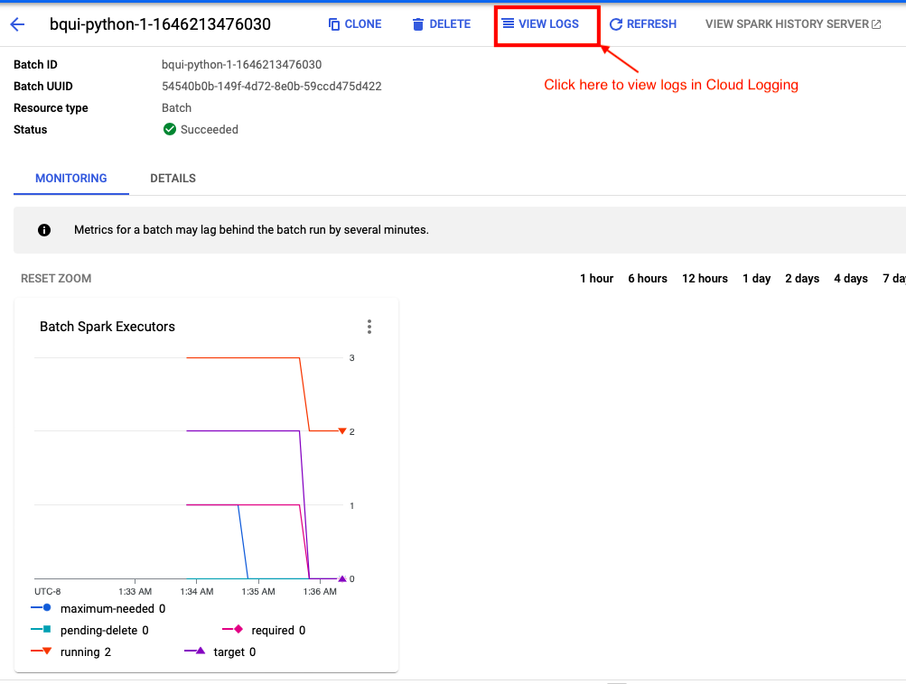

<!---->
  Copyright 2022 Google LLC
 
  Licensed under the Apache License, Version 2.0 (the "License");
  you may not use this file except in compliance with the License.
  You may obtain a copy of the License at
 
       http://www.apache.org/licenses/LICENSE-2.0
 
  Unless required by applicable law or agreed to in writing, software
  distributed under the License is distributed on an "AS IS" BASIS,
  WITHOUT WARRANTIES OR CONDITIONS OF ANY KIND, either express or implied.
  See the License for the specific language governing permissions and
  limitations under the License.
 <!---->

# Cell Tower Anomaly Detection with PySpark and Map Reduce Word Count on Dataproc

Following are the lab modules:

[1. Understanding Data](gcloud-execution.md#1-understanding-the-data)<br>
[2. Solution Architecture](gcloud-execution.md#2-solution-diagram)<br>
[3. Declaring Variables](gcloud-execution.md#3-declaring-variables)<br>
[4. Running the cell tower anomaly detection jobs on Dataproc Cluster](gcloud-execution.md#4-running-the-cell-tower-anomaly-detection-jobs-on-dataproc-cluster)<br>
[5. BQ output tables](gcloud-execution.md#5-bq-output-tables)<br>
[6. Logging](gcloud-execution.md#6-logging)<br>
[7. Running the cell tower anomaly detection jobs on Serverless Spark](gcloud-execution.md#4-running-the-cell-tower-anomaly-detection-jobs-on-serverless-spark)<br>
[8. BQ output tables](gcloud-execution.md#8-bq-output-tables)<br>
[9. Logging](gcloud-execution.md#9-logging)<br>
[10. Running a Map Reduce wordcount job through Cloud Shell](gcloud-execution.md#10-running-a-map-reduce-wordcount-job-through-cloud-shell)<br>
[11. Examine the wordcount output](gcloud-execution.md#11-examine-the-wordcount-output)<br>

## 1. Understanding the data

The datasets used for this project are

1.[telecom_customer_churn_data.csv](01-datasets/telecom_customer_churn_data.csv) <br>
2.[service_threshold_data.csv](01-datasets/service_threshold_data.csv) <br>
3.[customer_data](01-datasets/cust_raw_data/L1_Customer_details_raw_part-00000-fc7d6e20-dbda-4143-91b5-d9414310dfd1-c000.snappy.parquet) <br>

- Telecom Customer Churn Data   - This dataset contains information of services provided to the customers by the celltowers.
- Service Threshold Data -  This dataset contains the performance metrics thresold information of the celltowers.
- Cust Raw Data - This is a folder which contains the files which are in parquet format and holds the information of the customer data.

## 2. Solution Diagram


**Model Pipeline**

The model pipeline involves the following steps: <br>
	- Create buckets in GCS <br>
	- Create Dataproc and Persistent History Server Cluster <br>
	- Copy the raw data files, pyspark and notebook files into GCS <br>
	- Create a Cloud Composer environment and Airflow job to run the workloads against a Dataproc GCE cluster <br>
	- Create external tables in a Dataproc Metastore environment <br>
	- Reading data from the above external tables, processing it and creating external tables on GCS bucket data in Google BigQuery <br>

## 3. Declaring Variables

#### 3.1 Set the PROJECT_ID in Cloud Shell

Open Cloud shell or navigate to [shell.cloud.google.com](https://shell.cloud.google.com)<br>
Run the below

```
gcloud config set project <enter your project id here>
```

####  3.2 Verify the PROJECT_ID in Cloud Shell

Next, run the following command in cloud shell to ensure that the current project is set correctly:

```
gcloud config get-value project
```

####  3.3 Declare the variables

Based on the prereqs and checklist, declare the following variables in cloud shell by replacing with your values:


```
PROJECT_ID=$(gcloud config get-value project)
PROJECT_NUMBER=$(gcloud projects describe ${PROJECT_ID} | grep projectNumber | cut -d':' -f2 |  tr -d "'" | xargs)
GCP_ACCOUNT_NAME=$(gcloud auth list --filter=status:ACTIVE --format="value(account)")
REGION=us-central1
SUBNET=de-subnet-$PROJECT_NUMBER
BUCKET_CODE=de-code-and-data-bucket-$PROJECT_NUMBER
BQ_DATASET_NAME=de_bq_dataset
NAME=YOUR_NAME
CLUSTER_NAME=$NAME-dp-gce-cluster
OUTPUT_BUCKET=de-output-bucket-$PROJECT_NUMBER
BUCKET_PHS=de-phs-bucket-$PROJECT_NUMBER
HISTORY_SERVER_NAME=de-phs-cluster-$PROJECT_NUMBER
UMSA=de-umsa-$PROJECT_NUMBER
METASTORE_NAME=de-metastore-$PROJECT_NUMBER
METASTORE_DB_NAME=de_metastore_db
SERVICE_ACCOUNT=$UMSA@$PROJECT_ID.iam.gserviceaccount.com
```

**Note:** For all the variables except 'NAME', please ensure to use the values provided by the admin team.

### 3.4 Update Cloud Shell SDK version

Run the below on cloud shell-
```
gcloud components update

```

## 4. Running the cell tower anomaly detection jobs on Dataproc Cluster

* Execute the following gcloud commands in cloud shell in the given order to execute the different steps of the cell towr anomaly detection pipeline

**Cleaning and Joining Customer with Services Threshold Data**

```
gcloud dataproc jobs submit pyspark \
--cluster $CLUSTER_NAME \
--id $NAME-cell-tower-curate-customer-$RANDOM \
gs://$BUCKET_CODE/cell-tower-anomaly-detection/00-scripts-and-config/pyspark/curate_customer_data.py \
--region $REGION \
--project $PROJECT_ID \
--jars gs://spark-lib/bigquery/spark-bigquery-with-dependencies_2.12-0.22.2.jar \
-- $BUCKET_CODE "${METASTORE_DB_NAME}_${NAME}" $NAME
```

**Cleaning and Joining Customer Services with Telecom Data**

```
gcloud dataproc jobs submit pyspark \
--cluster $CLUSTER_NAME \
--id $NAME-cell-tower-curate-telco-$RANDOM \
gs://$BUCKET_CODE/cell-tower-anomaly-detection/00-scripts-and-config/pyspark/curate_telco_performance_data.py \
--region $REGION \
--project $PROJECT_ID \
--jars gs://spark-lib/bigquery/spark-bigquery-with-dependencies_2.12-0.22.2.jar \
-- $BUCKET_CODE "${METASTORE_DB_NAME}_${NAME}" $NAME

```

**Customer Service Data Aggregation Workflow**

```
gcloud dataproc jobs submit pyspark \
--cluster $CLUSTER_NAME \
--id $NAME-cell-tower-kpis-by-customer-$RANDOM \
gs://$BUCKET_CODE/cell-tower-anomaly-detection/00-scripts-and-config/pyspark/kpis_by_customer.py \
--region $REGION \
--project $PROJECT_ID \
--jars gs://spark-lib/bigquery/spark-bigquery-with-dependencies_2.12-0.22.2.jar \
-- $PROJECT_ID $BQ_DATASET_NAME $BUCKET_CODE "${METASTORE_DB_NAME}_${NAME}" $NAME

```

**Celltower Performance Metrics Aggregation Workflow**

```
gcloud dataproc jobs submit pyspark \
--cluster $CLUSTER_NAME \
--id $NAME-cell-tower-kpis-by-cell-tower-$RANDOM \
gs://$BUCKET_CODE/cell-tower-anomaly-detection/00-scripts-and-config/pyspark/kpis_by_cell_tower.py \
--region $REGION \
--project $PROJECT_ID \
--jars gs://spark-lib/bigquery/spark-bigquery-with-dependencies_2.12-0.22.2.jar \
-- $PROJECT_ID $BQ_DATASET_NAME $BUCKET_CODE "${METASTORE_DB_NAME}_${NAME}" $NAME

```

## 5. BQ output tables

Navigate to BigQuery Console, and check the **cell_tower_anomaly_detection** dataset. <br>
Once all jobs execute successfully, two new tables 'YOUR_NAME_kpis_by_cell_tower' and 'YOUR_NAME_kpis_by_customer' will be created:


To view the data in these tables -

* Select the table from BigQuery Explorer by navigating 'project_id' **>** 'dataset' **>** 'table_name'
* Click on the **Preview** button to see the data in the table


**Note:** If the **Preview** button is not visible, run the below queries to view the data. However, these queries will be charged for the full table scan.

```
  SELECT * FROM `YOUR_PROJECT_ID.de_bq_dataset.YOUR_NAME_kpis_by_cell_tower` LIMIT 1000;
  SELECT * FROM `YOUR_PROJECT_ID.de_bq_dataset.YOUR_NAME_kpis_by_customer` LIMIT 1000;
```


## 6. Logging


#### 6.1 Dataproc Jobs Logs

Once you submit the job, you can see the job run under *Dataproc* > *Jobs* as shown below:


#### 6.2 Persistent History Server logs

To view the Persistent History server logs, Navigate to the cluster and open web interfaces and navigate to spark history server.


## Cell Tower Anomaly Detection with Serverless Spark Batch


## 7. Running the cell tower anomaly detection jobs on Serverless Spark

* Execute the following gcloud commands in cloud shell in the given order to execute the different steps of the cell towr anomaly detection pipeline

**Cleaning and Joining Customer with Services Threshold Data**

```
gcloud dataproc batches submit \
--project $PROJECT_ID \
--region $REGION pyspark \
--batch $NAME-cell-tower-curate-customer-$RANDOM \
gs://$BUCKET_CODE/cell-tower-anomaly-detection/00-scripts-and-config/pyspark/curate_customer_data.py \
--subnet $SUBNET \
--history-server-cluster projects/$PROJECT_ID/regions/$REGION/clusters/$HISTORY_SERVER_NAME \
--metastore-service projects/$PROJECT_ID/locations/$REGION/services/$METASTORE_NAME \
-- $BUCKET_CODE "${METASTORE_DB_NAME}_${NAME}" $NAME
```

**Cleaning and Joining Customer Services with Telecom Data**

```
gcloud dataproc batches submit \
--project $PROJECT_ID \
--region $REGION pyspark \
--batch $NAME-cell-tower-curate-telco-$RANDOM \
gs://$BUCKET_CODE/cell-tower-anomaly-detection/00-scripts-and-config/pyspark/curate_telco_performance_data.py \
--subnet $SUBNET \
--history-server-cluster projects/$PROJECT_ID/regions/$REGION/clusters/$HISTORY_SERVER_NAME \
--metastore-service projects/$PROJECT_ID/locations/$REGION/services/$METASTORE_NAME \
-- $BUCKET_CODE "${METASTORE_DB_NAME}_${NAME}" $NAME
```


**Customer Service Data Aggregation Workflow**

```
gcloud dataproc batches submit \
--project $PROJECT_ID \
--region $REGION pyspark \
--batch $NAME-cell-tower-kpis-by-customer-$RANDOM \
gs://$BUCKET_CODE/cell-tower-anomaly-detection/00-scripts-and-config/pyspark/kpis_by_customer.py \
--subnet $SUBNET \
--history-server-cluster projects/$PROJECT_ID/regions/$REGION/clusters/$HISTORY_SERVER_NAME \
--metastore-service projects/$PROJECT_ID/locations/$REGION/services/$METASTORE_NAME \
-- $PROJECT_ID $BQ_DATASET_NAME $BUCKET_CODE "${METASTORE_DB_NAME}_${NAME}" $NAME
```


**Celltower Performance Metrics Aggregation Workflow**

```
gcloud dataproc batches submit \
--project $PROJECT_ID \
--region $REGION pyspark \
--batch $NAME-cell-tower-kpis-by-cell-tower-$RANDOM \
gs://$BUCKET_CODE/cell-tower-anomaly-detection/00-scripts-and-config/pyspark/kpis_by_cell_tower.py \
--subnet $SUBNET \
--history-server-cluster projects/$PROJECT_ID/regions/$REGION/clusters/$HISTORY_SERVER_NAME \
--metastore-service projects/$PROJECT_ID/locations/$REGION/services/$METASTORE_NAME \
-- $PROJECT_ID $BQ_DATASET_NAME $BUCKET_CODE "${METASTORE_DB_NAME}_${NAME}" $NAME
```

## 8. BQ output tables

Navigate to BigQuery Console, and check the **cell_tower_anomaly_detection** dataset. <br>
Once all batches execute successfully, two new tables 'YOUR_NAME_kpis_by_cell_tower' and 'YOUR_NAME_kpis_by_customer' will be created:


To view the data in these tables -

* Select the table from BigQuery Explorer by navigating 'project_id' **>** 'dataset' **>** 'table_name'
* Click on the **Preview** button to see the data in the table


**Note:** If the **Preview** button is not visible, run the below queries to view the data. However, these queries will be charged for the full table scan.

```
  SELECT * FROM `YOUR_PROJECT_ID.de_bq_dataset.YOUR_NAME_kpis_by_cell_tower` LIMIT 1000;
  SELECT * FROM `YOUR_PROJECT_ID.de_bq_dataset.YOUR_NAME_kpis_by_customer` LIMIT 1000;
```


## 9. Logging

#### 9.1 Serverless Batch logs

Logs associated with the application can be found in the logging console under
**Dataproc > Serverless > Batches > <batch_name>**.
<br> You can also click on “View Logs” button on the Dataproc batches monitoring page to get to the logging page for the specific Spark job.




#### 9.2 Persistent History Server logs

To view the Persistent History server logs, click the 'View History Server' button on the Dataproc batches monitoring page and the logs will be shown as below:


## 10. Running a Map Reduce wordcount job through Cloud Shell

Run the following command in cloud shell -

```
gcloud dataproc jobs submit hadoop \
--cluster ${CLUSTER_NAME} \
--id $NAME-mapreduce-wordcount-$RANDOM \
--region ${REGION} \
--jar file:///usr/lib/hadoop-mapreduce/hadoop-mapreduce-examples.jar \
-- wordcount gs://pub/shakespeare/rose.txt gs://${OUTPUT_BUCKET}/wordcount-${NAME}

```

## 11. Examine the wordcount output

Once you submit the job, you can see the job run under *Dataproc* > *Jobs* as shown below:


Once the job completes successfully, you will the see the bucket you chose be populated with your wordcount results.


On opening each file, we can see the output of the word count job in the form of: \<word\> \<count\> as shown below:


