# Lab 2: Orchestrating Apache Spark applications on Dataproc - GCE with Airflow on Cloud Composer

## 0. About the lab

### 0.1. Abstract
This lab demonstrates orchestration of Spark applications on Dataproc on Google Compute Engine (GCE) with Airflow on Cloud Composer 2 and covers common patterns-
1. Ephemeral Dataproc Cluster: Running an Airflow DAG that creates a Dataproc on GCE cluster, runs Spark jobs, deletes the cluster created by the DAG
2. Existing Dataproc Cluster: Running an Airflow DAG with Spark jobs against an existing static Dataproc on GCE cluster
<br>

## 0. About the lab

### 0.1. Abstract
This lab showcases running Spark on GCP and orchestration of Spark applications with Airflow.


|  |  | 
| -- | :--- | 
| Use case |  Anomaly Detection |
| Domain |  Telecommunications |
| Showcased | Detection of cell towers needing maintenance with Apache Spark |
| Technical Use-case | Data engineering at scale |
| Technology | Spark (PySpark) |
| Product | Cloud Dataproc on Google Comepute Engine|
| Dataset | Telco Customer Churn Public (small) Dataset |
| Process | Rule-based, thresholds-based anomaly detection |
| Scheduling and Orchestration | Apache Airflow on Cloud Composer 2 |
| Focus| Data Engineering on Google Cloud |

The goal of the lab is to demystify Spark on GCP and orchestration of Spark on managed Airflow on GCP through a (zero fluff, zero dazzle) minimum viable end to end sample to accelerate adoption. 

<hr>

### 0.2. Duration 
It takes ~1.5 hours to complete and is fully scrpited, including with Terraform for provisioning.


<hr>

### 0.3. Resources provisioned
Covered in section 3.1


<hr>

### 0.4. Prerequisites

- A pre-created project
- You need to have organization admin rights, and project owner privileges or work with privileged users to complete provisioning.


<hr>

### 0.5. Lab format

- Includes Terraform for provisioning automation
- Is fully scripted - the entire solution is provided, and with instructions
- Is self-paced/self-service


<hr>

### 0.6. Audience

- A quick read for architects
- Targeted for hands on practitioners, especially data engineers


<hr>

### 0.7. Features covered

| Functionality | Feature | 
| -- | :--- | 
| Spark platform |  Dataproc on GCE |
| Spark History Server |  Dataproc **Persistent** Spark History Server |
| Data Lake Metastore |  Apache Hive Metsatore on Dataproc Metastore Service |
| Data Lake File System |  Google Cloud Storage |
| Scheduling and Orchestration | Apache Airflow on Cloud Composer 2 |
| Provisioning Automation | Terraform |


<hr>

### 0.8. Lab Architecture


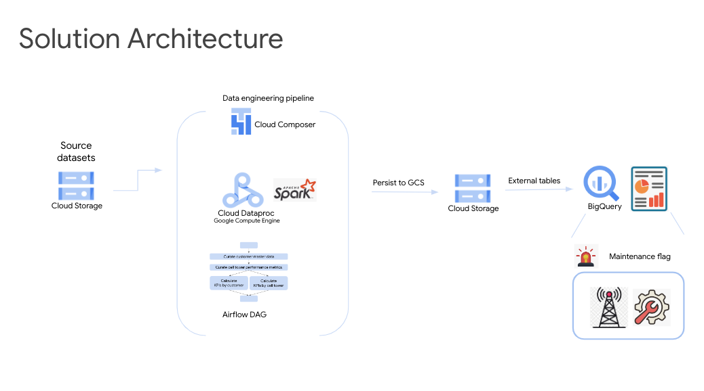   
<br><br>

<hr>

### 0.9. The data


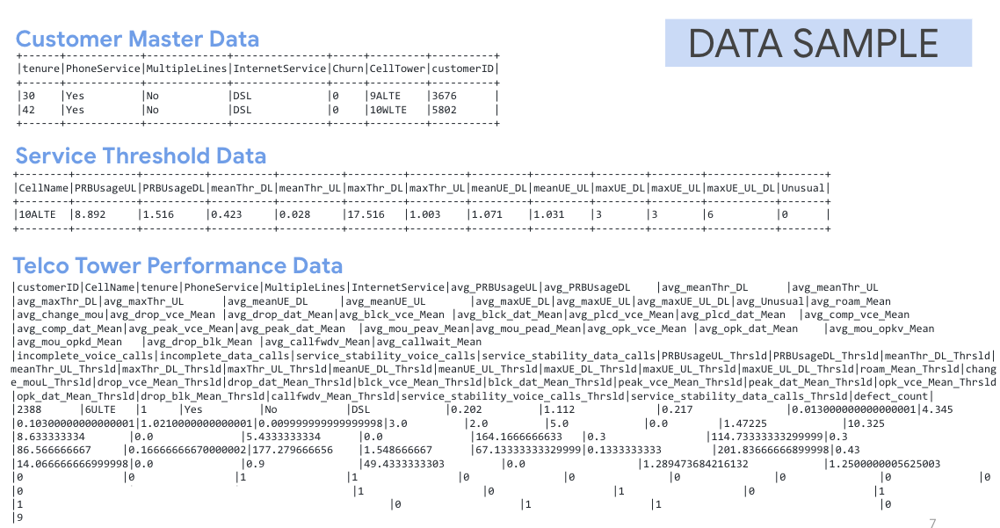   
<br><br>

<hr>

### 0.10. The relationships between the data entities


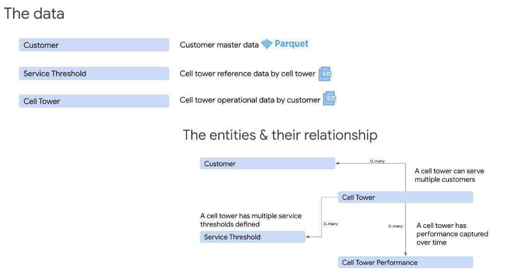   
<br><br>

### 0.11. The data engineering pipeline with a static cluster

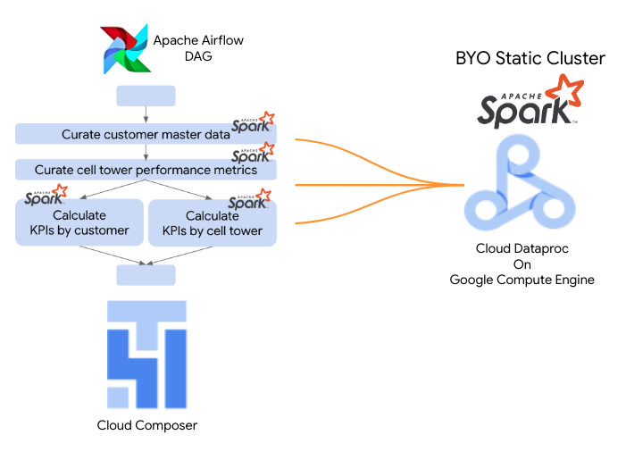   
<br><br>

### 0.12. The data engineering pipeline with an ephemeral cluster

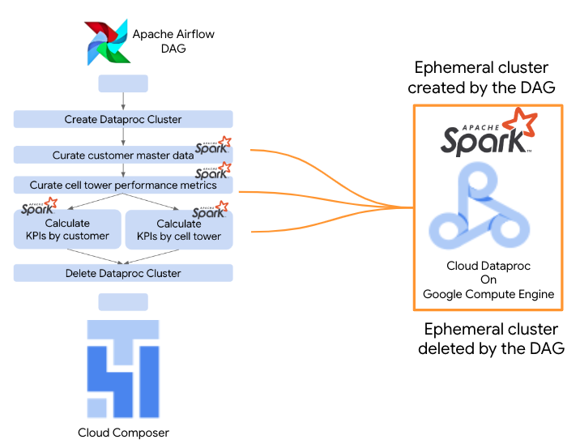   
<br><br>


### 0.13. Lab Flow

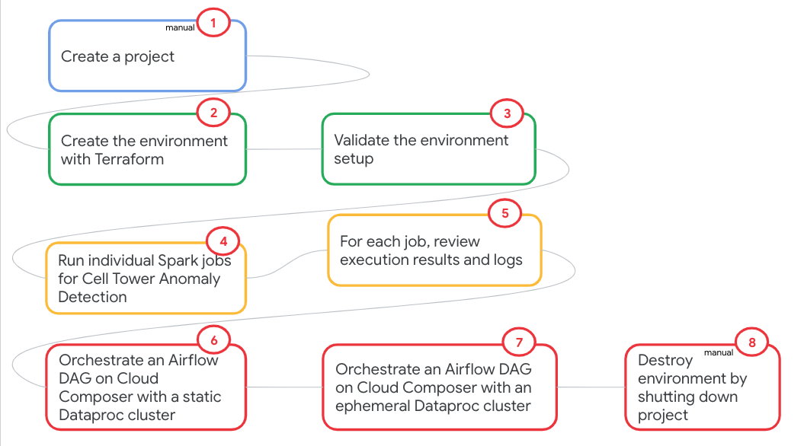   
<br><br>

<hr>

### 0.14. For success

Read the lab - narrative below, review the code, and then start trying out the lab.


<hr>

<hr>


## 1. Clone this repo in Cloud Shell

```
git clone https://github.com/anagha-google/dataproc-labs.git
```

<hr>

## 2. Foundational provisioning automation with Terraform 
The Terraform in this section updates organization policies and enables Google APIs.<br>

1. Paste this in Cloud Shell
```
PROJECT_ID=`gcloud config list --format "value(core.project)" 2>/dev/null`
cd ~/dataproc-labs/2-dataproc-gce-with-terraform/provisioning-automation/foundations-tf
```

2. Run the Terraform for organization policy edits and enabling Google APIs
```
terraform init
terraform apply \
  -var="project_id=${PROJECT_ID}" \
  -auto-approve >> dpgce-foundations-tf.output
```

**Note:** Wait till the provisioning completes (~10 minutes) before moving to the next section.


<hr>

## 3. Lab resources provisioning automation with Terraform 

### 3.1. Resources provisioned
In this section, we will provision-
1. Network, subnet, firewall rule
2. Storage buckets for code, datasets, and for use with the services
3. BigQuery datasets
4. Persistent Spark History Server
5. Dataproc Metastore
6. Cloud Composer 2
7. Dataproc on GCE cluster
8. User Managed Service Account
9. Requisite IAM permissions
10. Copy of code, data, etc into buckets
11. Import of Airflow DAG
12. Configuration of Airflow variables


### 3.2. Run the terraform scripts

1. Paste this in Cloud Shell after editing the GCP region variable to match your nearest region-

```
cd ~/dataproc-labs/2-dataproc-gce-with-terraform/provisioning-automation/core-tf/terraform
```

```
PROJECT_ID=`gcloud config list --format "value(core.project)" 2>/dev/null`
PROJECT_NBR=`gcloud projects describe $PROJECT_ID | grep projectNumber | cut -d':' -f2 |  tr -d "'" | xargs`
PROJECT_NAME=`gcloud projects describe ${PROJECT_ID} | grep name | cut -d':' -f2 | xargs`
GCP_ACCOUNT_NAME=`gcloud auth list --filter=status:ACTIVE --format="value(account)"`
GCP_REGION="us-central1"
DEPLOYER_ACCOUNT_NAME=$GCP_ACCOUNT_NAME
ORG_ID=`gcloud organizations list --format="value(name)"`
CC2_IMAGE_VERSION="composer-2.0.11-airflow-2.2.3"
```

2. Run the Terraform for provisioning the rest of the environment
```
terraform init
terraform apply \
  -var="project_id=${PROJECT_ID}" \
  -var="project_name=${PROJECT_NAME}" \
  -var="project_number=${PROJECT_NBR}" \
  -var="gcp_account_name=${GCP_ACCOUNT_NAME}" \
  -var="deployment_service_account_name=${DEPLOYER_ACCOUNT_NAME}" \
  -var="org_id=${ORG_ID}" \
  -var="cloud_composer_image_version=${CC2_IMAGE_VERSION}" \
  -var="gcp_region=${GCP_REGION}" \
  -auto-approve >> dpgce-core-tf.output
```

**Note:** Takes ~45 minutes to complete.

<br>

## 4. Explore the resources provisioned

Paste the following variables in Cloud Shell-
```
PROJECT_ID=`gcloud config list --format "value(core.project)" 2>/dev/null`
PROJECT_NBR=`gcloud projects describe $PROJECT_ID | grep projectNumber | cut -d':' -f2 |  tr -d "'" | xargs`
```

### 4.1. GCS bucket for code

Run this command in Cloud Shell-
```
gsutil ls -r gs://dpgce_data_and_code_bucket-${PROJECT_NBR}/scripts
```

### 4.2. GCS bucket for data

Run this command in Cloud Shell-
```
gsutil ls -r gs://dpgce_data_and_code_bucket-${PROJECT_NBR}/datasets
```

<br>

### 4.3. BigQuery dataset

Validate the creation of the BigQuery dataset called cell_tower_reporting_mart from the Cloud Console, BigQuery UI
<br>

### 4.4. Dataproc Metastore (DPMS)

- Validate the creation of the DPMS from the Cloud Console, Dataproc UI -> Metastore

### 4.5. Persistent Spark History Server (PHS)

- Validate the creation of the PHS from the Cloud Console, Dataproc UI -> Clusters
- The PHS has a name prefix - "dpgce-sphs-"
- Navigate to web interfaces, then "Spark History Server" and familiarize yourself with the UI

### 4.6. Dataproc on GCE cluster (DPGCE)

- Validate the creation of the Dataproc on GCE cluster from the Cloud Console, Dataproc UI -> Clusters
- The DPGCE has a name prefix - "	dpgce-cluster-static-"
- Click on all the tables of the cluster details and review the configuration
- Under configuration, check for the metastore configuration
- And check for the Spark History Server bucket configuration

### 4.7. Cloud Composer environment

From the Cloud Console, navigate to the Cloud Composer service and browse all the tabs of the deployed "environment".<br>
1. Review the Airflow variables
2. Click on the Airflow UI and view the two DAGs
3. Open the DAG called - "cell-tower-anomaly-detection-with-ephemeral-dpgce-cluster" and click on "code" and review the same
4. Open the DAG called - "cell-tower-anomaly-detection-on-static-dpgce-cluster" and click on "code" and review the same

<br>

<hr>

## 5. Run the Spark jobs individually

Paste the following variables in Cloud Shell
```
PROJECT_ID=`gcloud config list --format "value(core.project)" 2>/dev/null`
PROJECT_NBR=`gcloud projects describe $PROJECT_ID | grep projectNumber | cut -d':' -f2 |  tr -d "'" | xargs`
LOCATION=us-central1
VPC_NM=VPC=dpgce-vpc-$PROJECT_NBR
SPARK_SERVERLESS_SUBNET=spark-snet
PERSISTENT_HISTORY_SERVER_NM=dpgce-sphs-${PROJECT_NBR}
UMSA_FQN=dpgce-lab-sa@$PROJECT_ID.iam.gserviceaccount.com
CODE_AND_DATA_BUCKET=dpgce_data_and_code_bucket-${PROJECT_NBR}
DPGCE_CLUSTER_NAME=dpgce-cluster-static-${PROJECT_NBR}

echo $PROJECT_ID
echo $PROJECT_NBR
echo $LOCATION
echo $VPC_NM
echo $SPARK_SERVERLESS_SUBNET
echo $PERSISTENT_HISTORY_SERVER_NM
echo $UMSA_FQN
echo $CODE_AND_DATA_BUCKET
echo $DPGCE_CLUSTER_NAME

```

### 5.1. Curate customer master data

In this section, from PySpark, we transform customer master data (parquet) and service threshold data (CSV) and join them, and persist to GCS.<br><br>

#### 5.1.1. Abstract of the Pyspark script
This script -<br>
(a) Reads the customer master data<br>
(b) Reads the service threshold data<br>
(c) Subsets each of the datasets for relevant attributes<br>
(d) Then joins them both based on cell tower name and<br>
(e) Persists to GCS<br>

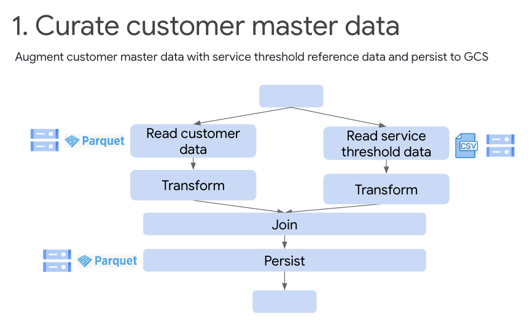   
<br><br>

<hr>

#### 5.1.2. Code

Review the [code](provisioning-automation/core-tf/scripts/pyspark/curate_customer_data.py) <br>

<hr>

#### 5.1.2. Run the command below in Cloud Shell
```
gcloud dataproc jobs submit pyspark \
--cluster $DPGCE_CLUSTER_NAME \
--id ctadws-manual-curate-customer-$RANDOM \
gs://$CODE_AND_DATA_BUCKET/scripts/pyspark/curate_customer_data.py \
--region $LOCATION \
--project $PROJECT_ID \
--jars gs://spark-lib/bigquery/spark-bigquery-with-dependencies_2.12-0.22.2.jar \
-- $CODE_AND_DATA_BUCKET

```

#### 5.1.3. Review execution in the Dataproc batches UI
Switch to Dataproc to check the execution under "batches". You should see a batch job called "ctadws-manual-curate-customer-..." there. Review its execution through completion. Review the code for the process and then explore the results in GCS.

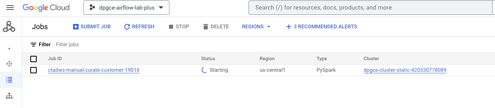   
<br><br>


#### 5.1.4. Review the intermediate console output

```
A) Customer data schema:

root
 |-- Index: long (nullable = true)
 |-- customerID: string (nullable = true)
 |-- gender: string (nullable = true)
 |-- SeniorCitizen: long (nullable = true)
 |-- Partner: string (nullable = true)
 |-- Dependents: string (nullable = true)
 |-- tenure: long (nullable = true)
 |-- PhoneService: string (nullable = true)
 |-- MultipleLines: string (nullable = true)
 |-- InternetService: string (nullable = true)
 |-- OnlineSecurity: string (nullable = true)
 |-- OnlineBackup: string (nullable = true)
 |-- DeviceProtection: string (nullable = true)
 |-- TechSupport: string (nullable = true)
 |-- StreamingTV: string (nullable = true)
 |-- StreamingMovies: string (nullable = true)
 |-- Contract: string (nullable = true)
 |-- PaperlessBilling: string (nullable = true)
 |-- PaymentMethod: string (nullable = true)
 |-- MonthlyCharges: double (nullable = true)
 |-- TotalCharges: string (nullable = true)
 |-- Churn: long (nullable = true)
 |-- CellTower: string (nullable = true)

B) Service threshold data schema:

root
 |-- Time: string (nullable = true)
 |-- CellName: string (nullable = true)
 |-- PRBUsageUL: double (nullable = true)
 |-- PRBUsageDL: double (nullable = true)
 |-- meanThr_DL: double (nullable = true)
 |-- meanThr_UL: double (nullable = true)
 |-- maxThr_DL: double (nullable = true)
 |-- maxThr_UL: double (nullable = true)
 |-- meanUE_DL: double (nullable = true)
 |-- meanUE_UL: double (nullable = true)
 |-- maxUE_DL: integer (nullable = true)
 |-- maxUE_UL: integer (nullable = true)
 |-- maxUE_UL+DL: integer (nullable = true)
 |-- Unusual: integer (nullable = true)

C) Subsetted customer data:
+------+------------+-------------+---------------+-----+---------+----------+
|tenure|PhoneService|MultipleLines|InternetService|Churn|CellTower|customerID|
+------+------------+-------------+---------------+-----+---------+----------+
|30    |Yes         |No           |DSL            |0    |9ALTE    |3676      |
|42    |Yes         |No           |DSL            |0    |10WLTE   |5802      |
|3     |Yes         |No           |DSL            |1    |6CLTE    |5179      |
|13    |Yes         |No           |Fiber optic    |1    |4VLTE    |1607      |
|12    |Yes         |Yes          |Fiber optic    |1    |8ULTE    |3610      |
|57    |Yes         |Yes          |Fiber optic    |1    |9WLTE    |6717      |
|32    |Yes         |Yes          |Fiber optic    |1    |4ALTE    |1809      |
|68    |Yes         |Yes          |DSL            |0    |3ULTE    |791       |
|8     |Yes         |No           |No             |0    |4WLTE    |792       |
|1     |Yes         |No           |No             |1    |4ALTE    |6789      |
+------+------------+-------------+---------------+-----+---------+----------+
only showing top 10 rows

D) Schema of the above-
root
 |-- tenure: long (nullable = true)
 |-- PhoneService: string (nullable = true)
 |-- MultipleLines: string (nullable = true)
 |-- InternetService: string (nullable = true)
 |-- Churn: long (nullable = true)
 |-- CellTower: string (nullable = true)
 |-- customerID: long (nullable = true)

E) Service threshold data-
+--------+----------+----------+----------+----------+---------+---------+---------+---------+--------+--------+-----------+-------+
|CellName|PRBUsageUL|PRBUsageDL|meanThr_DL|meanThr_UL|maxThr_DL|maxThr_UL|meanUE_DL|meanUE_UL|maxUE_DL|maxUE_UL|maxUE_UL_DL|Unusual|
+--------+----------+----------+----------+----------+---------+---------+---------+---------+--------+--------+-----------+-------+
|10ALTE  |8.892     |1.516     |0.423     |0.028     |17.516   |1.003    |1.071    |1.031    |3       |3       |6          |0      |
|10BLTE  |0.303     |0.404     |0.016     |0.013     |0.348    |0.168    |1.011    |1.011    |2       |1       |3          |0      |
|10CLTE  |7.8166    |0.9439    |0.2175    |0.0388    |4.332    |0.3604   |1.12     |1.0079   |4       |4       |8          |1      |
|1ALTE   |2.526     |0.707     |0.375     |0.02      |47.39    |0.623    |1.031    |1.021    |3       |2       |5          |0      |
|1BLTE   |22.0438   |2.0016    |0.562     |0.2697    |10.3994  |1.1771   |1.448    |1.163    |6       |5       |11         |1      |
|1CLTE   |33.751    |12.53     |1.807     |0.179     |14.49    |2.29     |2.072    |1.859    |9       |8       |17         |0      |
|2ALTE   |0.1033    |0.4246    |0.0095    |0.0063    |0.0512   |0.017    |1.0608   |0.0107   |2       |1       |3          |1      |
|3ALTE   |16.6015   |2.3348    |0.607     |0.0856    |24.7564  |1.2857   |1.2781   |1.1818   |6       |4       |10         |1      |
|3BLTE   |12.3848   |1.4019    |0.3927    |0.0438    |16.6522  |0.6806   |1.1293   |1.0491   |5       |3       |8          |1      |
|3CLTE   |7.175     |3.638     |1.705     |0.067     |43.851   |1.032    |1.142    |1.041    |4       |3       |7          |0      |
+--------+----------+----------+----------+----------+---------+---------+---------+---------+--------+--------+-----------+-------+
only showing top 10 rows

F) Schema of the above
root
 |-- CellName: string (nullable = true)
 |-- PRBUsageUL: double (nullable = true)
 |-- PRBUsageDL: double (nullable = true)
 |-- meanThr_DL: double (nullable = true)
 |-- meanThr_UL: double (nullable = true)
 |-- maxThr_DL: double (nullable = true)
 |-- maxThr_UL: double (nullable = true)
 |-- meanUE_DL: double (nullable = true)
 |-- meanUE_UL: double (nullable = true)
 |-- maxUE_DL: integer (nullable = true)
 |-- maxUE_UL: integer (nullable = true)
 |-- maxUE_UL_DL: integer (nullable = true)
 |-- Unusual: integer (nullable = true)

G) Dataset from joining the customer data and service threshold-
+------+------------+----------------+---------------+-----+---------+----------+--------+----------+----------+----------+----------+---------+---------+---------+---------+--------+--------+-----------+-------+
|tenure|PhoneService|MultipleLines   |InternetService|Churn|CellTower|customerID|CellName|PRBUsageUL|PRBUsageDL|meanThr_DL|meanThr_UL|maxThr_DL|maxThr_UL|meanUE_DL|meanUE_UL|maxUE_DL|maxUE_UL|maxUE_UL_DL|Unusual|
+------+------------+----------------+---------------+-----+---------+----------+--------+----------+----------+----------+----------+---------+---------+---------+---------+--------+--------+-----------+-------+
|59    |Yes         |No              |No             |0    |10ALTE   |6465      |10ALTE  |8.892     |1.516     |0.423     |0.028     |17.516   |1.003    |1.071    |1.031    |3       |3       |6          |0      |
|30    |Yes         |No              |No             |0    |10ALTE   |1797      |10ALTE  |8.892     |1.516     |0.423     |0.028     |17.516   |1.003    |1.071    |1.031    |3       |3       |6          |0      |
|51    |Yes         |No              |No             |0    |10ALTE   |6023      |10ALTE  |8.892     |1.516     |0.423     |0.028     |17.516   |1.003    |1.071    |1.031    |3       |3       |6          |0      |
|1     |Yes         |No              |No             |1    |10ALTE   |4065      |10ALTE  |8.892     |1.516     |0.423     |0.028     |17.516   |1.003    |1.071    |1.031    |3       |3       |6          |0      |
|21    |Yes         |No              |Fiber optic    |1    |10ALTE   |3868      |10ALTE  |8.892     |1.516     |0.423     |0.028     |17.516   |1.003    |1.071    |1.031    |3       |3       |6          |0      |
|27    |No          |No phone service|DSL            |1    |10ALTE   |6039      |10ALTE  |8.892     |1.516     |0.423     |0.028     |17.516   |1.003    |1.071    |1.031    |3       |3       |6          |0      |
|43    |Yes         |No              |DSL            |0    |10ALTE   |4440      |10ALTE  |8.892     |1.516     |0.423     |0.028     |17.516   |1.003    |1.071    |1.031    |3       |3       |6          |0      |
|1     |Yes         |No              |No             |0    |10ALTE   |6338      |10ALTE  |8.892     |1.516     |0.423     |0.028     |17.516   |1.003    |1.071    |1.031    |3       |3       |6          |0      |
|61    |Yes         |Yes             |Fiber optic    |0    |10ALTE   |1367      |10ALTE  |8.892     |1.516     |0.423     |0.028     |17.516   |1.003    |1.071    |1.031    |3       |3       |6          |0      |
|17    |Yes         |No              |No             |0    |10ALTE   |42        |10ALTE  |8.892     |1.516     |0.423     |0.028     |17.516   |1.003    |1.071    |1.031    |3       |3       |6          |0      |
+------+------------+----------------+---------------+-----+---------+----------+--------+----------+----------+----------+----------+---------+---------+---------+---------+--------+--------+-----------+-------+
only showing top 10 rows

H) Schema of the above-
root
 |-- tenure: long (nullable = true)
 |-- PhoneService: string (nullable = true)
 |-- MultipleLines: string (nullable = true)
 |-- InternetService: string (nullable = true)
 |-- Churn: long (nullable = true)
 |-- CellTower: string (nullable = true)
 |-- customerID: long (nullable = true)
 |-- CellName: string (nullable = true)
 |-- PRBUsageUL: double (nullable = true)
 |-- PRBUsageDL: double (nullable = true)
 |-- meanThr_DL: double (nullable = true)
 |-- meanThr_UL: double (nullable = true)
 |-- maxThr_DL: double (nullable = true)
 |-- maxThr_UL: double (nullable = true)
 |-- meanUE_DL: double (nullable = true)
 |-- meanUE_UL: double (nullable = true)
 |-- maxUE_DL: integer (nullable = true)
 |-- maxUE_UL: integer (nullable = true)
 |-- maxUE_UL_DL: integer (nullable = true)
 |-- Unusual: integer (nullable = true)
 
 ```
 
#### 5.1.5. Review the results in Cloud Storage
 
 ```
 gsutil ls -r gs://$CODE_AND_DATA_BUCKET/output_data/customer_augmented

 ```
 
The author's output-
```
gs://s8s_data_and_code_bucket-159504796045/output_data/customer_augmented/:
gs://s8s_data_and_code_bucket-159504796045/output_data/customer_augmented/
gs://s8s_data_and_code_bucket-159504796045/output_data/customer_augmented/_SUCCESS
gs://s8s_data_and_code_bucket-159504796045/output_data/customer_augmented/part-00000-b06a1fa4-3427-4d94-8ef7-e213fdd2a66f-c000.snappy.parquet
 ```

<hr>

### 5.2. Curate telecom performance data

In this section, from PySpark, we transform telco customer churn data, join with the augmented customer data, and persist to GCS.<br>

Review the [code](provisioning-automation/core-tf/scripts/pyspark/curate_telco_performance_data.py) first.<br>

#### 5.2.1. Abstract of the Pyspark script
This script -<br>
(a) Reads the curated customer data<br>
(b) Reads the telco customer churn data<br>
(c) Subsets each of the datasets for relevant attributes<br>
(d) Then joins them both based on customer ID and<br> 
(e) Persists to GCS

<br>

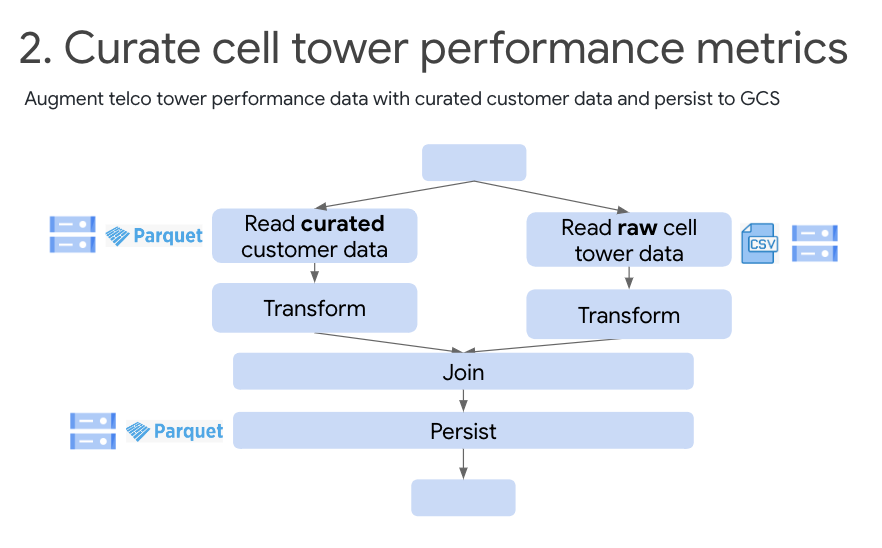   
<br><br>


#### 5.2.2. Execute the command below
```
gcloud dataproc jobs submit pyspark \
--cluster $DPGCE_CLUSTER_NAME \
--id ctadws-manual-curate-cell-tower-metrics-$RANDOM \
gs://$CODE_AND_DATA_BUCKET/scripts/pyspark/curate_telco_performance_data.py \
--region $LOCATION \
--project $PROJECT_ID \
--jars gs://spark-lib/bigquery/spark-bigquery-with-dependencies_2.12-0.22.2.jar \
-- $CODE_AND_DATA_BUCKET
```

#### 5.2.3. Review execution in the Dataproc batches UI
Switch to Dataproc to check the execution under "batches". You should see a batch job called "ctadws-manual-curate-cell-tower-metrics-..." there. Review its execution through completion. Review the code for the process and then explore the results in GCS.

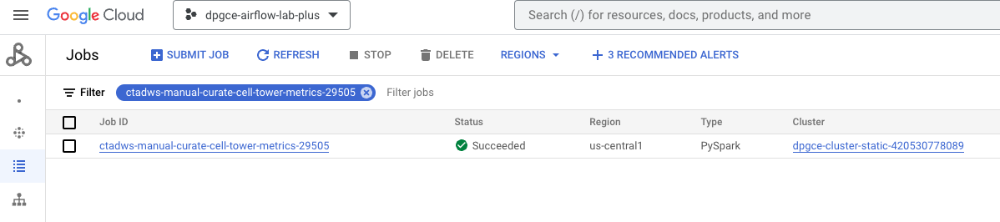   
<br><br>


#### 5.2.4. Review the console output
```

A) The telco customer churn data - schema
root
 |-- rev_Mean: double (nullable = true)
 |-- mou_Mean: double (nullable = true)
 |-- totmrc_Mean: double (nullable = true)
 |-- da_Mean: double (nullable = true)
 |-- ovrmou_Mean: double (nullable = true)
 |-- ovrrev_Mean: double (nullable = true)
 |-- vceovr_Mean: double (nullable = true)
 |-- datovr_Mean: double (nullable = true)
 |-- roam_Mean: double (nullable = true)
 |-- change_mou: double (nullable = true)
 |-- change_rev: double (nullable = true)
 |-- drop_vce_Mean: double (nullable = true)
 |-- drop_dat_Mean: double (nullable = true)
 |-- blck_vce_Mean: double (nullable = true)
 |-- blck_dat_Mean: double (nullable = true)
 |-- unan_vce_Mean: double (nullable = true)
 |-- unan_dat_Mean: double (nullable = true)
 |-- plcd_vce_Mean: double (nullable = true)
 |-- plcd_dat_Mean: double (nullable = true)
 |-- recv_vce_Mean: double (nullable = true)
 |-- recv_sms_Mean: double (nullable = true)
 |-- comp_vce_Mean: double (nullable = true)
 |-- comp_dat_Mean: double (nullable = true)
 |-- custcare_Mean: double (nullable = true)
 |-- ccrndmou_Mean: double (nullable = true)
 |-- cc_mou_Mean: double (nullable = true)
 |-- inonemin_Mean: double (nullable = true)
 |-- threeway_Mean: double (nullable = true)
 |-- mou_cvce_Mean: double (nullable = true)
 |-- mou_cdat_Mean: double (nullable = true)
 |-- mou_rvce_Mean: double (nullable = true)
 |-- owylis_vce_Mean: double (nullable = true)
 |-- mouowylisv_Mean: double (nullable = true)
 |-- iwylis_vce_Mean: double (nullable = true)
 |-- mouiwylisv_Mean: double (nullable = true)
 |-- peak_vce_Mean: double (nullable = true)
 |-- peak_dat_Mean: double (nullable = true)
 |-- mou_peav_Mean: double (nullable = true)
 |-- mou_pead_Mean: double (nullable = true)
 |-- opk_vce_Mean: double (nullable = true)
 |-- opk_dat_Mean: double (nullable = true)
 |-- mou_opkv_Mean: double (nullable = true)
 |-- mou_opkd_Mean: double (nullable = true)
 |-- drop_blk_Mean: double (nullable = true)
 |-- attempt_Mean: double (nullable = true)
 |-- complete_Mean: double (nullable = true)
 |-- callfwdv_Mean: double (nullable = true)
 |-- callwait_Mean: double (nullable = true)
 |-- churn: integer (nullable = true)
 |-- months: integer (nullable = true)
 |-- uniqsubs: integer (nullable = true)
 |-- actvsubs: integer (nullable = true)
 |-- new_cell: string (nullable = true)
 |-- crclscod: string (nullable = true)
 |-- asl_flag: string (nullable = true)
 |-- totcalls: integer (nullable = true)
 |-- totmou: double (nullable = true)
 |-- totrev: double (nullable = true)
 |-- adjrev: double (nullable = true)
 |-- adjmou: double (nullable = true)
 |-- adjqty: integer (nullable = true)
 |-- avgrev: double (nullable = true)
 |-- avgmou: double (nullable = true)
 |-- avgqty: double (nullable = true)
 |-- avg3mou: integer (nullable = true)
 |-- avg3qty: integer (nullable = true)
 |-- avg3rev: integer (nullable = true)
 |-- avg6mou: integer (nullable = true)
 |-- avg6qty: integer (nullable = true)
 |-- avg6rev: integer (nullable = true)
 |-- prizm_social_one: string (nullable = true)
 |-- area: string (nullable = true)
 |-- dualband: string (nullable = true)
 |-- refurb_new: string (nullable = true)
 |-- hnd_price: double (nullable = true)
 |-- phones: integer (nullable = true)
 |-- models: integer (nullable = true)
 |-- hnd_webcap: string (nullable = true)
 |-- truck: integer (nullable = true)
 |-- rv: integer (nullable = true)
 |-- ownrent: string (nullable = true)
 |-- lor: integer (nullable = true)
 |-- dwlltype: string (nullable = true)
 |-- marital: string (nullable = true)
 |-- adults: integer (nullable = true)
 |-- infobase: string (nullable = true)
 |-- income: integer (nullable = true)
 |-- numbcars: integer (nullable = true)
 |-- HHstatin: string (nullable = true)
 |-- dwllsize: string (nullable = true)
 |-- forgntvl: integer (nullable = true)
 |-- ethnic: string (nullable = true)
 |-- kid0_2: string (nullable = true)
 |-- kid3_5: string (nullable = true)
 |-- kid6_10: string (nullable = true)
 |-- kid11_15: string (nullable = true)
 |-- kid16_17: string (nullable = true)
 |-- creditcd: string (nullable = true)
 |-- eqpdays: integer (nullable = true)
 |-- Customer_ID: integer (nullable = true)

B) The telco customer churn data - sample
+---------+----------+-------------+-------------+-------------+-------------+-------------+-------------+-------------+-------------+-------------+-------------+-------------+-------------+------------+------------+-------------+-------------+-------------+-------------+-------------+-----+------+--------+--------+-----------------------------+--------+--------+--------------------+-----------+
|roam_Mean|change_mou|drop_vce_Mean|drop_dat_Mean|blck_vce_Mean|blck_dat_Mean|plcd_vce_Mean|plcd_dat_Mean|comp_vce_Mean|comp_dat_Mean|peak_vce_Mean|peak_dat_Mean|mou_peav_Mean|mou_pead_Mean|opk_vce_Mean|opk_dat_Mean|mou_opkv_Mean|mou_opkd_Mean|drop_blk_Mean|callfwdv_Mean|callwait_Mean|churn|months|uniqsubs|actvsubs|area                         |dualband|forgntvl|customer_ID_original|customer_ID|
+---------+----------+-------------+-------------+-------------+-------------+-------------+-------------+-------------+-------------+-------------+-------------+-------------+-------------+------------+------------+-------------+-------------+-------------+-------------+-------------+-----+------+--------+--------+-----------------------------+--------+--------+--------------------+-----------+
|0.0      |-157.25   |0.666666667  |0.0          |0.666666667  |0.0          |52.33333333  |0.0          |45.0         |0.0          |58.0         |0.0          |132.6        |0.0          |24.0        |0.0         |55.22        |0.0          |1.333333333  |0.0          |0.333333333  |1    |61    |2       |1       |NORTHWEST/ROCKY MOUNTAIN AREA|Y       |0       |1000001             |0001       |
|0.0      |532.25    |8.333333333  |0.0          |1.0          |0.0          |263.3333333  |0.0          |193.3333333  |0.0          |83.66666667  |0.0          |75.33333333  |0.0          |157.0       |0.0         |169.3433333  |0.0          |9.333333333  |0.0          |5.666666667  |0    |56    |1       |1       |CHICAGO AREA                 |N       |0       |1000002             |0002       |
|0.0      |-4.25     |0.333333333  |0.0          |0.0          |0.0          |9.0          |0.0          |6.0          |0.0          |5.0          |0.0          |5.193333333  |0.0          |1.0         |0.0         |0.233333333  |0.0          |0.333333333  |0.0          |0.0          |1    |58    |1       |1       |GREAT LAKES AREA             |N       |0       |1000003             |0003       |
|0.0      |-1.5      |0.0          |0.0          |0.0          |0.0          |3.666666667  |0.0          |3.666666667  |0.0          |1.333333333  |0.0          |3.38         |0.0          |3.666666667 |0.0         |5.45         |0.0          |0.0          |0.0          |0.0          |0    |60    |1       |1       |CHICAGO AREA                 |N       |0       |1000004             |0004       |
|0.0      |38.5      |9.666666667  |0.0          |0.666666667  |0.0          |222.3333333  |0.0          |137.0        |0.0          |97.33333333  |0.0          |173.4766667  |0.0          |90.33333333 |0.0         |218.0866667  |0.0          |10.33333333  |0.0          |0.0          |0    |57    |1       |1       |NEW ENGLAND AREA             |Y       |0       |1000005             |0005       |
|0.0      |156.75    |52.0         |0.0          |7.666666667  |0.0          |702.0        |0.0          |577.3333333  |0.0          |555.6666667  |0.0          |382.0966667  |0.0          |303.6666667 |0.0         |187.76       |0.0          |59.66666667  |0.0          |22.66666667  |0    |59    |2       |2       |GREAT LAKES AREA             |N       |0       |1000006             |0006       |
|0.0      |0.0       |0.0          |0.0          |0.0          |0.0          |0.0          |0.0          |0.0          |0.0          |0.0          |0.0          |0.0          |0.0          |0.0         |0.0         |0.0          |0.0          |0.0          |0.0          |0.0          |1    |53    |2       |2       |DALLAS AREA                  |Y       |0       |1000007             |0007       |
|0.0      |147.5     |9.0          |0.0          |1.666666667  |0.0          |97.0         |0.0          |73.33333333  |0.0          |33.33333333  |0.0          |81.06666667  |0.0          |53.0        |0.0         |431.1533333  |0.0          |10.66666667  |0.0          |0.666666667  |0    |53    |1       |1       |DALLAS AREA                  |Y       |1       |1000008             |0008       |
|0.0      |198.0     |12.66666667  |0.0          |3.0          |0.0          |533.6666667  |0.0          |346.6666667  |0.0          |238.3333333  |0.0          |377.4533333  |0.0          |192.3333333 |0.0         |297.32       |0.0          |15.66666667  |0.0          |4.0          |0    |55    |1       |1       |CHICAGO AREA                 |Y       |0       |1000009             |0009       |
|0.0      |59.5      |0.0          |0.0          |1.0          |0.0          |6.666666667  |0.0          |3.333333333  |0.0          |1.666666667  |0.0          |1.866666667  |0.0          |1.666666667 |0.0         |1.933333333  |0.0          |1.0          |0.0          |0.0          |0    |57    |2       |2       |DALLAS AREA                  |Y       |1       |1000010             |0010       |
+---------+----------+-------------+-------------+-------------+-------------+-------------+-------------+-------------+-------------+-------------+-------------+-------------+-------------+------------+------------+-------------+-------------+-------------+-------------+-------------+-----+------+--------+--------+-----------------------------+--------+--------+--------------------+-----------+
only showing top 10 rows

C) The joined/consolidated dataset
+------+------------+----------------+---------------+-----+---------+----------+--------+----------+----------+----------+----------+---------+---------+---------+---------+--------+--------+-----------+-------+---------+----------+-------------+-------------+-------------+-------------+-------------+-------------+-------------+-------------+-------------+-------------+-------------+-------------+------------+------------+-------------+-------------+-------------+-------------+-------------+------+--------+--------+-----------------------------+--------+--------+--------------------+
|tenure|PhoneService|MultipleLines   |InternetService|Churn|CellTower|customerID|CellName|PRBUsageUL|PRBUsageDL|meanThr_DL|meanThr_UL|maxThr_DL|maxThr_UL|meanUE_DL|meanUE_UL|maxUE_DL|maxUE_UL|maxUE_UL_DL|Unusual|roam_Mean|change_mou|drop_vce_Mean|drop_dat_Mean|blck_vce_Mean|blck_dat_Mean|plcd_vce_Mean|plcd_dat_Mean|comp_vce_Mean|comp_dat_Mean|peak_vce_Mean|peak_dat_Mean|mou_peav_Mean|mou_pead_Mean|opk_vce_Mean|opk_dat_Mean|mou_opkv_Mean|mou_opkd_Mean|drop_blk_Mean|callfwdv_Mean|callwait_Mean|months|uniqsubs|actvsubs|area                         |dualband|forgntvl|customer_ID_original|
+------+------------+----------------+---------------+-----+---------+----------+--------+----------+----------+----------+----------+---------+---------+---------+---------+--------+--------+-----------+-------+---------+----------+-------------+-------------+-------------+-------------+-------------+-------------+-------------+-------------+-------------+-------------+-------------+-------------+------------+------------+-------------+-------------+-------------+-------------+-------------+------+--------+--------+-----------------------------+--------+--------+--------------------+
|34    |Yes         |No              |DSL            |0    |7VLTE    |1         |7VLTE   |1.415     |2.021     |0.477     |0.053     |22.06    |8.151    |1.122    |0.01     |3       |3       |6          |0      |0.0      |-157.25   |0.666666667  |0.0          |0.666666667  |0.0          |52.33333333  |0.0          |45.0         |0.0          |58.0         |0.0          |132.6        |0.0          |24.0        |0.0         |55.22        |0.0          |1.333333333  |0.0          |0.333333333  |61    |2       |1       |NORTHWEST/ROCKY MOUNTAIN AREA|Y       |0       |1000001             |
|2     |Yes         |No              |DSL            |1    |10CLTE   |2         |10CLTE  |7.8166    |0.9439    |0.2175    |0.0388    |4.332    |0.3604   |1.12     |1.0079   |4       |4       |8          |1      |0.0      |532.25    |8.333333333  |0.0          |1.0          |0.0          |263.3333333  |0.0          |193.3333333  |0.0          |83.66666667  |0.0          |75.33333333  |0.0          |157.0       |0.0         |169.3433333  |0.0          |9.333333333  |0.0          |5.666666667  |56    |1       |1       |CHICAGO AREA                 |N       |0       |1000002             |
|45    |No          |No phone service|DSL            |0    |6CLTE    |3         |6CLTE   |4.143     |0.505     |0.021     |0.013     |0.409    |0.437    |1.021    |0.01     |2       |2       |4          |0      |0.0      |-4.25     |0.333333333  |0.0          |0.0          |0.0          |9.0          |0.0          |6.0          |0.0          |5.0          |0.0          |5.193333333  |0.0          |1.0         |0.0         |0.233333333  |0.0          |0.333333333  |0.0          |0.0          |58    |1       |1       |GREAT LAKES AREA             |N       |0       |1000003             |
|2     |Yes         |No              |Fiber optic    |1    |4ALTE    |4         |4ALTE   |1.9963    |1.1513    |0.9908    |0.0245    |64.7465  |0.8747   |1.0766   |1.0526   |3       |2       |5          |1      |0.0      |-1.5      |0.0          |0.0          |0.0          |0.0          |3.666666667  |0.0          |3.666666667  |0.0          |1.333333333  |0.0          |3.38         |0.0          |3.666666667 |0.0         |5.45         |0.0          |0.0          |0.0          |0.0          |60    |1       |1       |CHICAGO AREA                 |N       |0       |1000004             |
|22    |Yes         |Yes             |Fiber optic    |0    |6CLTE    |6         |6CLTE   |4.143     |0.505     |0.021     |0.013     |0.409    |0.437    |1.021    |0.01     |2       |2       |4          |0      |0.0      |156.75    |52.0         |0.0          |7.666666667  |0.0          |702.0        |0.0          |577.3333333  |0.0          |555.6666667  |0.0          |382.0966667  |0.0          |303.6666667 |0.0         |187.76       |0.0          |59.66666667  |0.0          |22.66666667  |59    |2       |2       |GREAT LAKES AREA             |N       |0       |1000006             |
|10    |No          |No phone service|DSL            |0    |6ULTE    |7         |6ULTE   |0.202     |1.112     |0.217     |0.013     |4.345    |0.103    |1.021    |0.01     |3       |2       |5          |0      |0.0      |0.0       |0.0          |0.0          |0.0          |0.0          |0.0          |0.0          |0.0          |0.0          |0.0          |0.0          |0.0          |0.0          |0.0         |0.0         |0.0          |0.0          |0.0          |0.0          |0.0          |53    |2       |2       |DALLAS AREA                  |Y       |0       |1000007             |
|62    |Yes         |No              |DSL            |0    |3CLTE    |9         |3CLTE   |7.175     |3.638     |1.705     |0.067     |43.851   |1.032    |1.142    |1.041    |4       |3       |7          |0      |0.0      |198.0     |12.66666667  |0.0          |3.0          |0.0          |533.6666667  |0.0          |346.6666667  |0.0          |238.3333333  |0.0          |377.4533333  |0.0          |192.3333333 |0.0         |297.32       |0.0          |15.66666667  |0.0          |4.0          |55    |1       |1       |CHICAGO AREA                 |Y       |0       |1000009             |
|16    |Yes         |No              |No             |0    |8ALTE    |11        |8ALTE   |8.589     |0.808     |0.126     |0.024     |8.344    |0.744    |1.101    |1.051    |5       |4       |9          |0      |0.0      |23.5      |0.0          |0.0          |0.333333333  |0.0          |19.33333333  |0.333333333  |15.0         |0.333333333  |7.666666667  |0.333333333  |66.07333333  |0.056666667  |7.333333333 |0.0         |70.42        |0.0          |0.333333333  |0.0          |0.0          |59    |2       |2       |DALLAS AREA                  |Y       |0       |1000011             |
|58    |Yes         |Yes             |Fiber optic    |0    |9ALTE    |12        |9ALTE   |15.966    |1.819     |0.415     |0.071     |10.116   |0.706    |1.364    |1.314    |6       |5       |11         |0      |0.0      |19.75     |0.0          |0.0          |0.0          |0.0          |9.0          |0.0          |8.0          |0.0          |9.333333333  |0.0          |7.17         |0.0          |1.666666667 |0.0         |0.75         |0.0          |0.0          |0.0          |0.0          |53    |3       |3       |CENTRAL/SOUTH TEXAS AREA     |N       |0       |1000012             |
|49    |Yes         |Yes             |Fiber optic    |1    |10CLTE   |13        |10CLTE  |7.8166    |0.9439    |0.2175    |0.0388    |4.332    |0.3604   |1.12     |1.0079   |4       |4       |8          |1      |0.0      |42.75     |0.0          |0.0          |0.0          |0.0          |0.0          |0.0          |0.0          |0.0          |0.0          |0.0          |0.0          |0.0          |0.0         |0.0         |0.0          |0.0          |0.0          |0.0          |0.0          |55    |1       |1       |GREAT LAKES AREA             |Y       |0       |1000013             |
|52    |Yes         |No              |No             |0    |8ALTE    |16        |8ALTE   |8.589     |0.808     |0.126     |0.024     |8.344    |0.744    |1.101    |1.051    |5       |4       |9          |0      |0.0      |201.5     |3.333333333  |0.0          |1.666666667  |0.0          |67.66666667  |0.0          |55.33333333  |0.0          |62.33333333  |0.0          |136.7966667  |0.0          |18.0        |0.0         |38.14333333  |0.0          |5.0          |0.0          |0.333333333  |55    |2       |2       |DALLAS AREA                  |Y       |0       |1000016             |
|10    |Yes         |No              |DSL            |1    |8BLTE    |18        |8BLTE   |1.92      |0.505     |0.051     |0.013     |2.179    |0.203    |1.041    |1.011    |3       |2       |5          |0      |0.0      |30.0      |2.0          |0.0          |0.666666667  |0.0          |53.0         |0.0          |33.33333333  |0.0          |48.33333333  |0.0          |77.15333333  |0.0          |7.0         |0.0         |6.086666667  |0.0          |2.666666667  |0.0          |0.333333333  |59    |3       |2       |NORTHWEST/ROCKY MOUNTAIN AREA|N       |0       |1000018             |
|1     |No          |No phone service|DSL            |1    |7WLTE    |20        |7WLTE   |1.415     |5.457     |0.662     |0.072     |40.261   |1.092    |1.334    |0.01     |5       |3       |8          |0      |0.0      |-58.0     |1.666666667  |0.0          |0.333333333  |0.0          |60.66666667  |1.333333333  |50.0         |1.333333333  |19.33333333  |0.0          |37.26666667  |0.0          |42.33333333 |1.333333333 |66.35333333  |2.373333333  |2.0          |0.0          |0.0          |56    |1       |1       |CHICAGO AREA                 |Y       |0       |1000020             |
|12    |Yes         |No              |No             |0    |3ALTE    |21        |3ALTE   |16.6015   |2.3348    |0.607     |0.0856    |24.7564  |1.2857   |1.2781   |1.1818   |6       |4       |10         |1      |0.0      |-1007.0   |7.333333333  |0.0          |18.0         |0.0          |760.3333333  |0.0          |622.0        |0.0          |718.0        |0.0          |1797.173333  |0.0          |60.33333333 |0.0         |115.5766667  |0.0          |25.33333333  |0.0          |20.33333333  |58    |2       |1       |TENNESSEE AREA               |Y       |0       |1000021             |
|30    |Yes         |No              |DSL            |0    |7BLTE    |25        |7BLTE   |0.505     |1.213     |0.265     |0.044     |14.784   |1.033    |1.324    |0.01     |6       |3       |9          |0      |0.0      |-47.5     |2.0          |0.0          |0.666666667  |0.0          |74.0         |0.0          |57.66666667  |0.0          |45.66666667  |0.0          |83.17333333  |0.0          |52.33333333 |0.0         |168.5633333  |0.0          |2.666666667  |0.0          |0.333333333  |52    |2       |2       |NORTHWEST/ROCKY MOUNTAIN AREA|Y       |0       |1000025             |
|1     |No          |No phone service|DSL            |1    |6BLTE    |27        |6BLTE   |5.255     |0.606     |0.124     |0.015     |5.714    |0.324    |1.031    |0.01     |3       |2       |5          |0      |0.0      |226.75    |19.66666667  |0.0          |3.666666667  |0.0          |175.6666667  |0.0          |124.6666667  |0.0          |110.6666667  |0.0          |135.0766667  |0.0          |72.0        |0.0         |120.4866667  |0.0          |23.33333333  |0.0          |4.333333333  |52    |1       |1       |NORTHWEST/ROCKY MOUNTAIN AREA|N       |0       |1000027             |
|72    |Yes         |Yes             |DSL            |0    |6ULTE    |28        |6ULTE   |0.202     |1.112     |0.217     |0.013     |4.345    |0.103    |1.021    |0.01     |3       |2       |5          |0      |0.0      |25.25     |4.0          |0.0          |0.0          |0.0          |343.0        |0.0          |297.6666667  |0.0          |206.3333333  |0.0          |367.47       |0.0          |170.3333333 |0.0         |386.9733333  |0.0          |4.0          |0.0          |0.0          |58    |1       |1       |GREAT LAKES AREA             |Y       |0       |1000028             |
|1     |Yes         |No              |DSL            |0    |10CLTE   |34        |10CLTE  |7.8166    |0.9439    |0.2175    |0.0388    |4.332    |0.3604   |1.12     |1.0079   |4       |4       |8          |1      |0.0      |-15.5     |1.333333333  |0.0          |3.0          |0.0          |32.0         |0.333333333  |20.33333333  |0.333333333  |7.0          |0.0          |8.953333333  |0.0          |14.0        |0.333333333 |25.91333333  |1.29         |4.333333333  |0.0          |0.0          |58    |1       |1       |MIDWEST AREA                 |T       |1       |1000034             |
|72    |Yes         |Yes             |Fiber optic    |0    |6CLTE    |35        |6CLTE   |4.143     |0.505     |0.021     |0.013     |0.409    |0.437    |1.021    |0.01     |2       |2       |4          |0      |0.0      |41.25     |0.333333333  |0.0          |0.0          |0.0          |17.33333333  |0.0          |16.0         |0.0          |31.66666667  |0.0          |32.44333333  |0.0          |6.333333333 |0.0         |8.61         |0.0          |0.333333333  |0.0          |0.333333333  |56    |2       |1       |NORTHWEST/ROCKY MOUNTAIN AREA|Y       |0       |1000035             |
|34    |Yes         |Yes             |Fiber optic    |1    |9ALTE    |38        |9ALTE   |15.966    |1.819     |0.415     |0.071     |10.116   |0.706    |1.364    |1.314    |6       |5       |11         |0      |0.0      |26.25     |0.0          |0.0          |0.0          |0.0          |34.66666667  |0.0          |16.0         |0.0          |21.66666667  |0.0          |42.21333333  |0.0          |5.666666667 |0.0         |18.93        |0.0          |0.0          |0.0          |0.0          |52    |1       |1       |NORTHWEST/ROCKY MOUNTAIN AREA|N       |0       |1000038             |
+------+------------+----------------+---------------+-----+---------+----------+--------+----------+----------+----------+----------+---------+---------+---------+---------+--------+--------+-----------+-------+---------+----------+-------------+-------------+-------------+-------------+-------------+-------------+-------------+-------------+-------------+-------------+-------------+-------------+------------+------------+-------------+-------------+-------------+-------------+-------------+------+--------+--------+-----------------------------+--------+--------+--------------------+
only showing top 20 rows

```

#### 5.2.4. List the results in the GCS bucket
```
gsutil ls -r gs://$CODE_AND_DATA_BUCKET/output_data/telco_performance_augmented
```
The author's output-
```
gs://s8s_data_and_code_bucket-159504796045/output_data/telco_performance_augmented/:
gs://s8s_data_and_code_bucket-159504796045/output_data/telco_performance_augmented/
gs://s8s_data_and_code_bucket-159504796045/output_data/telco_performance_augmented/_SUCCESS
gs://s8s_data_and_code_bucket-159504796045/output_data/telco_performance_augmented/part-00000-06106efe-4190-47b2-8565-098ef060f325-c000.snappy.parquet
gs://s8s_data_and_code_bucket-159504796045/output_data/telco_performance_augmented/part-00001-06106efe-4190-47b2-8565-098ef060f325-c000.snappy.parquet
gs://s8s_data_and_code_bucket-159504796045/output_data/telco_performance_augmented/part-00002-06106efe-4190-47b2-8565-098ef060f325-c000.snappy.parquet
gs://s8s_data_and_code_bucket-159504796045/output_data/telco_performance_augmented/part-00003-06106efe-4190-47b2-8565-098ef060f325-c000.snappy.parquet
gs://s8s_data_and_code_bucket-159504796045/output_data/telco_performance_augmented/part-00004-06106efe-4190-47b2-8565-098ef060f325-c000.snappy.parquet
gs://s8s_data_and_code_bucket-159504796045/output_data/telco_performance_augmented/part-00005-06106efe-4190-47b2-8565-098ef060f325-c000.snappy.parquet
gs://s8s_data_and_code_bucket-159504796045/output_data/telco_performance_augmented/part-00006-06106efe-4190-47b2-8565-098ef060f325-c000.snappy.parquet
gs://s8s_data_and_code_bucket-159504796045/output_data/telco_performance_augmented/part-00007-06106efe-4190-47b2-8565-098ef060f325-c000.snappy.parquet
```
This output will be used in subsequent steps.

<hr>

### 5.3. Calculate Cell Tower performance metrics by customer

In this section, from PySpark, we analyze the curated telecom data, and calculate the KPIs by customer.<br>

Review the [code](provisioning-automation/core-tf/scripts/pyspark/kpis_by_customer.py) first.<br>

#### 5.3.1. Abstract of the Pyspark script
This script -<br>
(a) Reads the curated telecom data <br>
(b) Add a number of derived metrics <br>
(c) that constitute performance indicators and <br>
(d) persists to GCS as parquet and <br>
(e) also creates an external table in BigQuery on the same dataset

<br>

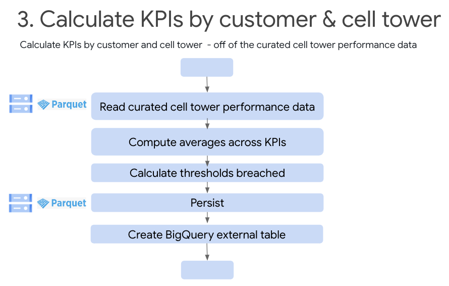   
<br><br>

<hr>


#### 5.3.1. Abstract of the Pyspark script
This script -<br>
(a) Reads the curated telecom data <br>
(b) Add a number of derived metrics <br>
(c) that constitute performance indicators and <br>
(d) persists to GCS as parquet and <br>
(e) also creates an external table in BigQuery on the same dataset

#### 5.3.2. Execute the command below
```
gcloud dataproc jobs submit pyspark \
--cluster $DPGCE_CLUSTER_NAME \
--id ctadws-manual-kpis-by-customer-$RANDOM \
gs://$CODE_AND_DATA_BUCKET/scripts/pyspark/kpis_by_customer.py \
--region $LOCATION \
--project $PROJECT_ID \
--jars gs://spark-lib/bigquery/spark-bigquery-with-dependencies_2.12-0.22.2.jar \
-- $PROJECT_ID "cell_tower_reporting_mart" $CODE_AND_DATA_BUCKET
```


#### 5.3.3. Review execution in the Dataproc batches UI
Switch to Dataproc to check the execution under "batches". You should see a batch job called "ctadws-manual-kpis-by-customer-..." there. Review its execution through completion. Review the code for the process and then explore the results in GCS.

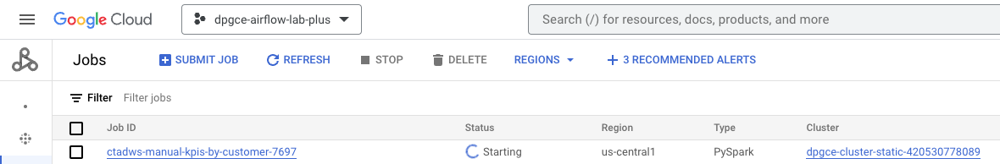   
<br><br>

#### 5.3.4. Review the console output from the application
```
root
 |-- tenure: long (nullable = true)
 |-- PhoneService: string (nullable = true)
 |-- MultipleLines: string (nullable = true)
 |-- InternetService: string (nullable = true)
 |-- Churn: long (nullable = true)
 |-- CellTower: string (nullable = true)
 |-- customerID: long (nullable = true)
 |-- CellName: string (nullable = true)
 |-- PRBUsageUL: double (nullable = true)
 |-- PRBUsageDL: double (nullable = true)
 |-- meanThr_DL: double (nullable = true)
 |-- meanThr_UL: double (nullable = true)
 |-- maxThr_DL: double (nullable = true)
 |-- maxThr_UL: double (nullable = true)
 |-- meanUE_DL: double (nullable = true)
 |-- meanUE_UL: double (nullable = true)
 |-- maxUE_DL: integer (nullable = true)
 |-- maxUE_UL: integer (nullable = true)
 |-- maxUE_UL_DL: integer (nullable = true)
 |-- Unusual: integer (nullable = true)
 |-- roam_Mean: double (nullable = true)
 |-- change_mou: double (nullable = true)
 |-- drop_vce_Mean: double (nullable = true)
 |-- drop_dat_Mean: double (nullable = true)
 |-- blck_vce_Mean: double (nullable = true)
 |-- blck_dat_Mean: double (nullable = true)
 |-- plcd_vce_Mean: double (nullable = true)
 |-- plcd_dat_Mean: double (nullable = true)
 |-- comp_vce_Mean: double (nullable = true)
 |-- comp_dat_Mean: double (nullable = true)
 |-- peak_vce_Mean: double (nullable = true)
 |-- peak_dat_Mean: double (nullable = true)
 |-- mou_peav_Mean: double (nullable = true)
 |-- mou_pead_Mean: double (nullable = true)
 |-- opk_vce_Mean: double (nullable = true)
 |-- opk_dat_Mean: double (nullable = true)
 |-- mou_opkv_Mean: double (nullable = true)
 |-- mou_opkd_Mean: double (nullable = true)
 |-- drop_blk_Mean: double (nullable = true)
 |-- callfwdv_Mean: double (nullable = true)
 |-- callwait_Mean: double (nullable = true)
 |-- months: integer (nullable = true)
 |-- uniqsubs: integer (nullable = true)
 |-- actvsubs: integer (nullable = true)
 |-- area: string (nullable = true)
 |-- dualband: string (nullable = true)
 |-- forgntvl: integer (nullable = true)
 |-- customer_ID_original: integer (nullable = true)

22/05/07 02:38:56 WARN package: Truncated the string representation of a plan since it was too large. This behavior can be adjusted by setting 'spark.sql.debug.maxToStringFields'.
+----------+--------+------+------------+-------------+---------------+--------------+------------------+--------------------+--------------------+-------------+-------------------+------------------+--------------------+------------+------------+---------------+-----------+-------------------+--------------+------------------+-----------------+------------------+-----------------+-----------------+-------------------+------------------+-----------------+-----------------+-------------------+-----------------+-----------------+-----------------+--------------------+------------------+--------------------+------------------+-----------------+------------------+----------------------+---------------------+-----------------------------+----------------------------+-----------------+-----------------+-----------------+-----------------+----------------+----------------+----------------+----------------+---------------+---------------+------------------+----------------+------------------+--------------------+--------------------+--------------------+--------------------+--------------------+--------------------+-------------------+-------------------+--------------------+--------------------+------------------------------------+-----------------------------------+------------+
|customerID|CellName|tenure|PhoneService|MultipleLines|InternetService|avg_PRBUsageUL|avg_PRBUsageDL    |avg_meanThr_DL      |avg_meanThr_UL      |avg_maxThr_DL|avg_maxThr_UL      |avg_meanUE_DL     |avg_meanUE_UL       |avg_maxUE_DL|avg_maxUE_UL|avg_maxUE_UL_DL|avg_Unusual|avg_roam_Mean      |avg_change_mou|avg_drop_vce_Mean |avg_drop_dat_Mean|avg_blck_vce_Mean |avg_blck_dat_Mean|avg_plcd_vce_Mean|avg_plcd_dat_Mean  |avg_comp_vce_Mean |avg_comp_dat_Mean|avg_peak_vce_Mean|avg_peak_dat_Mean  |avg_mou_peav_Mean|avg_mou_pead_Mean|avg_opk_vce_Mean |avg_opk_dat_Mean    |avg_mou_opkv_Mean |avg_mou_opkd_Mean   |avg_drop_blk_Mean |avg_callfwdv_Mean|avg_callwait_Mean |incomplete_voice_calls|incomplete_data_calls|service_stability_voice_calls|service_stability_data_calls|PRBUsageUL_Thrsld|PRBUsageDL_Thrsld|meanThr_DL_Thrsld|meanThr_UL_Thrsld|maxThr_DL_Thrsld|maxThr_UL_Thrsld|meanUE_DL_Thrsld|meanUE_UL_Thrsld|maxUE_DL_Thrsld|maxUE_UL_Thrsld|maxUE_UL_DL_Thrsld|roam_Mean_Thrsld|change_mouL_Thrsld|drop_vce_Mean_Thrsld|drop_dat_Mean_Thrsld|blck_vce_Mean_Thrsld|blck_dat_Mean_Thrsld|peak_vce_Mean_Thrsld|peak_dat_Mean_Thrsld|opk_vce_Mean_Thrsld|opk_dat_Mean_Thrsld|drop_blk_Mean_Thrsld|callfwdv_Mean_Thrsld|service_stability_voice_calls_Thrsld|service_stability_data_calls_Thrsld|defect_count|
+----------+--------+------+------------+-------------+---------------+--------------+------------------+--------------------+--------------------+-------------+-------------------+------------------+--------------------+------------+------------+---------------+-----------+-------------------+--------------+------------------+-----------------+------------------+-----------------+-----------------+-------------------+------------------+-----------------+-----------------+-------------------+-----------------+-----------------+-----------------+--------------------+------------------+--------------------+------------------+-----------------+------------------+----------------------+---------------------+-----------------------------+----------------------------+-----------------+-----------------+-----------------+-----------------+----------------+----------------+----------------+----------------+---------------+---------------+------------------+----------------+------------------+--------------------+--------------------+--------------------+--------------------+--------------------+--------------------+-------------------+-------------------+--------------------+--------------------+------------------------------------+-----------------------------------+------------+
|2388      |6ULTE   |1     |Yes         |No           |DSL            |0.202         |1.112             |0.217               |0.013000000000000001|4.345        |0.10300000000000001|1.0210000000000001|0.009999999999999998|3.0         |2.0         |5.0            |0.0        |1.47225            |10.325        |8.633333334       |0.0              |5.4333333334      |0.0              |164.1666666633   |0.3                |114.73333333299999|0.3              |86.566666667     |0.16666666670000002|177.279666656    |1.548666667      |67.13333333329999|0.1333333333        |201.83666666899998|0.43                |14.066666666999998|0.0              |0.9               |49.4333333303         |0.0                  |1.289473684216132            |1.2500000005625003          |0                |0                |1                |1                |0               |0               |0               |0               |0              |0              |0                 |0               |0                 |1                   |0                   |1                   |0                   |1                   |1                   |0                  |1                  |0                   |1                   |1                                   |0                                  |9           |
|2774      |9ALTE   |6     |Yes         |No           |DSL            |15.966        |1.8189999999999997|0.4149999999999999  |0.07099999999999998 |10.116       |0.7059999999999998 |1.3640000000000003|1.314               |6.0         |5.0         |11.0           |0.0        |0.40650000000000003|-5.525        |9.566666667       |0.1333333333     |1.7000000001000004|0.0              |172.0999999957   |1.8                |119.46666667030001|1.666666667      |71.0333333333    |1.0                |138.8203333397   |1.002666667      |82.83333333099998|0.6666666667000001  |212.205333297     |0.5093333333000001  |11.4000000003     |0.0              |0.0666666667      |52.633333325399974    |0.13333333299999994  |0.8575452716535328           |1.4999999999249998          |1                |0                |1                |0                |0               |0               |1               |1               |1              |1              |1                 |1               |0                 |1                   |1                   |0                   |0                   |1                   |0                   |0                  |0                  |0                   |1                   |1                                   |0                                  |13          |
|3364      |10BLTE  |21    |Yes         |Yes          |Fiber optic    |0.303         |0.404             |0.016000000000000004|0.013000000000000001|0.348        |0.16799999999999998|1.0109999999999997|1.0109999999999997  |2.0         |1.0         |3.0            |0.0        |0.126              |-2.05         |2.4000000000999995|0.0              |1.3333333335      |0.0              |72.66666666030001|0.16666666670000002|49.033333334      |0.1333333333     |38.833333327     |0.1                |80.57633333229998|0.0053333333     |28.5333333337    |0.033333333300000004|95.73066666700001 |0.019333333299999998|3.7333333331999996|0.0              |0.4999999998999999|23.63333332630001     |0.033333333400000026 |1.360981308171763            |3.000000003                 |0                |0                |1                |1                |0               |0               |0               |1               |0              |0              |0                 |1               |0                 |0                   |0                   |0                   |0                   |1                   |1                   |1                  |1                  |1                   |1                   |1                                   |0                                  |11          |
+----------+--------+------+------------+-------------+---------------+--------------+------------------+--------------------+--------------------+-------------+-------------------+------------------+--------------------+------------+------------+---------------+-----------+-------------------+--------------+------------------+-----------------+------------------+-----------------+-----------------+-------------------+------------------+-----------------+-----------------+-------------------+-----------------+-----------------+-----------------+--------------------+------------------+--------------------+------------------+-----------------+------------------+----------------------+---------------------+-----------------------------+----------------------------+-----------------+-----------------+-----------------+-----------------+----------------+----------------+----------------+----------------+---------------+---------------+------------------+----------------+------------------+--------------------+--------------------+--------------------+--------------------+--------------------+--------------------+-------------------+-------------------+--------------------+--------------------+------------------------------------+-----------------------------------+------------+
only showing top 3 rows
```

Note the defect count which is a netric derived that indicates issues with the cell tower.<br>


#### 5.3.5. List the results in the GCS bucket
```
gsutil ls -r gs://$CODE_AND_DATA_BUCKET/output_data/kpis_by_customer
```
The author's output-
```
gs://s8s_data_and_code_bucket-159504796045/output_data/kpis_by_customer/:
gs://s8s_data_and_code_bucket-159504796045/output_data/kpis_by_customer/
gs://s8s_data_and_code_bucket-159504796045/output_data/kpis_by_customer/_SUCCESS
gs://s8s_data_and_code_bucket-159504796045/output_data/kpis_by_customer/part-00000-41caca8e-43f5-4509-9569-96dff7b7fb2c-c000.snappy.parquet
gs://s8s_data_and_code_bucket-159504796045/output_data/kpis_by_customer/part-00001-41caca8e-43f5-4509-9569-96dff7b7fb2c-c000.snappy.parquet
gs://s8s_data_and_code_bucket-159504796045/output_data/kpis_by_customer/part-00002-41caca8e-43f5-4509-9569-96dff7b7fb2c-c000.snappy.parquet
```
This output will be used in subsequent steps.

#### 5.3.6. Analyze results in BigQuery

Run the query below-
```
select customerID,CellName, defect_count from `cell_tower_reporting_mart.kpis_by_customer` limit 3
```

<hr>

### 5.4. Calculate performance metrics by Cell Tower and flag towers needing maintenance

In this section, from PySpark, we analyze the curated telecom data, and calculate the KPIs by customer and cell tower to flag cell towers needing maintenance.<br>

Review the [code](provisioning-automation/core-tf/scripts/pyspark/kpis_by_customer.py) first.<br>

#### 5.4.1. Abstract of the Pyspark script
This script -<br>
(a) Reads the curated telecom data <br>
(b) Add a number of derived metrics by cell tower <br>
(c) that constitute performance indicators and <br>
(d) persists to GCS as parquet and <br>
(e) also creates an external table in BigQuery on the same dataset

<br>

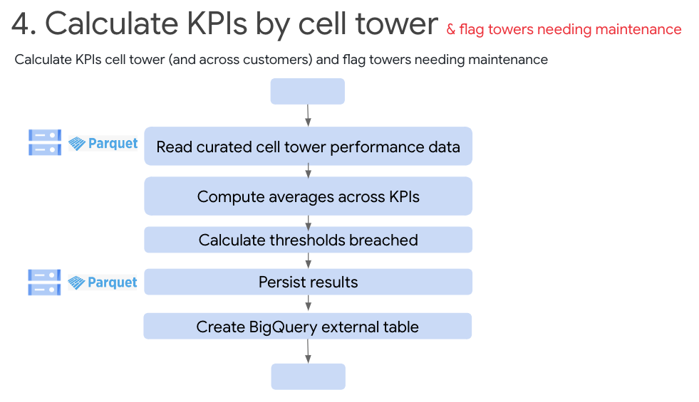   
<br><br>

<hr>


#### 5.4.2. Execute the command below
```
gcloud dataproc jobs submit pyspark \
--cluster $DPGCE_CLUSTER_NAME \
--id ctadws-manual-kpis-by-cell-tower-$RANDOM \
gs://$CODE_AND_DATA_BUCKET/scripts/pyspark/kpis_by_cell_tower.py \
--region $LOCATION \
--project $PROJECT_ID \
--jars gs://spark-lib/bigquery/spark-bigquery-with-dependencies_2.12-0.22.2.jar \
-- $PROJECT_ID "cell_tower_reporting_mart" $CODE_AND_DATA_BUCKET

```


#### 5.4.3. Review execution in the Dataproc batches UI
Switch to Dataproc to check the execution under "batches". You should see a batch job called "ctadws-manual-kpis-by-cell-tower-..." there. Review its execution through completion. Review the code for the process and then explore the results in GCS.

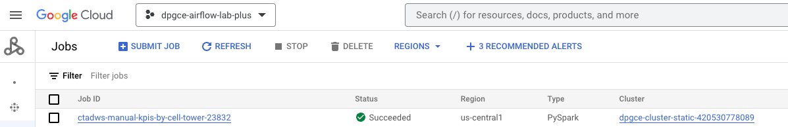   
<br><br>

#### 5.4.4. Review the console output from the application
```
root
 |-- tenure: long (nullable = true)
 |-- PhoneService: string (nullable = true)
 |-- MultipleLines: string (nullable = true)
 |-- InternetService: string (nullable = true)
 |-- Churn: long (nullable = true)
 |-- CellTower: string (nullable = true)
 |-- customerID: long (nullable = true)
 |-- CellName: string (nullable = true)
 |-- PRBUsageUL: double (nullable = true)
 |-- PRBUsageDL: double (nullable = true)
 |-- meanThr_DL: double (nullable = true)
 |-- meanThr_UL: double (nullable = true)
 |-- maxThr_DL: double (nullable = true)
 |-- maxThr_UL: double (nullable = true)
 |-- meanUE_DL: double (nullable = true)
 |-- meanUE_UL: double (nullable = true)
 |-- maxUE_DL: integer (nullable = true)
 |-- maxUE_UL: integer (nullable = true)
 |-- maxUE_UL_DL: integer (nullable = true)
 |-- Unusual: integer (nullable = true)
 |-- roam_Mean: double (nullable = true)
 |-- change_mou: double (nullable = true)
 |-- drop_vce_Mean: double (nullable = true)
 |-- drop_dat_Mean: double (nullable = true)
 |-- blck_vce_Mean: double (nullable = true)
 |-- blck_dat_Mean: double (nullable = true)
 |-- plcd_vce_Mean: double (nullable = true)
 |-- plcd_dat_Mean: double (nullable = true)
 |-- comp_vce_Mean: double (nullable = true)
 |-- comp_dat_Mean: double (nullable = true)
 |-- peak_vce_Mean: double (nullable = true)
 |-- peak_dat_Mean: double (nullable = true)
 |-- mou_peav_Mean: double (nullable = true)
 |-- mou_pead_Mean: double (nullable = true)
 |-- opk_vce_Mean: double (nullable = true)
 |-- opk_dat_Mean: double (nullable = true)
 |-- mou_opkv_Mean: double (nullable = true)
 |-- mou_opkd_Mean: double (nullable = true)
 |-- drop_blk_Mean: double (nullable = true)
 |-- callfwdv_Mean: double (nullable = true)
 |-- callwait_Mean: double (nullable = true)
 |-- months: integer (nullable = true)
 |-- uniqsubs: integer (nullable = true)
 |-- actvsubs: integer (nullable = true)
 |-- area: string (nullable = true)
 |-- dualband: string (nullable = true)
 |-- forgntvl: integer (nullable = true)
 |-- customer_ID_original: integer (nullable = true)

22/05/07 03:40:55 WARN package: Truncated the string representation of a plan since it was too large. This behavior can be adjusted by setting 'spark.sql.debug.maxToStringFields'.
+--------+----------------+------------------+-------------------+--------------------+--------------------+-------------------+-------------------+------------------+--------------------+------------+------------+---------------+-----------+------------------+-------------------+------------------+--------------------+------------------+--------------------+------------------+------------------+------------------+------------------+-----------------+-------------------+------------------+-------------------+------------------+-------------------+------------------+------------------+------------------+---------------------+------------------+-----------------------------+----------------------------+----------------------+---------------------+-----------------+-----------------+-----------------+-----------------+----------------+----------------+----------------+----------------+---------------+---------------+------------------+----------------+------------------+--------------------+--------------------+--------------------+--------------------+--------------------+--------------------+-------------------+-------------------+--------------------+--------------------+------------------------------------+-----------------------------------+
|CellName|customerID_count|avg_PRBUsageUL    |avg_PRBUsageDL     |avg_meanThr_DL      |avg_meanThr_UL      |avg_maxThr_DL      |avg_maxThr_UL      |avg_meanUE_DL     |avg_meanUE_UL       |avg_maxUE_DL|avg_maxUE_UL|avg_maxUE_UL_DL|avg_Unusual|avg_roam_Mean     |avg_change_mou     |avg_drop_vce_Mean |avg_drop_dat_Mean   |avg_blck_vce_Mean |avg_blck_dat_Mean   |avg_plcd_vce_Mean |avg_plcd_dat_Mean |avg_comp_vce_Mean |avg_comp_dat_Mean |avg_peak_vce_Mean|avg_peak_dat_Mean  |avg_mou_peav_Mean |avg_mou_pead_Mean  |avg_opk_vce_Mean  |avg_opk_dat_Mean   |avg_mou_opkv_Mean |avg_mou_opkd_Mean |avg_drop_blk_Mean |avg_callfwdv_Mean    |avg_callwait_Mean |service_stability_voice_calls|service_stability_data_calls|Incomplete_voice_calls|Incomplete_data_calls|PRBUsageUL_Thrsld|PRBUsageDL_Thrsld|meanThr_DL_Thrsld|meanThr_UL_Thrsld|maxThr_DL_Thrsld|maxThr_UL_Thrsld|meanUE_DL_Thrsld|meanUE_UL_Thrsld|maxUE_DL_Thrsld|maxUE_UL_Thrsld|maxUE_UL_DL_Thrsld|roam_Mean_Thrsld|change_mouL_Thrsld|drop_vce_Mean_Thrsld|drop_dat_Mean_Thrsld|blck_vce_Mean_Thrsld|blck_dat_Mean_Thrsld|peak_vce_Mean_Thrsld|peak_dat_Mean_Thrsld|opk_vce_Mean_Thrsld|opk_dat_Mean_Thrsld|drop_blk_Mean_Thrsld|callfwdv_Mean_Thrsld|service_stability_voice_calls_Thrsld|service_stability_data_calls_Thrsld|
+--------+----------------+------------------+-------------------+--------------------+--------------------+-------------------+-------------------+------------------+--------------------+------------+------------+---------------+-----------+------------------+-------------------+------------------+--------------------+------------------+--------------------+------------------+------------------+------------------+------------------+-----------------+-------------------+------------------+-------------------+------------------+-------------------+------------------+------------------+------------------+---------------------+------------------+-----------------------------+----------------------------+----------------------+---------------------+-----------------+-----------------+-----------------+-----------------+----------------+----------------+----------------+----------------+---------------+---------------+------------------+----------------+------------------+--------------------+--------------------+--------------------+--------------------+--------------------+--------------------+-------------------+-------------------+--------------------+--------------------+------------------------------------+-----------------------------------+
|9BLTE   |100             |0.5105000000000003|0.4258000000000001 |0.015199999999999997|0.010599999999999998|0.27549999999999986|0.16849999999999996|1.0379000000000003|1.0534999999999999  |1.0         |2.0         |3.0            |1.0        |1.1534000000033335|-4.134222222218892 |5.997333333296    |0.074666666662      |4.182000000069999 |0.025999999998      |144.04433333314097|1.4463333332890003|107.71733333328801|1.3053333333240003|90.00333333419199|0.589666666694     |181.04363999923   |0.728243333282     |64.295666666969   |0.715666666662     |165.15564666651102|1.438696666619    |10.280000000110999|0.001333333334       |1.760000000002    |1.399835136641175            |0.8239403819718376          |36.32699999985296     |0.140999999965       |0                |0                |1                |1                |0               |0               |0               |1               |0              |0              |0                 |1               |0                 |1                   |1                   |1                   |0                   |0                   |0                   |1                  |0                  |0                   |1                   |0                                   |1                                  |
|7ALTE   |78              |0.3015999999999999|1.9333999999999993 |0.6910000000000002  |0.07739999999999995 |27.644300000000005 |0.9661000000000006 |1.1826000000000005|0.010500000000000002|5.0         |2.0         |7.0            |1.0        |0.9609871794871796|-9.41801994301567  |5.522649572625641 |0.022649572643589744|3.6081196580987185|0.005982905980769232|137.95299145340257|0.9388888889576926|104.3059829056    |0.8931623930923078|85.59743589839742|0.2978632478538461 |167.79597863151668|0.5679914529961538 |62.05042735078332 |0.5952991452858973 |153.44808119780515|1.2904957264551284|9.159401709219232 |0.07564102564487178  |1.5594017094128205|1.3794818110518112           |0.500358937540209           |33.64700854780257     |0.0457264958653848   |0                |0                |0                |0                |1               |0               |0               |0               |1              |0              |0                 |1               |0                 |0                   |0                   |0                   |0                   |1                   |1                   |1                  |0                  |1                   |0                   |0                                   |1                                  |
|10BLTE  |102             |0.3030000000000001|0.40399999999999997|0.01600000000000001 |0.01300000000000001 |0.34800000000000025|0.1680000000000001 |1.0109999999999997|1.0109999999999997  |2.0         |1.0         |3.0            |0.0        |1.087627450980392 |-8.487881263649564 |6.033660130714706 |0.05228758169705883 |3.5849673202058825|0.010784313725490198|144.41928104466865|0.6578431372411765|108.98431372540101|0.5738562091137255|89.32941176632157|0.28071895424215687|174.54657516278138|0.7280588235166666 |64.6189542480147  |0.2931372548970588 |159.8404215682402 |0.6880392156960784|9.681699346381373 |0.019607843139215687 |1.5421568627294115|1.3824026217364243           |0.957636566327051           |35.43496731926764     |0.08398692812745101  |0                |0                |1                |1                |0               |0               |0               |1               |0              |0              |0                 |1               |0                 |1                   |1                   |0                   |0                   |0                   |1                   |1                  |1                  |1                   |0                   |0                                   |0                                  |
|4ALTE   |101             |1.9963            |1.1512999999999995 |0.9907999999999999  |0.02449999999999999 |64.7465            |0.8747000000000004 |1.0765999999999993|1.052599999999999   |3.0         |2.0         |5.0            |1.0        |1.5169262926289329|-17.602475247554455|6.213861386123762 |0.032673267324752474|4.046864686453465 |0.010561056103960395|150.39405940641288|0.8825082508188119|112.25511551149903|0.7933993398871287|93.01089108891287|0.4551155115089109 |177.77805280698215|0.8238019801306931 |68.11485148499999 |0.3382838283811881 |165.68636633829806|0.8198514851623763|10.303960396059406|0.00693069306930693  |1.8630363035930695|1.3655009012152863           |1.3453658535402213          |38.13894389491385     |0.08910891093168316  |0                |0                |0                |1                |1               |0               |0               |1               |0              |0              |0                 |0               |1                 |1                   |0                   |1                   |0                   |0                   |0                   |0                  |1                  |0                   |1                   |0                                   |0                                  |
|6WLTE   |98              |1.5730000000000002|3.738              |0.6115999999999996  |0.05939999999999997 |27.844399999999982 |0.9647000000000004 |1.3425999999999998|0.010500000000000004|6.0         |4.0         |10.0           |1.0        |1.308966836734354 |-13.579506802755098|5.846258503348981 |0.029931972785714286|3.7588435373346947|0.029931972782653058|142.50952380877447|1.0214285713357143|106.4459183674806 |0.9268707482346941|87.55544217688366|0.4105442177295918 |175.13057482989183|0.8403299320214287 |64.39761904812858 |0.5163265305693877 |162.35205782253266|1.4152653061908163|9.664965986421429 |0.007142857141836735 |1.7836734693612244|1.359606821976566            |0.7951251648387259          |36.06360544129387     |0.09455782310102023  |0                |1                |0                |0                |1               |0               |1               |0               |1              |1              |1                 |0               |1                 |0                   |0                   |0                   |0                   |1                   |0                   |1                  |0                  |1                   |1                   |0                                   |1                                  |
|8CLTE   |84              |4.849999999999997 |0.808              |0.19500000000000003 |0.04600000000000002 |9.762              |0.6099999999999998 |1.061             |1.0309999999999997  |3.0         |3.0         |6.0            |0.0        |1.7359431216927252|-11.07638888888889 |6.4099206349      |0.0428571428547619  |3.5091269840738097|0.009920634920238095|150.40119047773095|0.7055555554857142|112.6587301594    |0.6329365078845238|91.7242063492238 |0.316666666647619  |180.72847222013453|0.6650357142630952 |68.06666666595238 |0.3162698412523809 |174.32540873090835|0.7576666666750002|9.971825396765476 |3.9682539642857146E-4|1.7007936507809525|1.3475642460850101           |1.0012547051393417          |37.742460318330956    |0.07261904760119042  |0                |0                |1                |1                |0               |0               |0               |1               |0              |0              |0                 |0               |0                 |1                   |1                   |0                   |0                   |0                   |1                   |0                  |1                  |1                   |1                   |0                                   |0                                  |
|3BLTE   |91              |12.384799999999998|1.4018999999999997 |0.39269999999999977 |0.04379999999999999 |16.652199999999997 |0.6805999999999995 |1.1293000000000004|1.0490999999999997  |5.0         |3.0         |8.0            |1.0        |0.9070143467643468|-24.53522588522588 |5.5538461537999995|0.03223443222857143 |4.564835164803296 |0.010256410254945055|143.92307692344176|0.7864468864307691|108.13333333218793|0.7062271062153846|86.19047619015274|0.2809523809538461 |171.8656007320835 |0.5339010988901098 |65.13369963334836 |0.4252747252637363 |167.2095457893956 |1.2225531136384618|10.161172161183517|0.001098901098901099 |1.5930402930461538|1.3232854371137754           |0.66063738158813            |35.789743591253824    |0.08021978021538445  |1                |0                |1                |1                |0               |0               |0               |1               |1              |0              |1                 |1               |1                 |0                   |0                   |1                   |0                   |1                   |1                   |1                  |1                  |0                   |1                   |1                                   |1                                  |
|8BLTE   |93              |1.9200000000000013|0.5050000000000003 |0.051               |0.013000000000000008|2.1790000000000007 |0.20300000000000004|1.0410000000000001|1.0109999999999995  |3.0         |2.0         |5.0            |0.0        |1.4662341696535244|-13.262753882951014|6.208602150559138 |0.03727598565913979 |3.886021505255914 |0.050896057344086025|148.01541218624513|1.1756272401634411|111.0770609315473 |1.0290322580419353|89.2820788534742 |0.43655913977741934|176.94627240329035|0.8878637992376346 |68.32437275965592 |0.5924731183107527 |164.17772759923443|1.5598028673849462|10.182795698964515|0.0017921146946236562|1.8286738351075271|1.306738360665835            |0.7368421052116726          |36.938351254697835    |0.1465949821215058   |0                |0                |1                |1                |0               |0               |0               |1               |0              |0              |0                 |0               |1                 |1                   |0                   |0                   |1                   |0                   |0                   |0                  |0                  |0                   |1                   |1                                   |1                                  |
|6ULTE   |119             |0.202             |1.1120000000000012 |0.21699999999999992 |0.013000000000000008|4.345              |0.10300000000000008|1.0210000000000006|0.010000000000000005|3.0         |2.0         |5.0            |0.0        |0.9523879551817926|-16.02768440712418 |5.793837534976471 |0.03865546218067226 |4.175910364158823 |0.026890756297478998|143.32549019435461|1.096638655427731 |108.12268907698488|1.0056022408848744|88.85518207222269|0.49215686273193276|176.82341456607813|0.770952380984874  |64.65630252149664 |0.5134453781546218 |167.02180952602606|1.0027226890714287|10.035294117588236|0.008963585433613445 |1.709243697493277 |1.3742694618622913           |0.9585379159528084          |35.20280111736973     |0.0910364145428566   |0                |0                |1                |1                |0               |0               |0               |0               |0              |0              |0                 |1               |1                 |0                   |1                   |1                   |0                   |0                   |0                   |1                  |0                  |1                   |1                   |0                                   |0                                  |
|7WLTE   |90              |1.4149999999999996|5.456999999999996  |0.6620000000000001  |0.07200000000000002 |40.26099999999999  |1.0919999999999996 |1.3340000000000007|0.010000000000000004|5.0         |3.0         |8.0            |0.0        |0.957089814814815 |-13.948209876506171|5.701481481396666 |0.06444444444000001 |3.4651851851299997|0.027407407405555556|148.13222222282775|1.4074074073188891|112.5474074077489 |1.2785185185277779|92.24740740746222|0.5496296296488888 |183.05669629473115|1.048229629551111  |68.81333333381555 |0.7288888889233334 |177.03396296307113|1.3762555554744444|9.25851851848778  |0.0011111111111111111|2.0214814814533333|1.340545544567174            |0.754065040641195           |35.58481481507884     |0.12888888879111127  |0                |1                |0                |0                |1               |1               |1               |0               |1              |0              |1                 |1               |1                 |0                   |1                   |0                   |0                   |0                   |0                   |0                  |0                  |1                   |1                   |1                                   |1                                  |
|7BLTE   |92              |0.5050000000000003|1.2130000000000007 |0.26499999999999996 |0.04400000000000002 |14.783999999999997 |1.0330000000000004 |1.3240000000000003|0.010000000000000004|6.0         |3.0         |9.0            |0.0        |1.2442361111114733|-12.372373188405799|6.130797101444564 |0.027173913040217396|4.7065217389945655|0.03224637680652174 |146.25652173957937|1.0014492753532611|108.69746376780216|0.8702898550445652|87.36195652162608|0.39746376810434786|173.3982391308967 |0.7262210144608695 |66.13514492816522 |0.47282608694347844|167.05443115999566|1.1491702898380434|10.896739130406523|0.0076086956521739125|1.6992753623217394|1.3209611412588125           |0.8406130268185914          |37.55905797177721     |0.13115942030869587  |0                |0                |1                |1                |0               |1               |1               |0               |1              |0              |1                 |0               |0                 |1                   |0                   |1                   |0                   |1                   |1                   |1                  |0                  |0                   |1                   |1                                   |1                                  |
|3ALTE   |91              |16.60149999999999 |2.334800000000001  |0.6069999999999997  |0.08559999999999994 |24.756399999999992 |1.2856999999999992 |1.2781            |1.1818              |6.0         |4.0         |10.0           |1.0        |1.0250750915754578|-20.31736874240537 |6.575457875437364 |0.04652014651868132 |4.088278388242857 |0.014285714284615388|153.56446886287475|1.4413919413758243|114.93736263705274|1.341025640992308 |95.07326007376484|0.5578754578538461 |187.9873589728835 |2.0176190472604394 |71.42014651926593 |0.7831501831769231 |180.2737655688901 |3.304842490932967 |10.72454212437143 |0.008058608058241757 |2.3113553113758236|1.3311826523363177           |0.7123479887226372          |38.627106225822004    |0.10036630038351624  |1                |1                |0                |0                |1               |1               |1               |1               |1              |1              |1                 |1               |1                 |1                   |1                   |1                   |0                   |0                   |0                   |0                  |0                  |0                   |1                   |1                                   |1                                  |
|7VLTE   |94              |1.4149999999999996|2.0210000000000004 |0.47700000000000026 |0.052999999999999985|22.059999999999985 |8.151000000000003  |1.122             |0.010000000000000004|3.0         |3.0         |6.0            |0.0        |0.9721968085106383|-10.687049349917258|5.880496453857447 |0.03581560283297873 |3.6425531915734046|0.017021276590425533|142.6861702117383 |0.8195035460914895|106.72198581512555|0.7503546099053192|84.09858156062553|0.41914893620106386|161.58517730517767|0.7037163120202129 |66.8528368793883  |0.33120567370957443|168.87518085070639|0.6592375887223404|9.575886524780852 |0.005673758865957448 |1.729432624101064 |1.257965787036845            |1.2655246255491521          |35.96418439661275     |0.06914893618617024  |0                |0                |0                |1                |1               |1               |0               |0               |0              |0              |0                 |1               |0                 |0                   |0                   |0                   |0                   |1                   |0                   |0                  |1                  |1                   |1                   |1                                   |0                                  |
|6VLTE   |100             |1.6169999999999993|3.3349999999999977 |0.39799999999999985 |0.04099999999999999 |13.103000000000007 |1.390999999999999  |1.2329999999999997|0.010000000000000004|5.0         |4.0         |9.0            |0.0        |1.2656888888885556|-26.282361111144446|6.2356666666530005|0.016666666663999997|4.263999999925    |0.009999999999      |153.787333333083  |0.5806666666519998|115.700333333696  |0.526666666663    |91.227666666525  |0.24866666665999998|182.072316666189  |0.47396333332000007|71.629999999231   |0.27799999999999997|181.638696665807  |0.687873333276    |10.526333333264999|0.009666666666       |1.8659999999760004|1.2735957932082143           |0.8944844124460432          |38.08699999938702     |0.05399999998899985  |0                |1                |1                |1                |0               |1               |1               |0               |1              |1              |1                 |0               |1                 |1                   |0                   |1                   |0                   |0                   |1                   |0                  |1                  |0                   |1                   |1                                   |1                                  |
|9ALTE   |85              |15.966000000000005|1.8190000000000008 |0.41499999999999976 |0.07099999999999998 |10.11599999999999  |0.7059999999999997 |1.3639999999999999|1.314               |6.0         |5.0         |11.0           |0.0        |1.8342202614375163|-18.078986928065355|5.513725490171764 |0.03647058823176471 |4.294901960714118 |0.00901960784117647 |135.6160784304647 |1.0921568627082352|101.5290196079106 |1.0058823528658825|82.02352941158941|0.5368627450364707 |164.67821176617412|0.77825882352      |61.244313725028235|0.4690196078400001 |156.4292274505447 |1.2676627450905882|9.854117647055293 |0.004313725490588236 |1.5317647058635295|1.3392839991620233           |1.1446488293078239          |34.08705882255411     |0.08627450984235274  |1                |0                |1                |0                |0               |0               |1               |1               |1              |1              |1                 |0               |1                 |0                   |0                   |1                   |0                   |1                   |0                   |1                  |0                  |1                   |1                   |1                                   |0                                  |
|10ALTE  |94              |8.891999999999998 |1.515999999999999  |0.42299999999999993 |0.028000000000000014|17.516             |1.003              |1.0710000000000002|1.0309999999999995  |3.0         |3.0         |6.0            |0.0        |1.061690307328605 |-17.658451536643028|6.227659574457448 |0.03120567375319149 |3.5730496453563827|0.012056737587234042|148.7418439716053 |0.6999999999680852|112.82375886467342|0.631560283681915 |91.97588652524043|0.34078014183617017|174.3435035451979 |0.6280815602851064 |67.90709219934786 |0.2907801418404255 |164.32556382971916|0.5147765957319149|9.843971631213831 |0.0024822695031914894|1.8432624113202127|1.3544371220495834           |1.171951219499658           |35.91808510693188     |0.06843971628617018  |1                |0                |1                |1                |1               |0               |0               |1               |0              |0              |0                 |1               |1                 |1                   |0                   |0                   |0                   |0                   |1                   |0                  |1                  |1                   |1                   |0                                   |0                                  |
|4CLTE   |106             |26.879000000000012|3.031999999999998  |0.525               |0.12000000000000008 |9.145              |0.8939999999999992 |1.4249999999999994|1.2730000000000008  |6.0         |5.0         |11.0           |0.0        |0.8503453878409852|-17.932678197127885|5.612264150959433 |0.04496855345471698 |4.246226415048112 |0.017924528299056608|149.79937106933775|1.0588050313943398|112.73773584838113|0.9707547169820757|91.32672955988679|0.4789308176207547 |177.72784591239437|0.8702201257754718 |69.2971698113434  |0.4918238994009434 |178.28770754749814|1.3961823899122643|9.921383647680189 |0.003773584906603774 |1.9515723270339624|1.3178998479810546           |0.9737851662029989          |37.06163522095662     |0.08805031441226407  |1                |1                |0                |0                |0               |0               |1               |1               |1              |1              |1                 |1               |1                 |0                   |1                   |1                   |0                   |0                   |0                   |0                  |0                  |1                   |1                   |1                                   |0                                  |
|1BLTE   |91              |22.0438           |2.001599999999998  |0.5619999999999999  |0.2697000000000001  |10.399400000000009 |1.1770999999999998 |1.448             |1.1629999999999996  |6.0         |5.0         |11.0           |1.0        |0.9919676434676434|-1.568620268623931 |5.619780219778022 |0.04835164834835164 |4.475457875430769 |0.00952380952087912 |139.9545787547835 |0.9402930402329671|105.19597069544504|0.8472527472219781|85.21648351622967|0.41648351644175824|171.4922454218143 |0.7653663003263738 |62.46410256481427 |0.43076923076703294|160.19387545682417|1.480285714212088 |10.153113553132966|0.001465201463736264 |1.635164835165934 |1.364247303926395            |0.9668367346018717          |34.75860805933847     |0.09304029301098904  |1                |0                |0                |0                |0               |1               |1               |1               |1              |1              |1                 |1               |0                 |0                   |1                   |1                   |0                   |1                   |0                   |1                  |1                  |0                   |1                   |0                                   |0                                  |
|1ALTE   |122             |2.5259999999999976|0.7070000000000005 |0.375               |0.02000000000000001 |47.39000000000004  |0.6230000000000002 |1.0309999999999995|1.0210000000000006  |3.0         |2.0         |5.0            |0.0        |1.7902957650297813|-32.54568533700637 |6.182240437124589 |0.045901639345081964|4.44426229507623  |0.018032786885245903|149.56530054612787|0.9256830600926231|112.72049180367951|0.8284153005540984|91.07677595695903|0.43415300548442626|180.3914289607533 |0.9615081967090164 |70.58551912514098 |0.3942622950737705 |180.12923223830575|1.07330327867459  |10.690437158513117|0.019398907103278688 |2.142349726808196 |1.2903039757416692           |1.1011781012515838          |36.844808742448365    |0.09726775953852473  |0                |0                |1                |1                |1               |0               |0               |1               |0              |0              |0                 |0               |1                 |1                   |1                   |1                   |0                   |0                   |0                   |0                  |1                  |0                   |0                   |1                                   |0                                  |
|4BLTE   |72              |8.437600000000003 |1.4288999999999996 |0.3173000000000001  |0.02639999999999999 |26.159100000000002 |0.47659999999999997|1.1269999999999998|1.0604000000000002  |3.0         |4.0         |7.0            |1.0        |1.4098715277777776|2.8515432098765436 |5.729629629622223 |0.01851851851666667 |4.196296296204166 |0.026851851845833337|144.0240740748528 |1.4722222222249999|108.6490740740167 |1.389351851813889 |88.03888888843056|0.5398148147125    |173.7888611092708 |0.6918935184625001 |65.35787037024028 |0.8495370370694444 |168.77429629601525|1.160791666573611 |9.971296296147223 |0.004629629629166667 |1.5273148147972222|1.3470281144368152           |0.6354223431795752          |35.375000000836096    |0.0828703704111109   |1                |0                |1                |1                |1               |0               |0               |1               |0              |1              |0                 |0               |0                 |0                   |0                   |1                   |0                   |1                   |0                   |1                  |0                  |1                   |1                   |0                                   |1                                  |
+--------+----------------+------------------+-------------------+--------------------+--------------------+-------------------+-------------------+------------------+--------------------+------------+------------+---------------+-----------+------------------+-------------------+------------------+--------------------+------------------+--------------------+------------------+------------------+------------------+------------------+-----------------+-------------------+------------------+-------------------+------------------+-------------------+------------------+------------------+------------------+---------------------+------------------+-----------------------------+----------------------------+----------------------+---------------------+-----------------+-----------------+-----------------+-----------------+----------------+----------------+----------------+----------------+---------------+---------------+------------------+----------------+------------------+--------------------+--------------------+--------------------+--------------------+--------------------+--------------------+-------------------+-------------------+--------------------+--------------------+------------------------------------+-----------------------------------+
only showing top 20 rows


Sample of cell towers needing maintenance or not -
+--------+------------+---------------------+
|CellName|defect_count|Maintainence_Required|
+--------+------------+---------------------+
|9BLTE   |10          |Not Required         |
|7ALTE   |8           |Not Required         |
|10BLTE  |10          |Not Required         |
|4ALTE   |8           |Not Required         |
|6WLTE   |12          |Not Required         |
|8CLTE   |9           |Not Required         |
|3BLTE   |16          |Required             |
|8BLTE   |9           |Not Required         |
|6ULTE   |9           |Not Required         |
|7WLTE   |13          |Not Required         |
|7BLTE   |14          |Not Required         |
|3ALTE   |17          |Required             |
|7VLTE   |9           |Not Required         |
|6VLTE   |16          |Required             |
|9ALTE   |14          |Not Required         |
|10ALTE  |12          |Not Required         |
|4CLTE   |14          |Not Required         |
|1BLTE   |14          |Not Required         |
|1ALTE   |10          |Not Required         |
|4BLTE   |12          |Not Required         |
+--------+------------+---------------------+
only showing top 20 rows
```

A metric has been added called "Maintenance_Required" to reflect defects beyond a threshold.<br>


#### 5.4.5. List the results in the GCS bucket-
```
gsutil ls -r gs://$CODE_AND_DATA_BUCKET/output_data/kpis_by_cell_tower
```
The author's output-
```
gs://s8s_data_and_code_bucket-159504796045/output_data/kpis_by_cell_tower/:
gs://s8s_data_and_code_bucket-159504796045/output_data/kpis_by_cell_tower/
gs://s8s_data_and_code_bucket-159504796045/output_data/kpis_by_cell_tower/_SUCCESS
gs://s8s_data_and_code_bucket-159504796045/output_data/kpis_by_cell_tower/part-00000-1357d767-f10d-454f-9bea-ecbb310edbcb-c000.snappy.parquet
```
This output will be used in subsequent steps.

#### 5.4.6. Analyze results in BigQuery

Run the query below-
```
select CellName, Maintainence_Required from `cell_tower_reporting_mart.kpis_by_cell_tower` limit 3
```

<hr>
<hr>

## 6. Automate orchestration with Apache Airflow powered by Cloud Composer 2

### 6.1. The Cloud Composer Environment

The Terraform script provisioned a Cloud Composer environment. It also copied the Airflow DAGs into the Cloud Composer environment's DAG directory. Review your Cloud Composer environment as shown below.

<hr>

#### 1. The Cloud Composer Environment listing

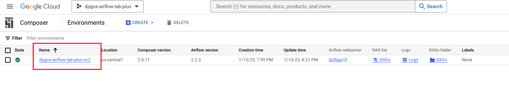   
<br><br>

<hr>


#### 2. The DAGS

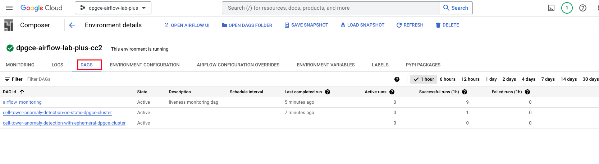   
<br><br>

<hr>


#### 3. The environment configuration

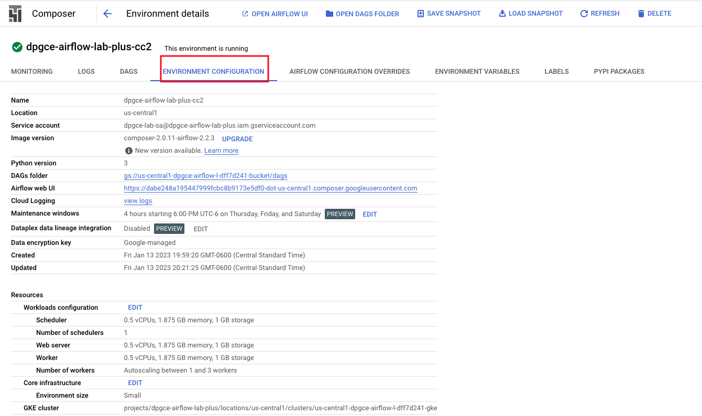   
<br><br>

<hr>

#### 4. The environment variables

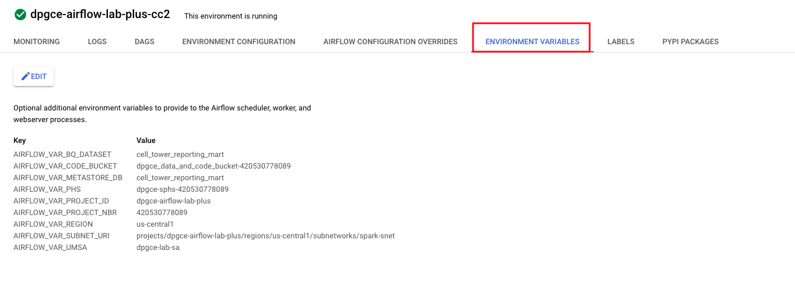   
<br><br>

<hr>

#### 5. From the environment listing - The DAG bucket and DAGS

   
<br><br>

   
<br><br>

<hr>

#### 6. From the environment listing - The Airflow UI

   
<br><br>

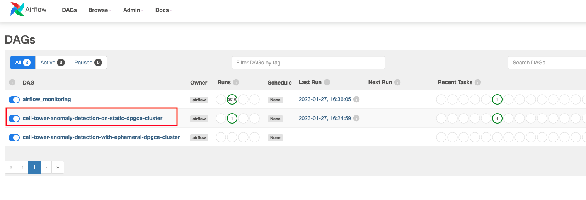   
<br><br>

<hr>

<br>

### 6.2. The DAGs & DAG code

There are two DAGs pre-created and imported into Airflow on Cloud Composer.

   
<br><br>

#### 6.2.1. cell-tower-anomaly-detection-on-static-dpgce-cluster

Runs the Spark jobs covered in the sections above, on an existing DPGCE cluster associated with a Dataproc Metastore and Dataproc Persistent Spark History Server

Review the DAG [code](provisioning-automation/core-tf/scripts/composer-dag/pipeline-with-existing-dpgce-cluster.py)

<hr>

#### 6.2.2. cell-tower-anomaly-detection-with-ephemeral-dpgce-cluster

Creates a new DPGCE cluster, runs the Spark jobs covered in the sections above, and then terminates the cluster; The ephemeral DPGCE cluster is associated with a Dataproc Metastore and Dataproc Persistent Spark History Server at creation time

Review the DAG [code](provisioning-automation/core-tf/scripts/composer-dag/pipeline-with-ephemeral-dpgce-cluster.py)

<hr>

<br><br>

### 6.3. Orchestrate Spark jobs on Dataproc-GCE ephemeral cluster

Click on the DAG "cell-tower-anomaly-detection-with-create-cluster" and run through the steps below - <br>

1. Execute the DAG
2. Validate the cluster creation & its specs, including the metastore and PHS configuration
3. Then validate each of the jobs to completion
4. Run the BQ queries from 5.3.5 and 5.4.5
5. Ensure the Spark jobs/applications are visible from the PHS


Start the DAG-

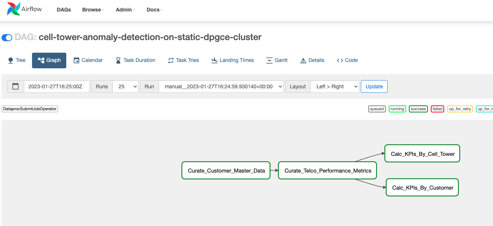   
<br><br>

Review the Airflow DAG code-

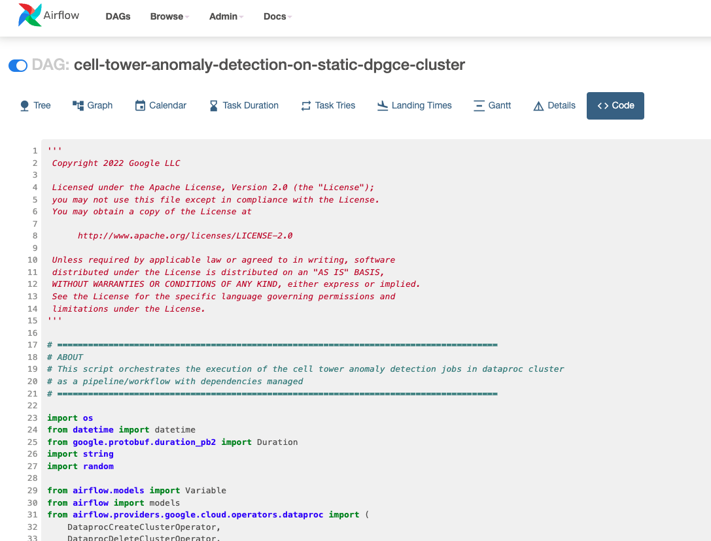   
<br><br>

Review the execution of Spark jobs in the Dataproc jobs GUI-

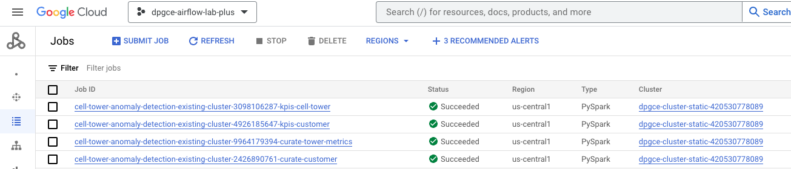   
<br><br>

<hr>

<br>

### 6.4. Orchestrate Spark jobs on Dataproc-GCE static cluster

Click on the DAG "cell-tower-anomaly-detection-with-existing-dpgce-cluster" and run through the steps below - <br>

1. Execute the DAG
2. Then validate each of the jobs to completion
3. Run the BQ queries from 5.3.5 and 5.4.5
4. Ensure the Spark jobs/applications are visible from the PHS

Start the DAG-

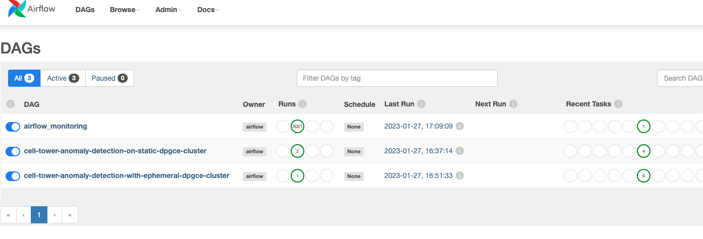   
<br><br>

Note the Dataproc cluster creation in the Dataproc GUI-

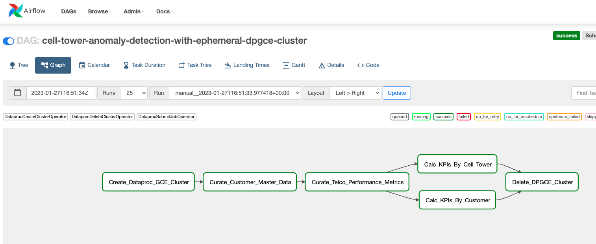   
<br><br>

Review the Airflow DAG code-

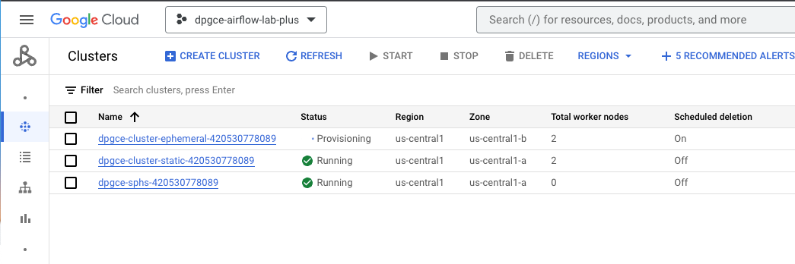   
<br><br>

Review the execution of Spark jobs in the Dataproc jobs GUI-

   
<br><br>

<hr>
<hr>

## Appendix


### For reference: Manually creating a static cluster with gcloud command

```
PROJECT_ID=`gcloud config list --format "value(core.project)" 2>/dev/null`
PROJECT_NBR=`gcloud projects describe $PROJECT_ID | grep projectNumber | cut -d':' -f2 |  tr -d "'" | xargs`
PROJECT_NAME=`gcloud projects describe ${PROJECT_ID} | grep name | cut -d':' -f2 | xargs`
LOCATION="us-central1"
ZONE="us-central1-b"
VPC_NM=VPC="dpgce-vpc-$PROJECT_NBR"
SPARK_SUBNET="spark-snet"
PERSISTENT_HISTORY_SERVER_NM="dpgce-sphs-${PROJECT_NBR}"
UMSA_FQN="dpgce-lab-sa@$PROJECT_ID.iam.gserviceaccount.com"
CODE_AND_DATA_BUCKET="dpgce_data_and_code_bucket-${PROJECT_NBR}"
DPGCE_CLUSTER_NAME="dpgce-cluster-static-${PROJECT_NBR}"
PHS_BUCKET="dpgce-sphs-${PROJECT_NBR}"
DPMS_NM="dpgce-metastore-${PROJECT_NBR}"
DPCGE_BUCKET="dpgce-spark-bucket-${PROJECT_NBR}"


gcloud dataproc clusters create $DPGCE_CLUSTER_NAME \
--region $LOCATION \
--zone $ZONE \
--service-account $UMSA_FQN \
--scopes "https://www.googleapis.com/auth/cloud-platform" \
--project $PROJECT_ID \
--subnet $SPARK_SUBNET \
--enable-component-gateway \
--bucket $DPCGE_BUCKET \
--dataproc-metastore projects/$PROJECT_ID/locations/$LOCATION/services/$DPMS_NM \
--master-machine-type n1-standard-4 \
--master-boot-disk-size 500 \
--num-workers 3 \
--worker-machine-type n1-standard-4 \
--worker-boot-disk-size 500 \
--image-version 2.0-debian10 \
--optional-components JUPYTER \
--no-address \
--shielded-integrity-monitoring \
--shielded-secure-boot \
--shielded-vtpm \
--initialization-actions gs://goog-dataproc-initialization-actions-${LOCATION}/connectors/connectors.sh \
--metadata spark-bigquery-connector-version="0.23.2" \
--properties "yarn:yarn.nodemanager.remote-app-log-dir=gs://$PHS_BUCKET/yarn-logs,\
mapred:mapreduce.jobhistory.done-dir=gs://$PHS_BUCKET/events/mapreduce-job-history/done,\
mapred:mapreduce.jobhistory.intermediate-done-dir=gs://$PHS_BUCKET/events/mapreduce-job-history/intermediate-done,\
spark:spark.eventLog.dir=gs://$PHS_BUCKET/events/spark-job-history,\
spark:spark.history.fs.logDirectory=gs://$PHS_BUCKET/events/spark-job-history,\
spark:spark.history.fs.gs.outputstream.type=FLUSHABLE_COMPOSITE,\
spark:spark.history.fs.gs.outputstream.sync.min.interval.ms=1000ms" 
```


##### =====================================================================================================
##### THIS CONCLUDES THE LAB - CELL TOWER ANOMALY DETECTION WITH SPARK POWERED BY DATAPROC ON GCE
##### DONT FORGET TO DESTROY THE RESOURCES UNLESS YOU ARE WORKING ON LAB 3 and 4
##### =====================================================================================================


## APPENDIX


The gcloud command equivalent for creating a cluster

```
THIS IS FYI
DPGCE_CLUSTER_NAME=dpgce-cluster-static-420530778089


gcloud dataproc clusters create $DPGCE_CLUSTER_NAME \
   --service-account=$UMSA_FQN \
   --project $PROJECT_ID \
   --subnet spark-snet \
   --region us-central1 \
   --zone us-central1-a \
   --enable-component-gateway \
   --bucket dpgce-spark-bucket-420530778089 \
   --dataproc-metastore projects/dpgce-airflow-lab-plus/locations/us-central1/services/dpgce-metastore-420530778089 \
   --scopes=cloud-platform \
   --master-machine-type n1-standard-4 \
   --master-boot-disk-size 500 \
   --num-workers 2 \
   --worker-machine-type n1-standard-4 \
   --worker-boot-disk-size 500 \
   --image-version 2.0.53-debian10 \
   --tags $DPGCE_CLUSTER_NAME \
   --optional-components JUPYTER \
   --initialization-actions gs://goog-dataproc-initialization-actions-us-central1/connectors/connectors.sh \
   --metadata spark-bigquery-connector-version=0.26.0 \
   --properties dataproc:dataproc.logging.stackdriver.enable=true,dataproc:dataproc.monitoring.stackdriver.enable=true,yarn:yarn.log-aggregation.enabled=true,dataproc:dataproc.logging.stackdriver.job.yarn.container.enable=true,dataproc:jobs.file-backed-output.enable=true,dataproc:dataproc.logging.stackdriver.job.driver.enable=true
   ```


