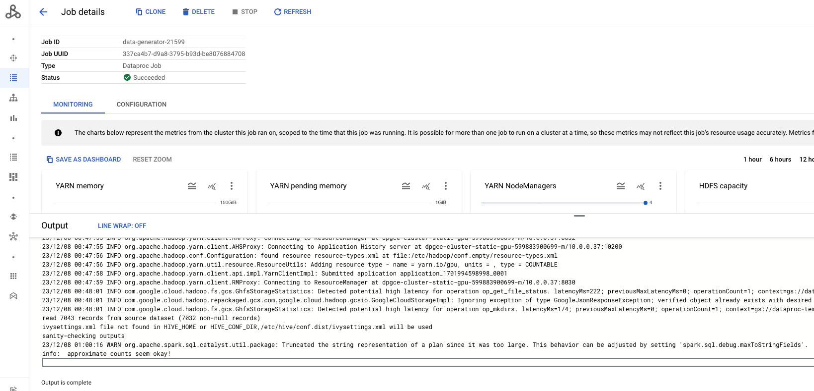

# Module-01: Infrastructure Provisioning and Data Generation

1. In this module we will create the requisite infrastructure for the lab with Terraform.
2. Next we will create a Dataproc cluster manually.
3. Finally we will generate data for the lab.<br>

<hr>

## 1. About 

### 1.1. Duration
It takes ~30 minutes or less to complete and is fully scrpited, including with Terraform for provisioning.

<hr>

### 1.2. Platform for provisioning

Your machine, or preferably Cloud Shell.

<hr>

### 1.3. Prerequisites
- A pre-created project
- You need to have organization admin rights, and project owner privileges or work with privileged users to complete provisioning.

<hr>

### 1.4. Lab flow

   


<hr>

### 1.5. Resources provisioned

   


<hr>

## 2. Foundational resources provisioning with Terraform

In this section we will enable the requisite Google APIs and update organizational policies with Terraform.<br>
Takes approximately 5 minutes to complete.

### 2.1. Clone this repo in Cloud Shell

```
git clone https://github.com/anagha-google/dataproc-labs.git
```

### 2.2. Run Terraform

The Terraform in this section updates organization policies and enables Google APIs.

Paste this in Cloud Shell
```
PROJECT_ID=`gcloud config list --format "value(core.project)" 2>/dev/null`

cd ~/dataproc-labs/4-dataproc-with-gpu/provisioning-automation/foundations-tf
```

Run the Terraform for organization policy edits and enabling Google APIs
```
terraform init
terraform apply \
  -var="project_id=${PROJECT_ID}" \
  -auto-approve >> 4-dataproc-with-gpu-tf-foundations.output
```

Wait till the provisioning completes. <br>

In a separate cloud shell tab, you can tail the output file for execution state through completion-
```
tail -f  ~/dataproc-labs/4-dataproc-with-gpu/provisioning-automation/foundations-tf/4-dataproc-with-gpu-tf-foundations.output
```

<hr>

## 3. Core resources provisioning automation with Terraform

This section provisions all the requisite core data services for the lab, and their dependecies.

### 3.1. Resources provisioned

In this section, we will provision or complete the following-

1. Network, subnet, firewall rule
2. Storage buckets for code, datasets, and for use with the services
3. Persistent Spark History Server
4. User Managed Service Account
5. Requisite IAM permissions
6. Copy of code, data, etc into buckets


### 3.2. Run the terraform scripts
Paste this in Cloud Shell after editing the GCP region variable to match your nearest region. Takes ~10 minutes or less to complete.

```
cd ~/dataproc-labs/4-dataproc-with-gpu/provisioning-automation/core-tf/terraform

PROJECT_ID=`gcloud config list --format "value(core.project)" 2>/dev/null`
PROJECT_NBR=`gcloud projects describe $PROJECT_ID | grep projectNumber | cut -d':' -f2 |  tr -d "'" | xargs`
PROJECT_NAME=`gcloud projects describe ${PROJECT_ID} | grep name | cut -d':' -f2 | xargs`
GCP_ACCOUNT_NAME=`gcloud auth list --filter=status:ACTIVE --format="value(account)"`
GCP_REGION="us-central1"
DEPLOYER_ACCOUNT_NAME=$GCP_ACCOUNT_NAME
ORG_ID=`gcloud organizations list --format="value(name)"`


terraform init
terraform apply \
  -var="project_id=${PROJECT_ID}" \
  -var="project_name=${PROJECT_NAME}" \
  -var="project_number=${PROJECT_NBR}" \
  -var="gcp_account_name=${GCP_ACCOUNT_NAME}" \
  -var="deployment_service_account_name=${DEPLOYER_ACCOUNT_NAME}" \
  -var="org_id=${ORG_ID}" \
  -var="gcp_region=${GCP_REGION}" \
  -auto-approve >> 4-dataproc-with-gpu-tf-core.output
```
  
Takes ~10 minutes to complete.<br> 


In a separate cloud shell tab, you can tail the output file for execution state through completion-

```
tail -f ~/dataproc-labs/4-dataproc-with-gpu/provisioning-automation/core-tf/terraform/4-dataproc-with-gpu-tf-core.output
```

<hr>

## 4. Provision a Dataproc on GCE cluster


### 4.1. Create a DPGCE cluster with GPUs

Paste in Cloud Shell-

```
PROJECT_ID=`gcloud config list --format "value(core.project)" 2>/dev/null`
PROJECT_NBR=`gcloud projects describe $PROJECT_ID | grep projectNumber | cut -d':' -f2 |  tr -d "'" | xargs`
DATAPROC_CLUSTER_NAME=dpgce-cluster-static-gpu-${PROJECT_NBR}
DPGCE_CLUSTER_BUCKET=spark-cluster-bucket-${PROJECT_NBR}
DPGCE_EVENT_LOG_BUCKET=spark-event-log-bucket-${PROJECT_NBR}
DATA_BUCKET=data_bucket-${PROJECT_NBR}
CODE_BUCKET=code_bucket-${PROJECT_NBR}
VPC_NM=VPC=vpc-$PROJECT_NBR
SPARK_SUBNET=spark-snet
UMSA_FQN=lab-sa@$PROJECT_ID.iam.gserviceaccount.com
REGION=us-central1
ZONE=us-central1-a
NUM_GPUS=1
NUM_WORKERS=4


gcloud dataproc clusters create $DATAPROC_CLUSTER_NAME  \
    --region $REGION \
    --zone $ZONE \
    --image-version=2.0-ubuntu18 \
    --master-machine-type=n1-standard-4 \
    --num-workers=$NUM_WORKERS \
    --worker-accelerator=type=nvidia-tesla-t4,count=$NUM_GPUS \
    --worker-machine-type=n1-standard-8 \
    --num-worker-local-ssds=1 \
    --initialization-actions=gs://goog-dataproc-initialization-actions-${REGION}/spark-rapids/spark-rapids.sh \
    --optional-components=JUPYTER,ZEPPELIN \
    --metadata gpu-driver-provider="NVIDIA",rapids-runtime="SPARK" \
    --subnet=$SPARK_SUBNET \
    --enable-component-gateway  \
    --bucket $DPGCE_CLUSTER_BUCKET \
    --properties "spark:spark.history.fs.logDirectory=gs://${DPGCE_EVENT_LOG_BUCKET}/*/spark-job-history,spark:spark.eventLog.dir=gs://${DPGCE_EVENT_LOG_BUCKET}/events/spark-job-history" \
    --service-account $UMSA_FQN   
```

Takes approximately ~12 minutes or less to provision. Largely because of scripts that need to run to install drivers and such.

<hr>

### 4.2. Quick pictorial walk-through of the cluster

   


   

<hr>

   

<hr>

   

<hr>

   

<hr>

   

<hr>

## 5. Generate data for the lab

The script (generate_data.py) provided to us by Nvidia creates a larger dataset. We will use the same to generate a large dataset. <br>

### 5.1. Review the lab dataset

The dataset is the famous Kaggle Telco Customer Churn dataset - small data. Review the same.

Paste in Cloud Shell-
```
head -10 ~/dataproc-labs/4-dataproc-with-gpu/provisioning-automation/core-tf/datasets/telco-customer-churn.csv
```

Author's sample output-
```
customerID,gender,SeniorCitizen,Partner,Dependents,tenure,PhoneService,MultipleLines,InternetService,OnlineSecurity,OnlineBackup,DeviceProtection,TechSupport,StreamingTV,StreamingMovies,Contract,PaperlessBilling,PaymentMethod,MonthlyCharges,TotalCharges,Churn
7590-VHVEG,Female,0,Yes,No,1,No,No phone service,DSL,No,Yes,No,No,No,No,Month-to-month,Yes,Electronic check,29.85,29.85,No
5575-GNVDE,Male,0,No,No,34,Yes,No,DSL,Yes,No,Yes,No,No,No,One year,No,Mailed check,56.95,1889.5,No
3668-QPYBK,Male,0,No,No,2,Yes,No,DSL,Yes,Yes,No,No,No,No,Month-to-month,Yes,Mailed check,53.85,108.15,Yes
7795-CFOCW,Male,0,No,No,45,No,No phone service,DSL,Yes,No,Yes,Yes,No,No,One year,No,Bank transfer (automatic),42.3,1840.75,No
9237-HQITU,Female,0,No,No,2,Yes,No,Fiber optic,No,No,No,No,No,No,Month-to-month,Yes,Electronic check,70.7,151.65,Yes
9305-CDSKC,Female,0,No,No,8,Yes,Yes,Fiber optic,No,No,Yes,No,Yes,Yes,Month-to-month,Yes,Electronic check,99.65,820.5,Yes
1452-KIOVK,Male,0,No,Yes,22,Yes,Yes,Fiber optic,No,Yes,No,No,Yes,No,Month-to-month,Yes,Credit card (automatic),89.1,1949.4,No
6713-OKOMC,Female,0,No,No,10,No,No phone service,DSL,Yes,No,No,No,No,No,Month-to-month,No,Mailed check,29.75,301.9,No
7892-POOKP,Female,0,Yes,No,28,Yes,Yes,Fiber optic,No,No,Yes,Yes,Yes,Yes,Month-to-month,Yes,Electronic check,104.8,3046.05,Yes
```

<hr>

### 5.2. Optionally review the script to generate the data

```
cat ~/dataproc-labs/4-dataproc-with-gpu/provisioning-automation/core-tf/scripts/pyspark/data-generator-util/generate_data.py

```


### 5.3. Review the size of the base dataset

Paste in Cloud Shell-
```
PROJECT_ID=`gcloud config list --format "value(core.project)" 2>/dev/null`
PROJECT_NBR=`gcloud projects describe $PROJECT_ID | grep projectNumber | cut -d':' -f2 |  tr -d "'" | xargs`
DATA_BUCKET=data_bucket-${PROJECT_NBR}

gsutil du -s -h -a gs://$DATA_BUCKET/churn/input/telco-customer-churn.csv | cut -d' ' -f1,2
```
Its 954 KiB.

### 5.4. Review the PySpark data generator script

Paste in Cloud Shell-
```
cd ~/dataproc-labs/4-dataproc-with-gpu/provisioning-automation/core-tf/scripts/pyspark/data-generator-util
cat generate_data.py
```

### 5.5. Declare variables
Paste in Cloud Shell-
```
PROJECT_ID=`gcloud config list --format "value(core.project)" 2>/dev/null`
PROJECT_NBR=`gcloud projects describe $PROJECT_ID | grep projectNumber | cut -d':' -f2 |  tr -d "'" | xargs`

DATAPROC_CLUSTER_NAME=dpgce-cluster-static-gpu-${PROJECT_NBR}
DPGCE_LOG_BUCKET=spark-bucket-dpgce-${PROJECT_NBR}
DATA_BUCKET=data_bucket-${PROJECT_NBR}
CODE_BUCKET=code_bucket-${PROJECT_NBR}
VPC_NM=VPC=vpc-$PROJECT_NBR
SPARK_SUBNET=spark-snet
UMSA_FQN=lab-sa@$PROJECT_ID.iam.gserviceaccount.com
REGION=us-central1
ZONE=us-central1-a
NUM_GPUS=1
NUM_WORKERS=4

LOG_SECOND=`date +%s`
LAB_LOG_ROOT_DIR="~/dataproc-labs/logs/lab-4/"
mkdir -p $LAB_LOG_ROOT_DIR
LOGFILE="$LAB_LOG_ROOT_DIR/$0.txt.$LOG_SECOND"


# This is used to define the size of the dataset that is generated
# 10000 will generate a dataset of roughly 25GB in size
SCALE=10

# Set this value to the total number of cores that you have across all
# your worker nodes. 
TOTAL_CORES=32
#
# Set this value to 1/4 the number of cores listed above. Generally,
# we have found that 4 cores per executor performs well.
NUM_EXECUTORS=8   # 1/4 the number of cores in the cluster
#
NUM_EXECUTOR_CORES=$((${TOTAL_CORES}/${NUM_EXECUTORS}))
#
# Set this to the total memory across all your worker nodes. e.g. RAM of each worker * number of worker nodes
TOTAL_MEMORY=120   # unit: GB
DRIVER_MEMORY=4    # unit: GB
#
# This takes the total memory and calculates the maximum amount of memory
# per executor
EXECUTOR_MEMORY=$(($((${TOTAL_MEMORY}-$((${DRIVER_MEMORY}*1000/1024))))/${NUM_EXECUTORS}))

# Source base data file to be bulked up
INPUT_FILE="gs://data_bucket-${PROJECT_NBR}/churn/input/telco-customer-churn.csv"
# *****************************************************************
# Output prefix is where the data that is generated will be stored.
# This path is important as it is used for the INPUT_PREFIX for
# the cpu and gpu env files
# *****************************************************************
#
OUTPUT_PREFIX="gs://data_bucket-${PROJECT_NBR}/churn/input/10scale/"
```

### 5.6. Run the data generator script from Nvidia

Paste in Cloud Shell-
```
gcloud dataproc jobs submit pyspark \
--cluster $DATAPROC_CLUSTER_NAME \
--id data-generator-$RANDOM \
gs://$CODE_BUCKET/churn/data-generator-util/generate_data.py \
--py-files=gs://$CODE_BUCKET/churn/aux_etl_code_archive.zip \
--properties="spark.executor.cores=${NUM_EXECUTOR_CORES},spark.executor.memory=${EXECUTOR_MEMORY}G,spark.driver.memory=${DRIVER_MEMORY}G" \
--configuration="spark.cores.max=$TOTAL_CORES,spark.task.cpus=1,spark.sql.files.maxPartitionBytes=2G" \
--region $REGION \
--project $PROJECT_ID \
-- --input-file=${INPUT_FILE} --output-prefix=${OUTPUT_PREFIX} --dup-times=${SCALE}  2>&1 >> $LOGFILE
```

Review the job execution in Dataproc -> Jobs UI

   

<hr>

   

<hr>

   

<hr>

### 5.7. Review the 10 scale lab dataset generated

Paste in Cloud Shell-
```
gsutil ls $OUTPUT_PREFIX
```

Lets check the size-
```
gsutil du -s -h -a ${OUTPUT_PREFIX} | cut -d' ' -f1,2
```
The author's output is 42.46 MiB


<hr>
<hr>

This concludes the lab module. Proceed to the [next module](Lab-Module-02.md).

<hr>
<hr>
