# Module 02: GPU acceleration for Spark on Dataproc GCE clusters 

This lab module demystifies Spark application acceleration with Spark-RAPIDS on Dataproc on GCE - powered by Nvidia GPUs through a minimum viable Spark application on the Kaggle Telco Customer Churn dataset. It also introduces Nvidia tooling - for qualifying Spark applications that can benefit from GPU acceleration as well as Nvidia tuning tool to further enhance GPU powered Spark application performance.

<hr>
<hr>

## 1. About the lab

### 1.1. Prerequisites

Successful completion of prior module

<hr>

### 1.2. What to expect

In this lab, we will-

1. Learn how to submit Spark jobs on Dataproc with GPUs
2. Use Nvidia qualification tool to identify if your Spark job on CPUs can benefit from GPU acceleration
3. Use Nvidia profiler tool to identify if your Spark job on GPUs can benefit from tuning Spark resources

<hr>

### 1.3. Lab flow

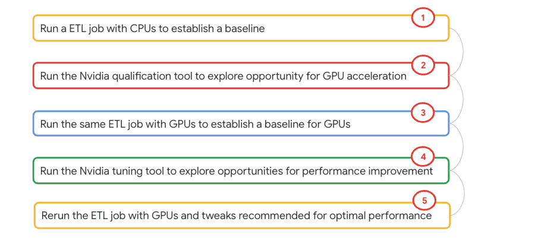   

<hr>

### 1.4. Lab infrastructure

| # | Entity | Specification  | Number of instances |
| -- | :--- | :--- | :--- |
| 1. | Dataproc Cluster | Cluster image 2.0.85-ubuntu18 |1 Master, 4 Workers |
| 2. | Master  | n1-standard-4<br>4 vCPUs<br>15 GB RAM  | 1 |
| 3. | Worker  | n1-standard-8<br>8 vCPUs<br>1 nvidia-tesla-t4 GPU<br>30 GB RAM<br>1 SSD  | 4 |

<hr>

### 1.5. Lab architecture

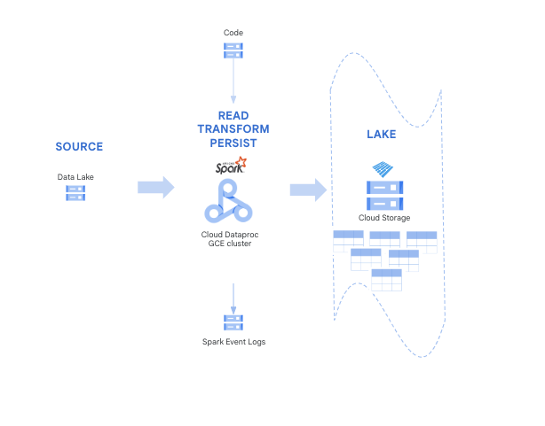   

### 1.6. Duration

~ 1 hour or less but does not require focus time.

<hr>

### 1.7. Documentation resources

**Dataproc on GCE with GPUs:** https://cloud.google.com/dataproc/docs/concepts/compute/gpus<br>
**Nvidia tooling:** https://github.com/NVIDIA/spark-rapids-tools/blob/main/user_tools/docs/user-tools-dataproc.md#1gcloud-cli<br>
**Nvidia user guide:** https://docs.nvidia.com/spark-rapids/user-guide/latest/index.html<br>
**Nvidia Dataproc guide:** https://docs.nvidia.com/spark-rapids/user-guide/latest/getting-started/google-cloud-dataproc.html<br>
**Nvidia spark rapids overview:** https://nvidia.github.io/spark-rapids/developer-overview <br>
**Nvidia contacts:** https://nvidia.github.io/spark-rapids/docs/contact-us.html <br>

<hr>
<hr>


## 2. Run an ETL job on CPUs for a baseline performance capture

### 2.1. Declare variables

Paste in Cloud Shell-
```
PROJECT_ID=`gcloud config list --format "value(core.project)" 2>/dev/null`
PROJECT_NBR=`gcloud projects describe $PROJECT_ID | grep projectNumber | cut -d':' -f2 |  tr -d "'" | xargs`

DATAPROC_CLUSTER_NAME=dpgce-cluster-static-gpu-${PROJECT_NBR}
DPGCE_LOG_BUCKET=spark-event-log-bucket-${PROJECT_NBR}
DATA_BUCKET=data_bucket-${PROJECT_NBR}
CODE_BUCKET=code_bucket-${PROJECT_NBR}
VPC_NM=VPC=vpc-$PROJECT_NBR
SPARK_SUBNET=spark-snet
UMSA_FQN=lab-sa@$PROJECT_ID.iam.gserviceaccount.com
REGION=us-central1
ZONE=us-central1-a
NUM_GPUS=1
NUM_WORKERS=4

LOG_SECOND=`date +%s`
LAB_LOG_ROOT_DIR="~/dataproc-labs/logs/lab-4/"
mkdir -p $LAB_LOG_ROOT_DIR
LOGFILE="$LAB_LOG_ROOT_DIR/$0.txt.$LOG_SECOND"

# Set this value to the total number of cores that you have across all
# your worker nodes. e.g. 8 servers with 40 cores = 320 cores
TOTAL_CORES=32
#
# Set this value to 1/4 the number of cores listed above. Generally,
# we have found that 4 cores per executor performs well.
NUM_EXECUTORS=8  # 1/4 the number of cores in the cluster
#
NUM_EXECUTOR_CORES=$((${TOTAL_CORES}/${NUM_EXECUTORS}))
#
# Set this to the total memory across all your worker nodes. e.g. RAM of each worker * number of worker nodes
TOTAL_MEMORY=120   # unit: GB
DRIVER_MEMORY=4    # unit: GB
#
# This takes the total memory and calculates the maximum amount of memory
# per executor
EXECUTOR_MEMORY=$(($((${TOTAL_MEMORY}-$((${DRIVER_MEMORY}*1000/1024))))/${NUM_EXECUTORS}))

# Input prefix designates where the data to be processed is located
INPUT_PREFIX="gs://data_bucket-$PROJECT_NBR/churn/input/10scale/"
#
# Output prefix is where results from the queries are stored
OUTPUT_PREFIX="gs://data_bucket-$PROJECT_NBR/churn/output/cpu-based-analytics/"
```

<hr>

### 2.2. Run a Spark analytics application on CPUs for a baseline

Paste in Cloud Shell-
```
SPARK_PROPERTIES="spark.executor.cores=${NUM_EXECUTOR_CORES},spark.executor.memory=${EXECUTOR_MEMORY}G,spark.driver.memory=${DRIVER_MEMORY}G,spark.cores.max=$TOTAL_CORES,spark.task.cpus=1,spark.sql.files.maxPartitionBytes=1G,spark.sql.adaptive.enabled=True,spark.sql.autoBroadcastJoinThreshold=-1,spark.rapids.sql.enabled=false "

gcloud dataproc jobs submit pyspark \
gs://$CODE_BUCKET/churn/main_analytics_app.py \
--py-files=gs://$CODE_BUCKET/churn/aux_etl_code_archive.zip \
--cluster $DATAPROC_CLUSTER_NAME \
--region $REGION \
--id cpu-etl-baseline-$RANDOM \
--properties=${SPARK_PROPERTIES} \
--project $PROJECT_ID \
-- --coalesce-output=8 --input-prefix=${INPUT_PREFIX} --output-prefix=${OUTPUT_PREFIX}   2>&1 >> $LOGFILE
```

Follow the execution in the Dataproc-Jobs UI. It takes ~30 minutes, you can step away and come back.

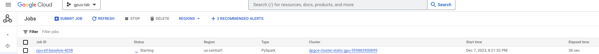   

<hr>

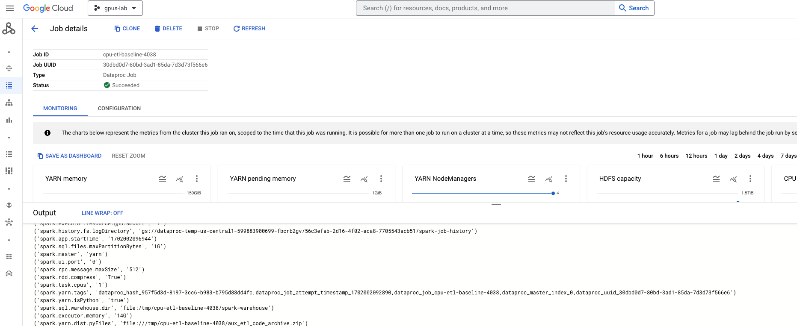   

<hr>

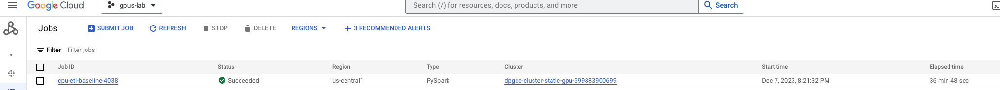   

<hr>

### 2.3. Review the results
Paste in Cloud Shell-

```
PROJECT_ID=`gcloud config list --format "value(core.project)" 2>/dev/null`
PROJECT_NBR=`gcloud projects describe $PROJECT_ID | grep projectNumber | cut -d':' -f2 |  tr -d "'" | xargs`
OUTPUT_PREFIX="gs://data_bucket-$PROJECT_NBR/churn/output/cpu-based-analytics"

gsutil ls -r $OUTPUT_PREFIX
```

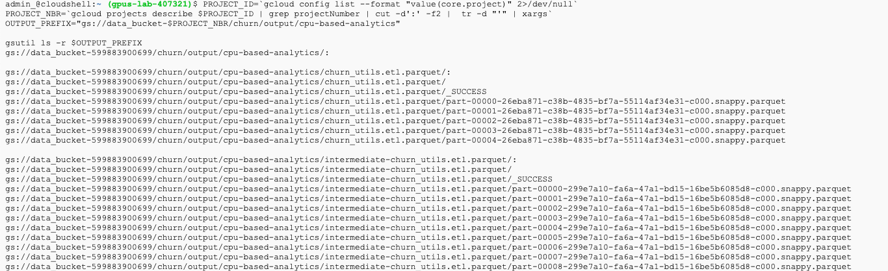   

<hr>

### 2.4. Note the execution time

The author's application took ~ 30 minutes to complete across multiple runs.
<hr>

### 2.5. Review the execution plan in the Spark History Server

In the Dataproc UI, click on clusters->on the cluster->web interfaces tab->Spark history server->on the job that completed

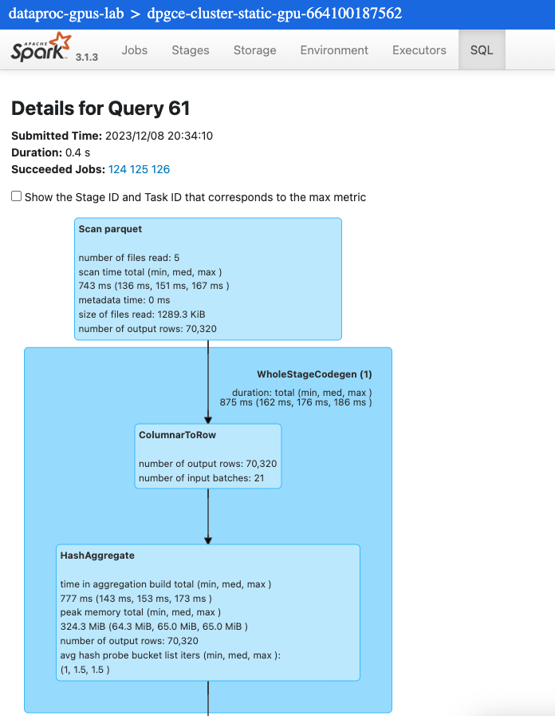   


<hr>
<hr>

## 3. Install the Nvidia Qualification Tool 


### 3.1. Install --RAPIDS User Tools-- in Cloud Shell

Paste in Cloud Shell-
```
python -m venv .venv
source .venv/bin/activate

pip install spark-rapids-user-tools
```

Check to see if you can run the Nvidia qualification tool, immediately after-
```
spark_rapids_user_tools dataproc -- --help
```

<hr>

### 3.2. Initialize environment variables

1. Initialize gcloud in Cloud Shell-
```
gcloud init
```

**Note**: Then select project, **ensure you configure region and zone** to match that of your Dataproc cluster zone.

2. Also configure dataproc region
```
gcloud config set dataproc/region us-central1
```

3. Run the command below - it generates a key needed by the tool

```
gcloud auth application-default login
```

This command persists a credentials JSON on your machine. Find the file and move that file to the location "/home/admin_/.config/gcloud/"<br>
The author's example-
```
mv /tmp/tmp.ZrZBbfPHru/application_default_credentials.json /home/admin_/.config/gcloud/application_default_credentials.json
```

4. Then configure rapids tool required variables
```
export RAPIDS_USER_TOOLS_CACHE_FOLDER=/var/tmp/spark_rapids_user_tools_cache
export RAPIDS_USER_TOOLS_OUTPUT_DIRECTORY=~/rapids_user_tools_output
mkdir -p $RAPIDS_USER_TOOLS_OUTPUT_DIRECTORY 
```

<hr>
<hr>

## 4. Run the Nvidia Qualification Tool to see if the Spark application qualifies for GPUs


You can run this only after you run a few Spark applications. The tool will review the logs and provide recommendations based on YARN application IDs-
```
PROJECT_ID=`gcloud config list --format "value(core.project)" 2>/dev/null`
PROJECT_NBR=`gcloud projects describe $PROJECT_ID | grep projectNumber | cut -d':' -f2 |  tr -d "'" | xargs`
REGION=us-central1
CLUSTER_NAME=dpgce-cluster-static-gpu-$PROJECT_NBR
SPARK_EVENT_LOG_DIR=gs://spark-event-log-bucket-$PROJECT_NBR/events/spark-job-history/

spark_rapids_user_tools dataproc qualification \
   --eventlogs $SPARK_EVENT_LOG_DIR \
   --cpu_cluster $CLUSTER_NAME 
```

Here are the author's results, that correctly call out the two Spark applications run without GPU acceleration, while omiiting the ones that used GPUs and the speed up is accurate as well-
```
2023-12-10 04:27:59,382 INFO rapids.tools.qualification: ******* [Initialization]: Starting *******
2023-12-10 04:27:59,411 INFO rapids.tools.qualification.ctxt: Start connecting to the platform
2023-12-10 04:28:01,917 INFO rapids.tools.qualification: ======= [Initialization]: Finished =======
2023-12-10 04:28:01,918 INFO rapids.tools.qualification: ******* [Connecting to Execution Cluster]: Starting *******
2023-12-10 04:28:01,918 INFO rapids.tools.qualification: Qualification requires no execution cluster. Skipping phase
2023-12-10 04:28:01,918 INFO rapids.tools.qualification: ======= [Connecting to Execution Cluster]: Finished =======
2023-12-10 04:28:01,918 INFO rapids.tools.qualification: ******* [Process-Arguments]: Starting *******
2023-12-10 04:28:01,918 INFO rapids.tools.qualification.ctxt: Local workdir root folder is set as /home/admin_/rapids_user_tools_output/qual_20231210042801_e1AEd71B
2023-12-10 04:28:01,993 INFO rapids.tools.qualification.ctxt: Dependencies are generated locally in local disk as: /home/admin_/rapids_user_tools_output/qual_20231210042801_e1AEd71B/work_dir
2023-12-10 04:28:01,993 INFO rapids.tools.qualification.ctxt: Local output folder is set as: /home/admin_/rapids_user_tools_output/qual_20231210042801_e1AEd71B
2023-12-10 04:28:01,993 INFO rapids.tools.qualification: Qualification tool processing the arguments
2023-12-10 04:28:02,340 INFO rapids.tools.qualification: RAPIDS accelerator jar is downloaded to work_dir /home/admin_/rapids_user_tools_output/qual_20231210042801_e1AEd71B/work_dir/rapids-4-spark-tools_2.12-23.04.0.jar
2023-12-10 04:28:02,341 INFO rapids.tools.qualification: Checking dependency Apache Spark
2023-12-10 04:28:02,342 INFO rapids.tools.qualification: Checking dependency GCS Connector Hadoop3
2023-12-10 04:28:02,601 INFO rapids.tools.qualification: The dependency https://repo1.maven.org/maven2/com/google/cloud/bigdataoss/gcs-connector/hadoop3-2.2.11/gcs-connector-hadoop3-2.2.11-shaded.jar has been downloaded into /var/tmp/spark_rapids_user_tools_cache/gcs-connector-hadoop3-2.2.11-shaded.jar
2023-12-10 04:28:02,634 INFO rapids.tools.qualification: Completed downloading of dependency [GCS Connector Hadoop3] => 0.292 seconds
2023-12-10 04:28:20,817 INFO rapids.tools.qualification: The dependency https://archive.apache.org/dist/spark/spark-3.3.1/spark-3.3.1-bin-hadoop3.tgz has been downloaded into /var/tmp/spark_rapids_user_tools_cache/spark-3.3.1-bin-hadoop3.tgz
2023-12-10 04:28:26,309 INFO rapids.tools.qualification: Completed downloading of dependency [Apache Spark] => 23.967 seconds
2023-12-10 04:28:26,310 INFO rapids.tools.qualification: Dependencies are processed as: /home/admin_/rapids_user_tools_output/qual_20231210042801_e1AEd71B/work_dir/spark-3.3.1-bin-hadoop3/jars/*; /home/admin_/rapids_user_tools_output/qual_20231210042801_e1AEd71B/work_dir/gcs-connector-hadoop3-2.2.11-shaded.jar
2023-12-10 04:28:26,311 INFO rapids.tools.qualification: Total Execution Time: Downloading dependencies for local Mode => 23.971 seconds
2023-12-10 04:28:26,312 INFO rapids.tools.qualification: Loading CPU cluster properties by name dpgce-cluster-static-gpu-664100187562. Note that this will fail if the cluster was permanently deleted.
2023-12-10 04:28:39,118 INFO rapids.tools.qualification: Creating GPU cluster by converting the CPU cluster instances to GPU supported types
2023-12-10 04:28:39,119 INFO rapids.tools.cluster: Node with n1-standard-8 supports GPU devices.
2023-12-10 04:28:39,119 INFO rapids.tools.cluster: Node with n1-standard-8 supports GPU devices.
2023-12-10 04:28:39,119 INFO rapids.tools.cluster: Node with n1-standard-8 supports GPU devices.
2023-12-10 04:28:39,119 INFO rapids.tools.cluster: Node with n1-standard-8 supports GPU devices.
2023-12-10 04:28:39,119 INFO rapids.tools.qualification: No remote output folder specified.
2023-12-10 04:28:39,119 INFO rapids.tools.qualification: ======= [Process-Arguments]: Finished =======
2023-12-10 04:28:39,119 INFO rapids.tools.qualification: ******* [Execution]: Starting *******
2023-12-10 04:28:39,119 INFO rapids.tools.qualification: Skipping preparing remote dependency folder
2023-12-10 04:28:39,120 INFO rapids.tools.submit.dataprocLocal: Prepare job submission command
2023-12-10 04:28:39,120 INFO rapids.tools.submit.dataprocLocal: Running the Rapids Job...
2023-12-10 04:28:50,065 INFO rapids.tools.submit.dataprocLocal: dataproc job output:
        <STDOUT>
        | 23/12/10 04:28:41 INFO PluginTypeChecker: Reading operators scores with platform: dataproc
        | 23/12/10 04:28:41 WARN NativeCodeLoader: Unable to load native-hadoop library for your platform... using builtin-java classes where applicable
        | 23/12/10 04:28:43 INFO Qualification: Threadpool size is 1
        | 23/12/10 04:28:43 INFO QualificationAppInfo: Parsing Event Log: gs://spark-event-log-bucket-664100187562/events/spark-job-history/application_1702060521274_0001
        | 23/12/10 04:28:44 WARN QualificationAppInfo: Eventlog is from GPU run. Skipping ...
        | 23/12/10 04:28:44 WARN Qualification: No Application found that contain SQL for gs://spark-event-log-bucket-664100187562/events/spark-job-history/application_1702060521274_0001!
        | 23/12/10 04:28:44 INFO QualificationAppInfo: Parsing Event Log: gs://spark-event-log-bucket-664100187562/events/spark-job-history/application_1702060521274_0005
        | Qual Tool Progress 20% [===========>                                              ] (0 succeeded + 0 failed + 1 N/A) / 5
        | 23/12/10 04:28:44 WARN QualificationAppInfo: Eventlog is from GPU run. Skipping ...
        | 23/12/10 04:28:44 WARN Qualification: No Application found that contain SQL for gs://spark-event-log-bucket-664100187562/events/spark-job-history/application_1702060521274_0005!
        | 23/12/10 04:28:44 INFO QualificationAppInfo: Parsing Event Log: gs://spark-event-log-bucket-664100187562/events/spark-job-history/application_1702060521274_0004
        | 23/12/10 04:28:44 WARN QualificationAppInfo: Eventlog is from GPU run. Skipping ...
        | 23/12/10 04:28:44 WARN Qualification: No Application found that contain SQL for gs://spark-event-log-bucket-664100187562/events/spark-job-history/application_1702060521274_0004!
        | 23/12/10 04:28:44 INFO QualificationAppInfo: Parsing Event Log: gs://spark-event-log-bucket-664100187562/events/spark-job-history/application_1702060521274_0002
        | Qual Tool Progress 60% [==================================>                       ] (0 succeeded + 0 failed + 3 N/A) / 5
        | 23/12/10 04:28:48 INFO QualificationAppInfo: Total number of events parsed: 3599 for gs://spark-event-log-bucket-664100187562/events/spark-job-history/application_1702060521274_0002
        | 23/12/10 04:28:48 INFO QualificationAppInfo: gs://spark-event-log-bucket-664100187562/events/spark-job-history/application_1702060521274_0002 has App: application_1702060521274_0002
        | 23/12/10 04:28:48 INFO Qualification: Took 3577ms to process gs://spark-event-log-bucket-664100187562/events/spark-job-history/application_1702060521274_0002
        | 23/12/10 04:28:48 INFO QualificationAppInfo: Parsing Event Log: gs://spark-event-log-bucket-664100187562/events/spark-job-history/application_1702060521274_0003
        | Qual Tool Progress 80% [==============================================>           ] (1 succeeded + 0 failed + 3 N/A) / 5
        | 23/12/10 04:28:48 WARN QualificationAppInfo: Eventlog is from GPU run. Skipping ...
        | 23/12/10 04:28:48 WARN Qualification: No Application found that contain SQL for gs://spark-event-log-bucket-664100187562/events/spark-job-history/application_1702060521274_0003!
        | Qual Tool Progress 100% [=========================================================] (1 succeeded + 0 failed + 4 N/A) / 5
        | 
        | Qual Tool execution time: 5168ms
        |       process.success.count = 1
        |       process.failure.count = 0
        |       process.NA.count = 4
        |       execution.total.count = 5
        | APPLICATION SUMMARY:
        | ============================================================================================================================================================================================================================================================================
        | |       App Name|                        App ID|App Duration|SQL DF Duration|GPU Opportunity|Estimated GPU Duration|Estimated GPU Speedup|Estimated GPU Time Saved|      Recommendation|        Unsupported Execs|Unsupported Expressions|Estimated Job Frequency (monthly)|
        | ============================================================================================================================================================================================================================================================================
        | |churn_utils.etl|application_1702060521274_0002|     2206942|        2157190|        2157050|             528172.88|                 4.17|              1678769.11|Strongly Recommended|AdaptiveSparkPlan;Expa...|ArrayBuffer;AtLeastN...|                               30|
        | ============================================================================================================================================================================================================================================================================
        | 23/12/10 04:28:48 INFO ToolTextFileWriter: Summary Report output location: /home/admin_/rapids_user_tools_output/qual_20231210042801_e1AEd71B/rapids_4_spark_qualification_output/rapids_4_spark_qualification_output.log
        | 23/12/10 04:28:48 INFO ToolTextFileWriter: CSV output location: /home/admin_/rapids_user_tools_output/qual_20231210042801_e1AEd71B/rapids_4_spark_qualification_output/rapids_4_spark_qualification_output.csv
        | 23/12/10 04:28:48 INFO ToolTextFileWriter: Plan Exec Info output location: /home/admin_/rapids_user_tools_output/qual_20231210042801_e1AEd71B/rapids_4_spark_qualification_output/rapids_4_spark_qualification_output_execs.csv
        | 23/12/10 04:28:49 INFO ToolTextFileWriter: Stage Exec Info output location: /home/admin_/rapids_user_tools_output/qual_20231210042801_e1AEd71B/rapids_4_spark_qualification_output/rapids_4_spark_qualification_output_stages.csv
        | 23/12/10 04:28:49 INFO QualificationReportGenerator: Generating UI data in /home/admin_/rapids_user_tools_output/qual_20231210042801_e1AEd71B/rapids_4_spark_qualification_output/ui/html/index.html
        | 23/12/10 04:28:50 INFO QualificationReportGenerator: Took 977ms to process
2023-12-10 04:28:50,066 INFO rapids.tools.qualification: Total Execution Time: Building Job Arguments and Executing Job CMD => 10.946 seconds
2023-12-10 04:28:50,066 INFO rapids.tools.qualification: ======= [Execution]: Finished =======
2023-12-10 04:28:50,066 INFO rapids.tools.qualification: ******* [Collecting-Results]: Starting *******
2023-12-10 04:28:50,420 INFO rapids.tools.price.Dataproc: The catalog file /var/tmp/spark_rapids_user_tools_cache/gcloud-catalog.json is updated
2023-12-10 04:28:50,439 INFO rapids.tools.qualification: Generating GPU Estimated Speedup and Savings as /home/admin_/rapids_user_tools_output/qual_20231210042801_e1AEd71B/qualification_summary.csv
2023-12-10 04:28:50,584 INFO rapids.tools.qualification: ======= [Collecting-Results]: Finished =======
2023-12-10 04:28:50,584 INFO rapids.tools.qualification: ******* [Archiving Tool Output]: Starting *******
2023-12-10 04:28:50,585 INFO rapids.tools.qualification: ======= [Archiving Tool Output]: Finished =======
2023-12-10 04:28:50,585 INFO rapids.tools.qualification: ******* [Generating Report Summary]: Starting *******

____________________________________________________________________________________________________
                                        QUALIFICATION Report                                        
____________________________________________________________________________________________________

Output:
--------------------
Qualification tool output: /home/admin_/rapids_user_tools_output/qual_20231210042801_e1AEd71B/rapids_4_spark_qualification_output
    qual_20231210042801_e1AEd71B
    ├── rapids_4_spark_qualification_output
    │   ├── rapids_4_spark_qualification_output.csv
    │   ├── rapids_4_spark_qualification_output_execs.csv
    │   ├── rapids_4_spark_qualification_output.log
    │   ├── ui
    │   │   └── html
    │   │       ├── index.html
    │   │       ├── sql-recommendation.html
    │   │       ├── raw.html
    │   │       └── application.html
    │   └── rapids_4_spark_qualification_output_stages.csv
    └── qualification_summary.csv
    3 directories, 9 files
    - To learn more about the output details, visit https://nvidia.github.io/spark-rapids/docs/spark-qualification-tool.html#understanding-the-qualification-tool-output
    - Full savings and speedups CSV report: /home/admin_/rapids_user_tools_output/qual_20231210042801_e1AEd71B/qualification_summary.csv
+----+--------------------------------+-----------------+----------------------+----------------------+---------------+-----------------+-----------------+-----------------+
|    | App ID                         | App Name        | Speedup Based        | Savings Based        |           App |   Estimated GPU |   Estimated GPU |   Estimated GPU |
|    |                                |                 | Recommendation       | Recommendation       |   Duration(s) |     Duration(s) |         Speedup |      Savings(%) |
|----+--------------------------------+-----------------+----------------------+----------------------+---------------+-----------------+-----------------+-----------------|
|  0 | application_1702060521274_0002 | churn_utils.etl | Strongly Recommended | Strongly Recommended |       2206.94 |          528.17 |            4.18 |           76.07 |
+----+--------------------------------+-----------------+----------------------+----------------------+---------------+-----------------+-----------------+-----------------+

Report Summary:
------------------------------  ------
Total applications                   1
RAPIDS candidates                    1
Overall estimated speedup         4.18
Overall estimated cost savings  76.07%
------------------------------  ------


Initialization Scripts:
-----------------------
To launch a GPU-accelerated cluster with RAPIDS Accelerator for Apache Spark, add the
  following to your cluster creation script:
    --initialization-actions=gs://goog-dataproc-initialization-actions-us-central1/spark-rapids/spark-rapids.sh \
    --worker-accelerator type=nvidia-tesla-t4,count=1

To create a GPU cluster, run the following script:

```bash
#!/bin/bash

export CLUSTER_NAME="dpgce-cluster-static-gpu-664100187562"

gcloud dataproc clusters create $CLUSTER_NAME \
    --image-version=2.0.85-ubuntu18 \
    --region us-central1 \
    --zone us-central1-a-a \
    --master-machine-type n1-standard-4 \
    --num-workers 4 \
    --worker-machine-type n1-standard-8 \
    --num-worker-local-ssds 2 \
    --enable-component-gateway \
    --subnet=default \
    --initialization-actions=gs://goog-dataproc-initialization-actions-us-central1/spark-rapids/spark-rapids.sh \
    --worker-accelerator type=nvidia-tesla-t4,count=1 \
    --properties 'spark:spark.driver.memory=50g'

```

Once the cluster is created, run the Bootstrap tool to provide optimized
RAPIDS Accelerator for Apache Spark configs based on GPU cluster shape.
Notes:
    - Overriding the Apache Spark default configurations on the cluster
      requires SSH access.
    - If SSH access is unavailable, you can still dump the recommended
      configurations by enabling the `dry_run` flag.

```bash
# To see all options, run `spark_rapids_user_tools dataproc bootstrap -- --help`

# The following cmd overrides the default Apache Spark configurations
# on the cluster (requires SSH)
spark_rapids_user_tools dataproc bootstrap \
    --cluster $CLUSTER_NAME \
    --verbose \
    --nodry_run

# The following cmd dumps the recommended configurations to the output
# without overriding the existing cluster configurations
spark_rapids_user_tools dataproc bootstrap \
    --cluster $CLUSTER_NAME \
    --verbose

```


<hr>
<hr>


## 5. Run the same ETL job on GPUs 

### 5.1. Declare variables

Paste in Cloud Shell-
```
PROJECT_ID=`gcloud config list --format "value(core.project)" 2>/dev/null`
PROJECT_NBR=`gcloud projects describe $PROJECT_ID | grep projectNumber | cut -d':' -f2 |  tr -d "'" | xargs`

DATAPROC_CLUSTER_NAME=dpgce-cluster-static-gpu-${PROJECT_NBR}
DPGCE_LOG_BUCKET=spark-bucket-dpgce-${PROJECT_NBR}
DATA_BUCKET=data_bucket-${PROJECT_NBR}
CODE_BUCKET=code_bucket-${PROJECT_NBR}
VPC_NM=VPC=vpc-$PROJECT_NBR
SPARK_SUBNET=spark-snet
UMSA_FQN=lab-sa@$PROJECT_ID.iam.gserviceaccount.com
REGION=us-central1
ZONE=us-central1-a
NUM_CORES_PER_WORKER=8
NUM_GPUS_PER_WORKER=1
NUM_WORKERS=4
NUM_GPUS_TOTAL=NUM_WORKERS*NUM_GPUS_PER_WORKER

# Log for each execution
LOG_SECOND=`date +%s`
LAB_LOG_ROOT_DIR="~/dataproc-labs/logs/lab-4/"
mkdir -p $LAB_LOG_ROOT_DIR
LOGFILE="$LAB_LOG_ROOT_DIR/$0.txt.$LOG_SECOND"

# Set this value to the total number of cores that you have across all
# your worker nodes. e.g. 4 workers with 8 cores each = 32 cores
TOTAL_CORES=32

# Set this value to the number of GPUs that you have within your cluster.
# In our example, we have 4 workers, each with 1 GPU, therefore 4 executors
NUM_EXECUTORS=4   # change to fit how many GPUs you have

# 32/4 =8
NUM_EXECUTOR_CORES=8

# This setting needs to be a decimal equivalent to the 1 divided by number of cores in an executor
# In our example we have 8 cores per executor. Therefore, the value is 1/8.
RESOURCE_GPU_AMT=0.125

#
# Set this to the total memory across all your worker nodes (n1-standard-8 SKU). e.g. RAM of each worker (25 GB) * number of worker nodes (4)
TOTAL_MEMORY=100   # unit: GB
DRIVER_MEMORY=4    # unit: GB
#
# This takes the total memory and calculates the maximum amount of memory
# per executor 

SPARK_PER_EXECUTOR_MEMORY_OVERHEAD_GB=3
RAPIDS_PER_EXECUTOR_MEMORY_PINNED_POOL_SIZE_GB=2
EXECUTOR_MEMORY=20 #In head

# Input prefix designates where the data to be processed is located
INPUT_PREFIX="gs://data_bucket-$PROJECT_NBR/churn/input/10scale/"

# Output prefix is where results from the queries are stored
OUTPUT_PREFIX="gs://data_bucket-$PROJECT_NBR/churn/output/gpu-based-analytics/"
```

<hr>

### 5.2. Run the Spark ETL analytics application on GPUs

Paste in Cloud Shell-
```
SPARK_PROPERTIES="spark.executor.memoryOverhead=${SPARK_PER_EXECUTOR_MEMORY_OVERHEAD_GB}G,spark.executor.cores=${NUM_EXECUTOR_CORES},spark.executor.memory=${EXECUTOR_MEMORY}G,spark.driver.memory=${DRIVER_MEMORY}G,spark.sql.files.maxPartitionBytes=1G,spark.rapids.sql.enabled=True,spark.task.resource.gpu.amount=$RESOURCE_GPU_AMT,spark.plugins=com.nvidia.spark.SQLPlugin,spark.rapids.memory.pinnedPool.size=${RAPIDS_PER_EXECUTOR_MEMORY_PINNED_POOL_SIZE_GB}G,spark.rapids.sql.concurrentGpuTasks=2,spark.executor.resource.gpu.amount=1,spark.rapids.sql.explain=NOT_ON_GPU,spark.executor.instances=${NUM_EXECUTORS}"

gcloud dataproc jobs submit pyspark \
gs://$CODE_BUCKET/churn/main_analytics_app.py \
--py-files=gs://$CODE_BUCKET/churn/aux_etl_code_archive.zip \
--cluster $DATAPROC_CLUSTER_NAME \
--region $REGION \
--id gpu-etl-baseline-$RANDOM \
--properties=${SPARK_PROPERTIES} \
--project $PROJECT_ID \
-- --coalesce-output=8 --input-prefix=${INPUT_PREFIX} --output-prefix=${OUTPUT_PREFIX}   2>&1 >> $LOGFILE
```

Follow the execution in the Dataproc-Jobs UI. It takes ~5 minutes, you can step away and come back.

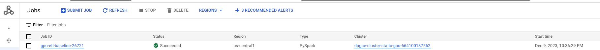   

<hr>


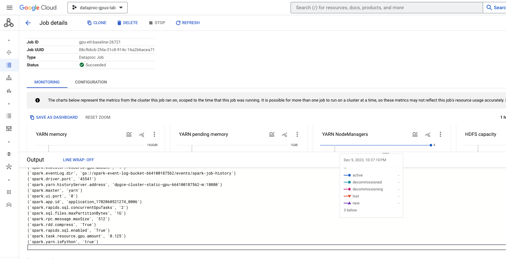   

<hr>


   


<hr>

### 5.3. YARN Resource Manager view

In the Dataproc UI, click on clusters->on the cluster->web interfaces tab->YARN Resoruce Manager->on the job executing


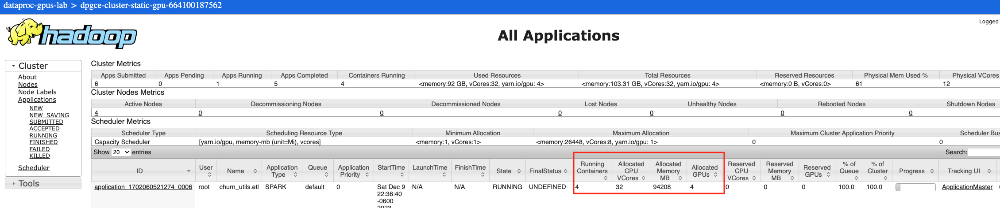  
<br><br>
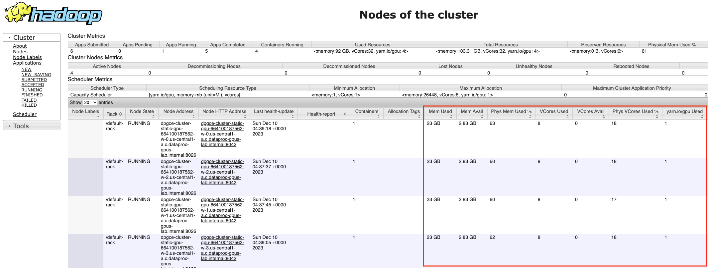  
<br><br>
<hr>

### 5.4. Spark execution plan in Spark History Server view

In the Dataproc UI, click on clusters->on the cluster->web interfaces tab->Spark History Server->on the job that completed

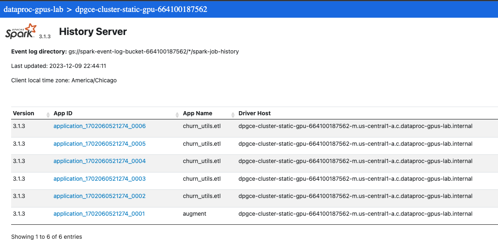  
<br><br>
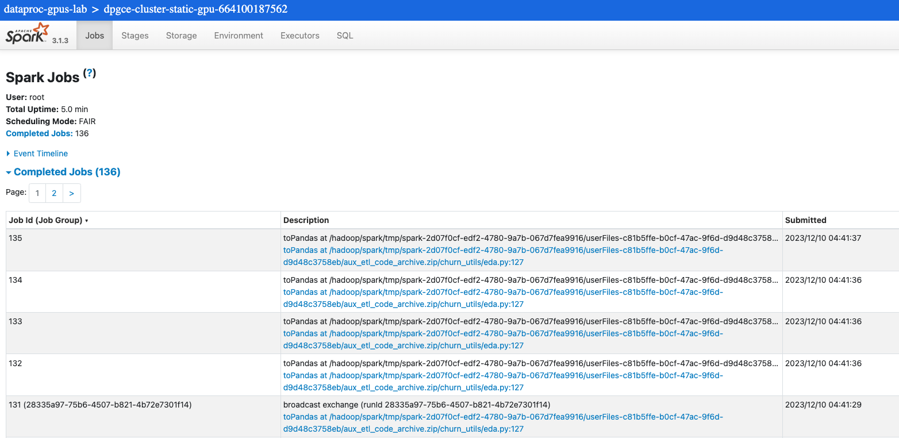  
<br><br>
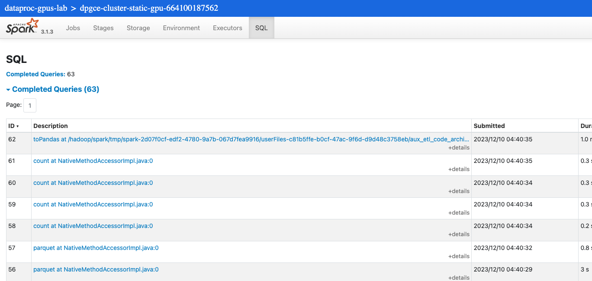  
<br><br>
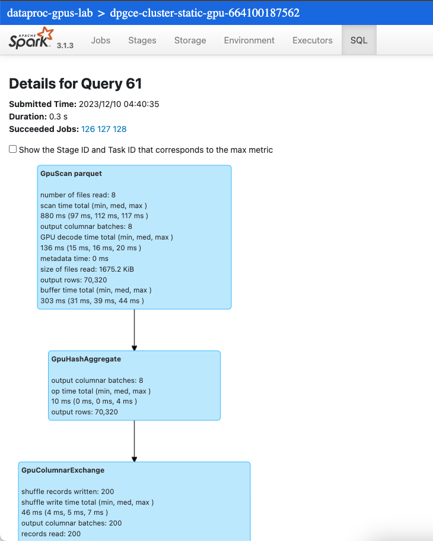  
<br><br>

<hr>

### 5.5. Review the results

Paste in Cloud Shell-
```
gsutil ls -r $OUTPUT_PREFIX
gsutil du -s -h -a $OUTPUT_PREFIX
```

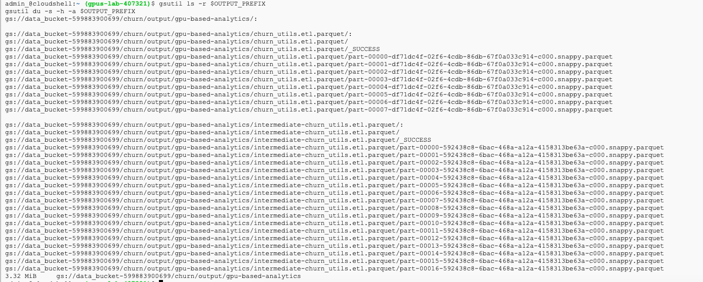   

<hr>

### 5.6. Note the execution time

The author's application took ~5 minutes to complete across multiple tests.

<hr>
<hr>

## 6. Tuning GPU based applications - profiling and recommendations from Nvidia

### 6.1. Install the Nvidia profiler 
We already installed the Nvidia tooling earlier. 

<hr>

### 6.2. Run the Nvidia profiler on the Spark on GPU applications run already

This unit uses Nvidia's tooling to tune GPU based Spark applications and needs to be run after your initial attempts of runnng GPU based Spark applications.<br>
Docs: https://github.com/NVIDIA/spark-rapids-tools/blob/main/user_tools/docs/index.md
<br>
Run the below in Cloud Shell-

```
PROJECT_ID=`gcloud config list --format "value(core.project)" 2>/dev/null`
PROJECT_NBR=`gcloud projects describe $PROJECT_ID | grep projectNumber | cut -d':' -f2 |  tr -d "'" | xargs`
REGION=us-central1
ZONE=us-central1-a
CLUSTER_NAME=dpgce-cluster-static-gpu-$PROJECT_NBR
SPARK_EVENT_LOG_DIR=gs://spark-event-log-bucket-$PROJECT_NBR/events/spark-job-history/


spark_rapids_user_tools dataproc profiling \
   --eventlogs $SPARK_EVENT_LOG_DIR \
   --gpu_cluster $CLUSTER_NAME 


```

Author's sample output (scroll to the right for full details)-
```
+--------------------------------+-----------------+------------------------------------------------------------------------------------+----------------------------------------------------------------------------------------------------------------------------------+
| application_1702060521274_0006 | churn_utils.etl | --conf spark.executor.memory=16384m                                                | - 'spark.rapids.shuffle.multiThreaded.reader.threads' was not set.                                                               |
|                                |                 | --conf spark.executor.memoryOverhead=5734m                                         | - 'spark.rapids.shuffle.multiThreaded.writer.threads' was not set.                                                               |
|                                |                 | --conf spark.rapids.memory.pinnedPool.size=4096m                                   | - 'spark.shuffle.manager' was not set.                                                                                           |
|                                |                 | --conf spark.rapids.shuffle.multiThreaded.reader.threads=8                         | - 'spark.sql.shuffle.partitions' was not set.                                                                                    |
|                                |                 | --conf spark.rapids.shuffle.multiThreaded.writer.threads=8                         | - The RAPIDS Shuffle Manager requires the spark.driver.extraClassPath and                                                        |
|                                |                 | --conf spark.shuffle.manager=com.nvidia.spark.rapids.spark313.RapidsShuffleManager | plugin jar.  If the Spark RAPIDS jar is being bundled with your Spark distribution,                                              |
|                                |                 | --conf spark.sql.files.maxPartitionBytes=4096m                                     | spark.executor.extraClassPath settings to include the path to the Spark RAPIDS                                                   |
|                                |                 | --conf spark.sql.shuffle.partitions=200                                            | this step is not needed.                                                                                                         |
+--------------------------------+-----------------+------------------------------------------------------------------------------------+----------------------------------------------------------------------------------------------------------------------------------+

```

<hr>

### 6.3. Tune the Spark application with the recommedations from the profiler

Lets tune our Spark application parameters based on the recommendation above and run the same Spark application as follows-
```
PROJECT_ID=`gcloud config list --format "value(core.project)" 2>/dev/null`
PROJECT_NBR=`gcloud projects describe $PROJECT_ID | grep projectNumber | cut -d':' -f2 |  tr -d "'" | xargs`

DATAPROC_CLUSTER_NAME=dpgce-cluster-static-gpu-${PROJECT_NBR}
DPGCE_LOG_BUCKET=spark-bucket-dpgce-${PROJECT_NBR}
DATA_BUCKET=data_bucket-${PROJECT_NBR}
CODE_BUCKET=code_bucket-${PROJECT_NBR}
VPC_NM=VPC=vpc-$PROJECT_NBR
SPARK_SUBNET=spark-snet
UMSA_FQN=lab-sa@$PROJECT_ID.iam.gserviceaccount.com
REGION=us-central1
ZONE=us-central1-a
NUM_CORES_PER_WORKER=8
NUM_GPUS_PER_WORKER=1
NUM_WORKERS=4
NUM_GPUS_TOTAL=NUM_WORKERS*NUM_GPUS_PER_WORKER

# Log for each execution
LOG_SECOND=`date +%s`
LAB_LOG_ROOT_DIR="~/dataproc-labs/logs/lab-4/"
mkdir -p $LAB_LOG_ROOT_DIR
LOGFILE="$LAB_LOG_ROOT_DIR/$0.txt.$LOG_SECOND"

# Set this value to the total number of cores that you have across all
# your worker nodes. e.g. 4 workers with 8 cores each = 32 cores
TOTAL_CORES=32

# Set this value to the number of GPUs that you have within your cluster.
# In our example, we have 4 workers, each with 1 GPU, therefore 4 executors
NUM_EXECUTORS=4   # change to fit how many GPUs you have

# 32/4 =8
NUM_EXECUTOR_CORES=8

# This setting needs to be a decimal equivalent to the 1 divided by number of cores in an executor
# In our example we have 8 cores per executor. Therefore, the value is 1/8.
RESOURCE_GPU_AMT=0.125

#
# Set this to the total memory across all your worker nodes (n1-standard-8 SKU). e.g. RAM of each worker (25 GB) * number of worker nodes (4)
TOTAL_MEMORY=100   # unit: GB
DRIVER_MEMORY=4    # unit: GB
#
# This takes the total memory and calculates the maximum amount of memory
# per executor 

SPARK_PER_EXECUTOR_MEMORY_OVERHEAD_MB=5734
RAPIDS_PER_EXECUTOR_MEMORY_PINNED_POOL_SIZE_MB=4096
EXECUTOR_MEMORY_MB=16384
SPARK_SQL_FILES_MAX_PARTITION_BYTES_MB=4096


# Input prefix designates where the data to be processed is located
INPUT_PREFIX="gs://data_bucket-$PROJECT_NBR/churn/input/10scale/"

# Output prefix is where results from the queries are stored
OUTPUT_PREFIX="gs://data_bucket-$PROJECT_NBR/churn/output/gpu-based-analytics/"

SPARK_PROPERTIES="spark.executor.cores=${NUM_EXECUTOR_CORES},spark.driver.memory=${SPARK_PER_EXECUTOR_MEMORY_OVERHEAD_MB}m,spark.cores.max=$TOTAL_CORES,spark.task.cpus=1,spark.sql.files.maxPartitionBytes=1G,spark.sql.adaptive.enabled=True,spark.sql.autoBroadcastJoinThreshold=-1,spark.rapids.sql.enabled=True,spark.rapids.sql.decimalType.enabled=True,spark.task.resource.gpu.amount=$RESOURCE_GPU_AMT,spark.plugins=com.nvidia.spark.SQLPlugin,spark.rapids.sql.concurrentGpuTasks=2,spark.executor.resource.gpu.amount=1,spark.rapids.sql.variableFloatAgg.enabled=True,spark.rapids.sql.explain=NOT_ON_GPU,spark.executor.instances=4,spark.executor.memory=${EXECUTOR_MEMORY_MB}m,spark.rapids.memory.pinnedPool.size=${RAPIDS_PER_EXECUTOR_MEMORY_PINNED_POOL_SIZE_MB}m,spark.executor.memoryOverhead=${SPARK_PER_EXECUTOR_MEMORY_OVERHEAD_MB}m,spark.rapids.shuffle.multiThreaded.reader.threads=8,spark.rapids.shuffle.multiThreaded.writer.threads=8,spark.shuffle.manager=com.nvidia.spark.rapids.spark313.RapidsShuffleManager,spark.sql.files.maxPartitionBytes=${SPARK_SQL_FILES_MAX_PARTITION_BYTES_MB}m,spark.sql.shuffle.partitions=200"

gcloud dataproc jobs submit pyspark \
gs://$CODE_BUCKET/churn/main_analytics_app.py \
--py-files=gs://$CODE_BUCKET/churn/aux_etl_code_archive.zip \
--cluster $CLUSTER_NAME \
--region $REGION \
--id gpu-etl-tuned-$RANDOM \
--properties=${SPARK_PROPERTIES} \
--project $PROJECT_ID \
-- --coalesce-output=8 --input-prefix=${INPUT_PREFIX} --output-prefix=${OUTPUT_PREFIX}   2>&1 >> $LOGFILE
```

<hr>

### 6.4. Note the execution time

The author's application took ~5 minutes to complete across multiple tests.

<hr>
<hr>


## 7.0. Performance Optimization Summary

We ran the same Spark ETL application from Nvidia on a cluster and compared performance across CPUs and GPUs. The Spark applications are in no way perfectly tuned, but the performance is significantly improved and can be tweaked further for performance critical applications. 

|About|Details|
| :-- | :-- |
| Dataproc | Image version 2.0.85-ubuntu18 | 
| Apache Spark | 3.1.3 | 
| Workload | ETL with PySpark on Dataproc on GCE with Spark 3.1.3 | 
| Data size | 45 MB | 
| Storage system | Google Cloud Storage | 
| Processing complexity | Medium |

|Infrastructure| Specification|
| :-- | :-- |
| Master Node SKU | n1-standard-4  (4 vCPUs, 15 GB RAM)| 
| Worker Node SKU | n1-standard-8 (8 vCPUs, 30 GB RAM) | 
| Worker Node Accelerator | 1 nvidia-tesla-t4 gpu |
| Worker Node Count | 4 |

The author's results-
|Infrastructure base| Specifics| Average execution time|
| :-- | :-- | :-- |
| CPU-based | Baseline performance | 30 minutes |
| GPU-based | Tuned with Nvidia profiler recommendations | 5 minutes |

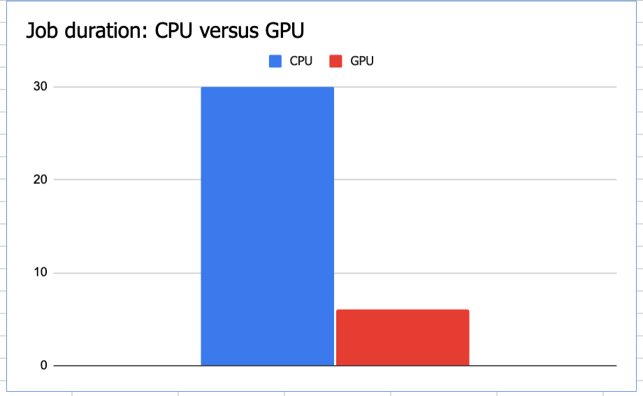   


<hr>
<hr>

## 8.0. Airflow orchestration

The lab at https://github.com/anagha-google/dataproc-labs/tree/main/2-dataproc-gce-with-terraform covers Airflow orchestration with static as well as ephemeral clusters. <br>

WRT to specifics for creating a GPU accelerated cluster with Terrarm, details are at -
https://registry.terraform.io/providers/hashicorp/google/latest/docs/resources/dataproc_cluster#example-usage---using-a-gpu-accelerator


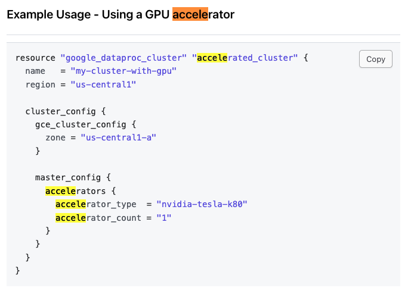   

<hr>
<hr>

This concludes the lab module. Delete the Dataproc cluster and proceed to the [next module](Lab-Module-03.md).

<hr>
<hr>

