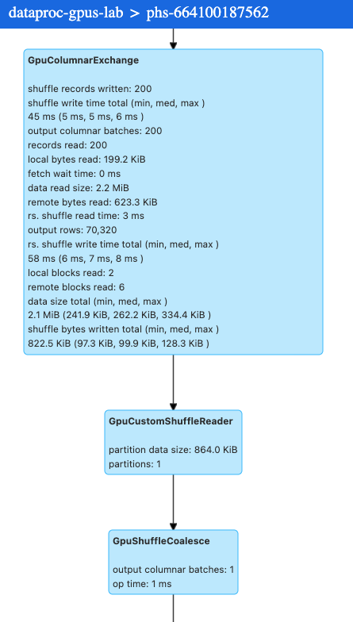

# Module-03: GPU acceleration for Spark on Dataproc Serverless

In Module 2 you learned how to run Spark jobs with GPU acceleration on Dataproc/GCE clusters. In this module, using the exact same Spark application, we will learn how to run Dataproc Serverless Spark jobs with GPU acceleration and associated architectural considerations.

<hr>

## 1. About the lab

### 1.1. Prerequisites
Successful completion of prior module

<hr>

### 1.2. What to expect
In this lab, we will-

1. Create a Dataproc Persistent Spark History Server
2. Learn how to submit Spark jobs on Dataproc Serverless with GPUs and understand architectural considerations
3. Visit the Spark History Server to review the execution DAG to review stages that benefited from GPU acceleration.
4. Understand how to use Nvidia command line tools showcased in Lab Module 2, with Dataproc Serverless
5. Know the limitations, know where to go for documentation and best practices

<hr>

### 1.3. Lab architecture

   
<br><br>

### 1.4. Lab infrastructure

   
<br><br>

<hr>

### 1.5. Lab flow

   
<br><br>

<hr>


### 1.6. Duration
~ 1 hour or less but does not require focus time.

<hr>

### 1.7. Architectural Considerations, Best Practices & Documentation Resources

1. Understand the Spark properties supported in Dataproc Serverless by reviewing the docs at -
2. Create a Persistent Spark History Server (PHS) always for use with Dataproc Serverless. Ideally, 1 PHS per project is a minimum
3. Reference the PHS when you submit a Dataproc Serverless batch job
4. The GPU SKUs supported are different across [Dataproc GCE clusters](https://cloud.google.com/dataproc/docs/concepts/compute/gpus) and [Dataproc Serverless](https://cloud.google.com/dataproc-serverless/docs/guides/gpus-serverless). Review the documentation to ensure you are specifying the right SKUs
5. Ensure you have sufficient GPU quota prior to attempting this lab
6. Not every Spark opertor is supported by spark-rapids. Review the documentation at - https://nvidia.github.io/spark-rapids/docs/configs.html
7. If a specific Spark operator is unsupported, fallback to CPUs is seamless
8. The compatible version of spark-rapids available for Dataproc Serverless is for Spark 3.3.2, which is Dataproc Serverless runtime 1.1. Ensure you specific the runtime explicitly.
9. Watch the Dataproc Serverless relases and spark-rapids releases from time to time to review if you need to switch to higher versions
10. Nvidia spark-rapids-user-tools currently cannot automatically download the event logs from PHS. In the interim, you can download the event logs to your local machine and run the tools there. Its an extra step, but it works.
11. [December 2023]- NVIDIA A100 or NVIDIA L4 GPUs can be attached to Dataproc Serverless batch workloads. A100 and L4 accelerators are subject to Compute Engine GPU regional availability.
12. The Spark RAPIDS and XGBoost libraries are only available for Dataproc Serverless GPU-accelerated workloads when using Dataproc Serverless Spark runtime version 1.1.
13. Dataproc Serverless GPU-accelerated batches utilize increased Compute Engine quotas. For example, to run a serverless batch workload that uses an NVIDIA L4 GPU, you must allocate the NVIDIA_L4_GPUS quota.
14. Accelerator-enabled jobs are not compatible with the constraints/compute.requireShieldedVm organization policy. If your organization enforces this policy, its accelerator-enabled jobs not run.
15. Spark Rapids details are available [here](https://nvidia.github.io/spark-rapids/)
16. Rapids User Tools details are available [here](https://docs.nvidia.com/spark-rapids/user-guide/latest/index.html)
17. Cost breakdown is available [here](https://cloud.google.com/dataproc-serverless/pricing)

<hr>

### 1.6. Documentation resources

**Dataproc Serverless:** https://cloud.google.com/dataproc-serverless/docs/guides/gpus-serverless<br>
**Nvidia tooling:** https://github.com/NVIDIA/spark-rapids-tools/blob/main/user_tools/docs/user-tools-dataproc.md#1gcloud-cli<br>
**Nvidia user guide:** https://docs.nvidia.com/spark-rapids/user-guide/latest/index.html<br>
**Nvidia Dataproc guide:** https://docs.nvidia.com/spark-rapids/user-guide/latest/getting-started/google-cloud-dataproc.html<br>
**Nvidia spark rapids overview:** https://nvidia.github.io/spark-rapids/developer-overview <br>
**Nvidia contacts:** https://nvidia.github.io/spark-rapids/docs/contact-us.html <br>

<hr>
<hr>

## 2. Create a Persistent Spark History Server

This section should take 5 minutes to complete.

### 2.1. Provision the History Server
Paste the below in Cloud Shell-
```
PROJECT_ID=`gcloud config list --format "value(core.project)" 2>/dev/null`
PROJECT_NBR=`gcloud projects describe $PROJECT_ID | grep projectNumber | cut -d':' -f2 |  tr -d "'" | xargs`
DATAPROC_PHS_NAME=phs-${PROJECT_NBR}
PHS_BUCKET=spark-event-log-bucket-s8s-${PROJECT_NBR}
VPC_NM=VPC=vpc-$PROJECT_NBR
SPARK_SUBNET=spark-snet
UMSA_FQN=lab-sa@$PROJECT_ID.iam.gserviceaccount.com
REGION=us-central1
ZONE=us-central1-a
DPGCE_CLUSTER_BUCKET=spark-cluster-bucket-${PROJECT_NBR}


gcloud dataproc clusters create ${DATAPROC_PHS_NAME} \
    --project=$PROJECT_ID \
    --region=$REGION \
    --zone $ZONE \
    --single-node \
    --enable-component-gateway \
    --subnet=$SPARK_SUBNET \
    --properties "spark:spark.history.fs.logDirectory=gs://${PHS_BUCKET}/*/spark-job-history,spark:spark.eventLog.dir=gs://${PHS_BUCKET}/events/spark-job-history" \
    --service-account $UMSA_FQN   \
    --bucket $DPGCE_CLUSTER_BUCKET 
```

<hr>

### 2.2. Navigating to the Spark History Server

1. From the Cloud Console, search for Dataproc and from there, click on clusters. 
2. The cluster having a "phs" prefix is the persistent history server we just provisioned.
3. Below are the steps to navigate to the Spark History Server

   
<br><br>

   
<br><br>

   
<br><br>

   
<br><br>

   
<br><br>

   
<br><br>

<hr>
<hr>


## 3. Run the ETL job from module 2, to establish the CPU performance baseline

### 3.1. Execute the job

Paste in Cloud Shell-
```
PROJECT_ID=`gcloud config list --format "value(core.project)" 2>/dev/null`
PROJECT_NBR=`gcloud projects describe $PROJECT_ID | grep projectNumber | cut -d':' -f2 |  tr -d "'" | xargs`
PERSISTENT_SPARK_HISTORY_SERVER=phs-${PROJECT_NBR}
DATA_BUCKET=data_bucket-${PROJECT_NBR}
CODE_BUCKET=code_bucket-${PROJECT_NBR}
VPC_NM=VPC=vpc-$PROJECT_NBR
SPARK_SUBNET=spark-snet
UMSA_FQN=lab-sa@$PROJECT_ID.iam.gserviceaccount.com
REGION=us-central1
ZONE=us-central1-a
SPARK_JOB_PREFIX="cpu-etl-baseline"
DATAPROC_SERVERLESS_SPARK_RUNTIME="1.1"
INPUT_PREFIX="gs://data_bucket-$PROJECT_NBR/churn/input/10scale/"
OUTPUT_PREFIX="gs://data_bucket-$PROJECT_NBR/churn/output/cpu-based-analytics-serverless/"

gcloud dataproc batches submit \
--project $PROJECT_ID \
--region $REGION pyspark \
--batch $SPARK_JOB_PREFIX-$RANDOM gs://$CODE_BUCKET/churn/main_analytics_app.py \
--py-files=gs://$CODE_BUCKET/churn/aux_etl_code_archive.zip \
--version $DATAPROC_SERVERLESS_SPARK_RUNTIME \
--subnet $SPARK_SUBNET \
--history-server-cluster projects/$PROJECT_ID/regions/$REGION/clusters/$PERSISTENT_SPARK_HISTORY_SERVER \
--properties spark.dynamicAllocation.enabled=false,spark.executor.instances=4,spark.driver.cores=4,spark.executor.cores=8 \
--service-account $UMSA_FQN \
-- --coalesce-output=8 --input-prefix=${INPUT_PREFIX} --output-prefix=${OUTPUT_PREFIX} 
```


Follow the job execution in the Dataproc->Batches UI-

   
<br><br>
   
<br><br>
   
<br><br>

<hr>


### 3.2. Review the execution plan

Navigate to the Spark History Server and review the execution plan.

   
<br><br>
   
<br><br>
   
<br><br>
   
<br><br>

   
<br><br>

<hr>

### 3.3. Note the execution time

The CPU based execution took 15 minutes

<hr>
<hr>

## 4. Running the Nvidia Qualification Tool

- The Nvidia rapids user tools currently does not support Dataproc Serverless event logs directly.
- To run the qualification tool, copy the event logs from the Persistent Histroy Server bucket locally and run the tool as detailed in the lab module 2.
- Documentation about the tooling is available [here](https://docs.nvidia.com/spark-rapids/user-guide/latest/index.html)
  
<hr>
<hr>

## 5. Run the same ETL job with GPUs

### 4.1. Execute the job

Paste in Cloud Shell-
```
PROJECT_ID=`gcloud config list --format "value(core.project)" 2>/dev/null`
PROJECT_NBR=`gcloud projects describe $PROJECT_ID | grep projectNumber | cut -d':' -f2 |  tr -d "'" | xargs`
PERSISTENT_SPARK_HISTORY_SERVER=phs-${PROJECT_NBR}
DATA_BUCKET=data_bucket-${PROJECT_NBR}
CODE_BUCKET=code_bucket-${PROJECT_NBR}
VPC_NM=VPC=vpc-$PROJECT_NBR
SPARK_SUBNET=spark-snet
UMSA_FQN=lab-sa@$PROJECT_ID.iam.gserviceaccount.com
REGION=us-central1
ZONE=us-central1-a
SPARK_JOB_PREFIX="gpu-etl-baseline"
DATAPROC_SERVERLESS_SPARK_RUNTIME="1.1"
INPUT_PREFIX="gs://data_bucket-$PROJECT_NBR/churn/input/10scale/"
OUTPUT_PREFIX="gs://data_bucket-$PROJECT_NBR/churn/output/gpu-based-analytics-serverless/"

gcloud dataproc batches submit \
--project $PROJECT_ID \
--region $REGION pyspark \
--batch $SPARK_JOB_PREFIX-$RANDOM gs://$CODE_BUCKET/churn/main_analytics_app.py \
--py-files=gs://$CODE_BUCKET/churn/aux_etl_code_archive.zip \
--version=$DATAPROC_SERVERLESS_SPARK_RUNTIME \
--subnet $SPARK_SUBNET \
--history-server-cluster projects/$PROJECT_ID/regions/$REGION/clusters/$PERSISTENT_SPARK_HISTORY_SERVER \
--service-account $UMSA_FQN \
--properties spark.dataproc.driver.compute.tier=premium,\
spark.driver.memory=4g,\
spark.driver.cores=4,\
spark.dataproc.driver.disk.tier=premium,\
spark.dataproc.driver.disk.size=750g,\
spark.dataproc.executor.compute.tier=premium,\
spark.executor.instances=4,\
spark.executor.cores=8,\
spark.dataproc.executor.disk.tier=premium,\
spark.dataproc.executor.resource.accelerator.type=l4,\
spark.shuffle.manager=com.nvidia.spark.rapids.spark332.RapidsShuffleManager,\
spark.sql.codegen.wholeStage=false,\
spark.dynamicAllocation.enabled=false,\
spark.rapids.memory.pinnedPool.size=4g,\
spark.rapids.sql.concurrentGpuTasks=3 \
-- --coalesce-output=8 --input-prefix=${INPUT_PREFIX} --output-prefix=${OUTPUT_PREFIX}
```

   
<br><br>
   
<br><br>

<hr>

### 4.2. Note the execution time

The batch job took ~5 minutes<br>
Note: The Spark History Server reflects the actual Spark execution time.

<hr>

### 4.3. Review the execution plan

   
<br><br>
   
<br><br>
   
<br><br>
   
<br><br>
   
<br><br>
   
<br><br>
   
<br><br>
   
<br><br>

<hr>
<hr>

## 5. Running the Nvidia Profiler Tool

- The Nvidia rapids user tools currently does not support Dataproc Serverless event logs directly.
- To run the profiler tool, copy the event log ofthe specific Spark job you want to tune from the Persistent Histroy Server bucket locally and run the tool as detailed in the lab module 2.
- Documentation about the tooling is available [here](https://docs.nvidia.com/spark-rapids/user-guide/latest/index.html)
  
<hr>
<hr>

## 6. Performance Optimization Summary

We ran the same Spark ETL application from Nvidia on Dataproc Serverless batches and compared performance across CPUs and GPUs. The Spark applications are in no way perfectly tuned, but the performance is significantly improved and can be tweaked further for performance critical applications. 

|About|Details|
| :-- | :-- |
| Dataproc | Runtime 1.1 | 
| Apache Spark | 3.3.2 | 
| Workload | ETL with PySpark on Dataproc on GCE with Spark 3.3.2 | 
| Data size | 45 MB | 
| Storage system | Google Cloud Storage | 
| Processing complexity | Medium |

|Infrastructure| Specification|
| :-- | :-- |
| Executor GPU SKU | 1 nvidia-l4 gpu |
| Worker Node Count | 4 |

The author's results-
|Infrastructure base| Specifics| Average execution time|
| :-- | :-- | :-- |
| CPU-based | Baseline performance | 15 minutes |
| GPU-based | Yet to be tuned with Nvidia profiler  | 5 minutes |

   
<br><br>

## 7. In closing

Dataproc with Nvidia GPUs can majorly accelerate ETL and Data Science worklads that use Spark SQL and Spark dataframes and optimize performance and thereby costs.

<br>
This concludes the lab. **DONT FORGET** to Shut down the project to avoid billing.

<hr>
<hr>


