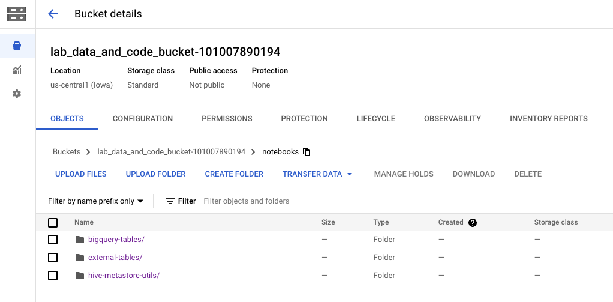

# BYO Jupyter infrastructure with Dataproc for Spark compute

## A. About the lab

### A.1. Abstract
This lab demonstrates how to use the Dataproc Jupyter plugin for bring your own Jupyter infrastructure with Dataproc Spark on GCE or Dataproc Spark Serverless with a minimum viable sample.

<br>

<hr>

### A.2. Duration 
It takes ~1 hour to complete and is fully scrpited, including with Terraform for provisioning.


<hr>

### A.3. Resources provisioned

   
<br><br>


<hr>

### A.4. Prerequisites

- A pre-created project
- You need to have organization admin rights, and project owner privileges or work with privileged users to complete provisioning.


<hr>

### A.5. Lab format

- Includes Terraform for provisioning automation
- Is fully scripted - the entire solution is provided, and with instructions
- Is self-paced/self-service


<hr>

### A.6. Audience

- A quick read for architects
- Targeted for hands on practitioners, especially data scientists and data engineers

<hr>

### A.7. Features covered

| Functionality | Feature | 
| -- | :--- | 
| ...|  ... |


<hr>


### A.8. Lab Flow

   
<br><br>

<hr>

# B. PROVISIONING THE LAB ENVIRONMENT

<hr>

## B.1. Infrastructure provisioning

We will use Terraform for infrastructure provisioning.

### B.1.1. Clone this repo in Cloud Shell

```
cd ~
git clone https://github.com/anagha-google/dataproc-labs.git
```

<hr>

### B.1.2. Foundational provisioning automation with Terraform 
The Terraform in this section updates organization policies and enables Google APIs. Study the ```~/dataproc-labs/7-dataproc-jupyter-plugin/provisioning-automation/foundations-tf/configure-preferences.sh``` script and set the boolean for update organization policies to false if you dont need to update them. If you dont know about organization policies, just run as is. <br>

1. Configure preferences by running this in Cloud Shell
```
cd ~/dataproc-labs/7-dataproc-jupyter-plugin/provisioning-automation/foundations-tf
chmod +x configure-preferences.sh 
./configure-preferences.sh
```

2. Run the Terraform for organization policy edits and enabling Google APIs
```
terraform init
terraform apply \
  -auto-approve >> dataproc-jupyter-plugin-foundations-tf.output
```

**Note:** Wait till the provisioning completes (~5 minutes or less) before moving to the next section.

<hr>

### B.1.3. Lab resources provisioning automation with Terraform 

#### B.1.3.1. Resources provisioned
In this section, we will provision the core components for the lab-
1. Network, subnet, firewall rule
2. Storage buckets for code/data/logs 
3. Dataproc on GCE cluster
4. User Managed Service Account
5. Requisite IAM permissions
6. Copy of code, data, etc into buckets


#### B.1.3.2. Run the terraform scripts

1. Paste this in Cloud Shell after editing the GCP region variable to match your nearest region-

```
cd ~/dataproc-labs/7-dataproc-jupyter-plugin/provisioning-automation/core-tf/terraform

chmod +x configure-preferences.sh 
./configure-preferences.sh
```

2. Run the Terraform for provisioning the rest of the environment
```
terraform init
terraform apply \
  -auto-approve >> dataproc-jupyter-plugin-core-tf.output
```

You can open another tab in Cloud Shell and tail the output file above to monitor progress.

**Note:** Takes ~40 minutes to complete (largely due to time taken to provision Dataproc Metastore).

<br>

<hr>

### B.2. Explore the resources provisioned

The following are screenshots from the author's environment-

#### B2.1. Networking

   
<br><br>

   
<br><br>

   
<br><br>

#### B2.2. Storage

   
<br><br>

   
<br><br>


   
<br><br>


   
<br><br>

#### B2.3. Dataproc on GCE cluster

   
<br><br>


#### B2.4. Dataproc Metastore Service

   
<br><br>

#### B2.5. IAM Permissions for the Compute Engine Default Service Account
<br>
Make sure the Compute Engine default service account (<project_id>-compute@developer.gserviceaccount.com) as shown below:<br>
Note: your project_id will be different than the one shown below (883609552780)
<br><br>

   


<hr>

## C. THE LAB

## 1. About the lab


## 2. Install the Dataproc Jupyter Plugin locally

All of this is to be run locally on your machine, NOT on Cloud Shell.

### 2.1. Dependencies

1. Python 3.8 or higher

On your local machine, run the below in the terminal to validate Python version:
```

$ python3 --version
```
Install or upgrade to 3.8 or higher

2. gcloud CLI
https://cloud.google.com/sdk/docs/install   

### 2.2. Login and configure project & region

3. Launch gcloud and authenticate

```
gcloud auth login
```

4. Configure project & region

```
gcloud init
```

Run through the steps to configure identoty/user, project, regio.
All three are important.


### 2.3. Install JupyterLab on your LOCAL MACHINE or upgrade if you already have it


5. Create a Python virtual environment

```
cd ~
python --version

# Create environment for default version of Python
conda create -n dl_venv  anaconda
source activate dl_venv
```


6. Install JupyterLab

```
pip3 install jupyterlab

# Command to verify Jupyterlab version
pip3 show jupyterlab

# Command to upgrade Jupyterlab to the latest version
pip3 install --upgrade jupyterlab

```

7. Verify the installation by launching Jupyter
```
jupyter lab
```

   
<br><br>


8. Shut down JupyterLab


### 2.4. Install the plugin on your local machine & launch JupyterLab

In the same virtual environment-

9. Install plugin and launch JupyterLab
```
# Install the plugin. 
pip3 install dataproc-jupyter-plugin

# Enable the plugin extension. You can skip this step if the version of jupyterlab you have installed is greater than or equal to 4.0.0
jupyter server extension enable dataproc_jupyter_plugin --user

# Launch JupyterLab
jupyter lab  
```


10. What to expect

In the Jupyter launcher, you should see a new section called Dataproc Jobs and Sessions. Additionally, you might see two more sections called Dataproc Serverless Notebooks and Dataproc Cluster Notebooks if you have access to Dataproc serverless notebooks and/or have Dataproc clusters with “Jupyter Notebook” optional component running in your project.

11. Quick visuals from the author's environment

   
<br><br>


**NOTE:** Do not shut down the terminal session on your local machine from where you launched Jupyter.


<br>

<hr>


