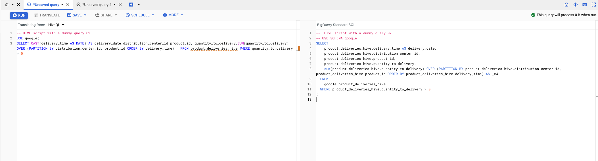

# Data Lake Golden demo plug-in 01: On prem Cloudera HIVE to BigQuery

NOTE: This is not a standalone repository, the content needs to be deployed on top of the
[Google Cloud Data Analytics Golden Demo](https://github.com/GoogleCloudPlatform/data-analytics-golden-demo)

## Introduction

This repository contains a step by step demo that shows to migrate a HIVE workload from a on-prem Hadoop deployment based on legacy Cloudera 5.7 distribution to a Google Cloud modern DataLake.
In detail the demo shows:

1. The use of the HDFS - GCS connector on a Cloudera deployment to easily move data from HDFS to GCS
2. How to migrate HIVE tables to Google Data Platform BigLake tables
3. How to migrate HQL queries to BigQuery SQL


## Architecture


## Installation

Deploy [Google Cloud Data Analytics Golden Demo](https://github.com/GoogleCloudPlatform/data-analytics-golden-demo) and wait for `run-all-dags` Composer DAG to finish.

This repository contains a number of scripts that, on top, of the Golden Demo components bootstrap some others GCP components:

* A new subnet on vpc-main called `gce-subnet` 
* A Google Compute Engine VM `gce-cdh-5-single-node` with a Cloudera image that simulates a Cloudera (single-node) deployment
* A GCS bucket `hive_stage` 

From a [Google Cloud Cloud Shell](https://cloud.google.com/shell) terminal logged as your admin user, execute the following commands:


```console
~$ git clone https://github.com/velascoluis/dl01-hive-to-bq.git
~$ cd dl01-hive-to-bq/src/terraform
~$ source local_project_launcher.sh ${GOOGLE_CLOUD_PROJECT} <YOUR_REGION> <YOUR_ZONE>
~$ cd dl01-hive-to-bq/src/scripts-hydrated
~$ source upload_to_host.sh <YOUR_ZONE>
# Your shell will be auto connected to the Cloudera container now:
~$ cd /home/cloudera
~$ source ./prepare_node.sh
```

Change `<YOUR_REGION> <YOUR_ZONE>` accordingly, for example:

```console
~$ source local_project_launcher.sh ${GOOGLE_CLOUD_PROJECT} us-central1 us-central1-a
```


## Step by step demo


1. Connect to HIVE and populate tables (parquet on HDFS):
 ```console
#Inspect file contents
~$ cat populate_hive.sql
~$ hive -f populate_hive.sql
```
2. Launch some random queries:
 ```console
 #Inspect file contents
~$ cat sample_query_01.sql
~$ hive -f sample_query_01.sql
~$ cat sample_query_02.sql
~$ hive -f sample_query_02.sql
```
3. Determine parquet files to copy and double check HDFS replication factor:
 ```console
~$ export DATABASE_NAME=google
~$ export TABLE_NAME=product_deliveries_hive
~$ export FILES_LOCATION=`hive --database ${DATABASE_NAME} -S -e "describe formatted ${TABLE_NAME} ;" | grep 'Location' | awk '{ print $NF }'`
~$ hadoop fs -ls -h ${FILES_LOCATION}
```

4. Confirm GCS bucket visibility and copy data across:

 ```console
~$ export GOOGLE_CLOUD_PROJECT=<YOUR_PROJECT_ID>
~$ export BUCKET_NAME=hive_stage-${GOOGLE_CLOUD_PROJECT} 
~$ hadoop fs -ls  gs://${BUCKET_NAME}
~$ hadoop distcp -overwrite  -delete ${FILES_LOCATION}/* gs://${BUCKET_NAME}/product_deliveries_hive
```

Change `<YOUR_PROJECT_ID>`  accordingly, for example:

```console
~$ export GOOGLE_CLOUD_PROJECT=velascoluis-477-20221213124940
```

4. Go back to Cloud Shell and confirm data is copied in the GCS bucket:

 ```console
 ~$ export BUCKET_NAME=hive_stage-${GOOGLE_CLOUD_PROJECT} 
~$ gcloud storage ls -R gs://${BUCKET_NAME}
```

5. Navigate to the BigQuery Console and execute the following:


 ```sql
CREATE SCHEMA IF NOT EXISTS google;
--BigLake table
CREATE OR REPLACE EXTERNAL TABLE `google.product_deliveries_hive`
 WITH CONNECTION `projects/<YOUR_PROJECT_ID>/locations/us/connections/biglake-connection`
 OPTIONS (
   format ="PARQUET",
   uris = ['gs://hive_stage-<YOUR_PROJECT_ID>/product_deliveries_hive/*']);
```
Change `<YOUR_PROJECT_ID>`  accordingly.

6. Lets finally translate online one of the HIVE queries from `HiveQL` to the BigQuery SQL dialect: `GoogleSQL`, open sourced as [zetaSQL](https://github.com/google/zetasql). In a new BigQuery SQL workspace tab, click on `Enable SQL Translation` under the `More` menu.


In the Translating from drop-down menu select `HiveQL`:


Finally copy the `HiveQL`, it will be automatically translated:



Execute they query and check the results back.


