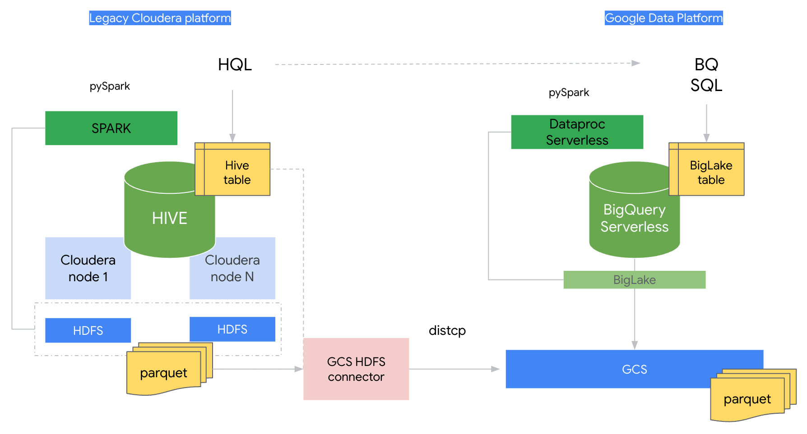
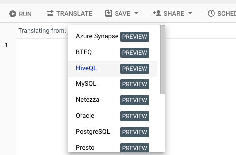

# Data Lake Modernization Workshops: On prem Cloudera HIVE to BigQuery with BigLake

## Introduction

This repository contains a step by step demo that shows to migrate a HIVE workload from a on-prem Hadoop deployment based on legacy Cloudera 5.7 distribution to a Google Cloud modern DataLake.
In detail the demo shows:

1. The use of the HDFS - GCS connector on a Cloudera deployment to easily move data from HDFS to GCS
2. How to migrate HIVE tables to Google Data Platform BigLake tables
3. How to migrate HQL queries to BigQuery SQL
4. How to migrate pySpark code to Dataproc Serverless

## Architecture



## Installation

The deployment uses Terraform to provision all necessary resources, and several scripts to execute each step of the lab.
From a [Google Cloud Cloud Shell](https://cloud.google.com/shell) terminal logged as your admin user, execute the instructions below.

On the top of the Google Cloud console, ensure an existing project is selected. Start by running the following command, changing region and zone if needed:

```console
REGION=us-central1
ZONE=us-central1-a

```

This repository provision several GCP components:

* A VPC `vpc-main` and subnet `gce-subnet`
* A Google Compute Engine VM `gce-cdh-5-single-node` with a Cloudera image that simulates a Cloudera (single-node) deployment
* A GCS bucket `hive_stage`

To start the provisioning:

```console
git clone https://github.com/GoogleCloudPlatform/datalake-modernization-workshops.git
cd hive-to-bq-biglake/src/terraform
source local_project_launcher.sh ${GOOGLE_CLOUD_PROJECT} ${REGION} ${ZONE}
cd hive-to-bq-biglake/src/scripts-hydrated
source upload_to_host.sh ${ZONE}

```

Your shell will be auto connected to the Cloudera container now. Execute the following commands:

```console
cd /home/cloudera
source ./prepare_node.sh

```

## Step by step demo

Still from the Cloudera container, execute the following commands:

1. Connect to HIVE and populate tables (parquet on HDFS):

```console
# Inspect file contents
cat populate_hive.sql
hive -f populate_hive.sql

```

2. Launch some random queries:

```console
# Inspect file contents
cat sample_query_01.sql
hive -f sample_query_01.sql
cat sample_query_02.sql
hive -f sample_query_02.sql

```

3. Launch a pySpark process:

```console
# Inspect file contents
cat delivery_data_analysis.py
spark-submit delivery_data_analysis.py
# Create table with output
hive -f output_table.sql

```

4. Determine parquet files to copy and double check HDFS replication factor:

```console
export DATABASE_NAME=google
export TABLE_NAME=product_deliveries_hive
export FILES_LOCATION=`hive --database ${DATABASE_NAME} -S -e "describe formatted ${TABLE_NAME} ;" | grep 'Location' | awk '{ print $NF }'`
hadoop fs -ls -h ${FILES_LOCATION}

```

5. Confirm GCS bucket visibility and copy data across:

```console
export BUCKET_NAME=hive_stage-${GOOGLE_CLOUD_PROJECT} 
hadoop fs -ls  gs://${BUCKET_NAME}
hadoop distcp -overwrite  -delete ${FILES_LOCATION}/* gs://${BUCKET_NAME}/product_deliveries_hive

```

6. Go back to Cloud Shell and confirm data is copied in the GCS bucket:

```console
export BUCKET_NAME=hive_stage-${GOOGLE_CLOUD_PROJECT} 
gcloud storage ls -R gs://${BUCKET_NAME}

```

7. Navigate to the BigQuery Console and execute the following, replacing `<YOUR_PROJECT_ID>` accordingly.

```sql
CREATE SCHEMA IF NOT EXISTS google;
--BigLake table
CREATE OR REPLACE EXTERNAL TABLE `google.product_deliveries_hive`
 WITH CONNECTION `projects/<YOUR_PROJECT_ID>/locations/us/connections/biglake-connection`
 OPTIONS (
   format ="PARQUET",
   uris = ['gs://hive_stage-<YOUR_PROJECT_ID>/product_deliveries_hive/*']);
```

8. Finally, lets translate online one of the HIVE queries from `HiveQL` to the BigQuery SQL dialect: `GoogleSQL`, open sourced as [zetaSQL](https://github.com/google/zetasql). In a new BigQuery SQL workspace tab, click on `Enable SQL Translation` under the `More` menu.


In the Translating from drop-down menu select `HiveQL`:



Finally copy the `HiveQL`, it will be automatically translated:


Execute they query and check the results back.

9. For the pySpark part, create a new file on Cloud Shell and introduce some minor adjustments on the original code:

```python

from pyspark.sql import SparkSession
from pyspark.sql.functions import col, avg, sum, hour, countDistinct, date_format
from pyspark.sql.types import StructType, StructField, TimestampType, DoubleType, IntegerType

spark = SparkSession.builder.appName("BigQueryDeliveryAnalysis").getOrCreate()

schema = StructType(
    [
        StructField("delivery_time", TimestampType(), True),
        StructField("timestamp", TimestampType(), True),
        StructField("distance", DoubleType(), True),
        StructField("distribution_center_id", IntegerType(), True),
        StructField("product_id", IntegerType(), True),
        StructField("quantity_to_delivery", IntegerType(), True),
        StructField("delivery_cost", IntegerType(), True),
    ]
)
#This reads from BQ Storage insted of HDFS
df = spark.read.format("bigquery") \
    .option("project", "PROJECT_ID") \
    .option("dataset", "google") \
    .option("table", "product_deliveries_hive") \
    .load()
#Main logic remains unchanged
df_hourly = (
    df.withColumn("delivery_hour", date_format(col("delivery_time"), "yyyy-MM-dd HH"))
    .groupBy("delivery_hour")
    .agg(
        countDistinct("delivery_time").alias("num_deliveries"),
        countDistinct("product_id").alias("unique_products"),
    )
)

df_hourly.show()
#This writes from BQ Storage insted of HDFS
df_hourly.write.format("bigquery") \
    .option("writeMethod", "direct") \
    .option("project", "PROJECT_ID") \
    .option("dataset", "google") \
    .option("table", "hourly_deliveries") \
    .mode("overwrite") \
    .save()

```

10. Launch the process using Dataproc Serverless

On Cloud Shell, execute:

```console
gcloud dataproc batches submit pyspark FILE_NAME.py --deps-bucket=gs://hive_stage-${GOOGLE_CLOUD_PROJECT} --region=${REGION} --subnet=gce-snet --version=2.2

```
