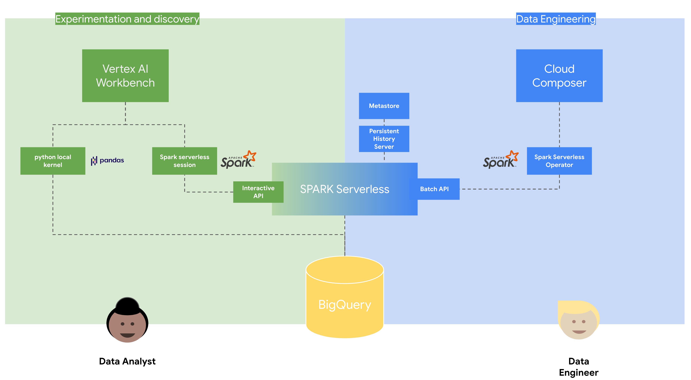
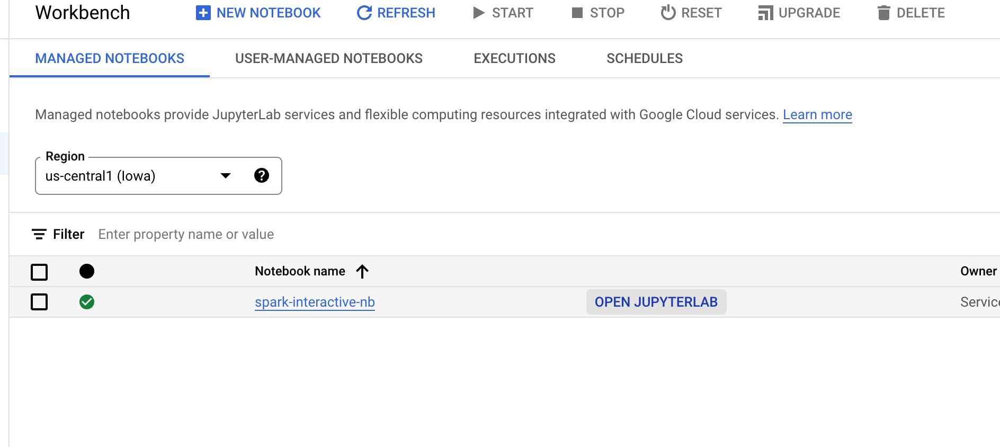
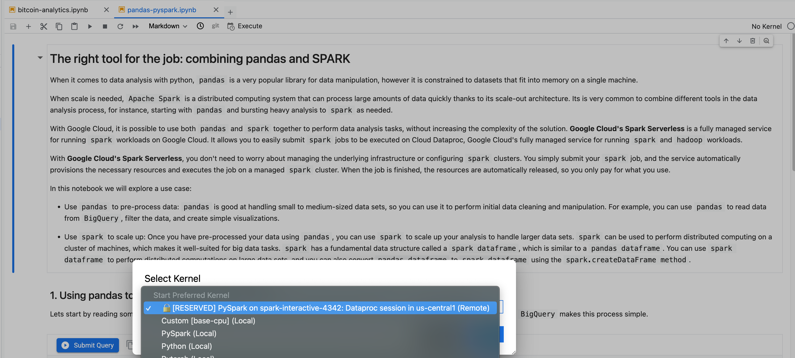
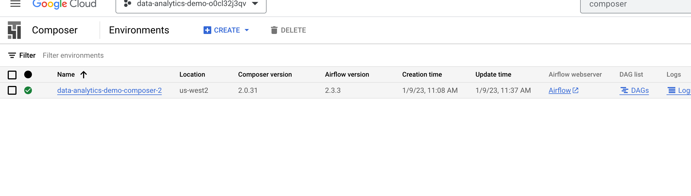
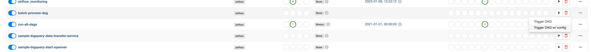
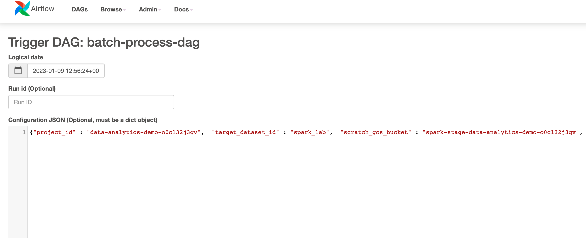

# Data Lake Golden demo plug-in 02: pandas and SPARK

NOTE: This is not a standalone repository, the content needs to be deployed on top of the
[Google Cloud Data Analytics Golden Demo](https://github.com/GoogleCloudPlatform/data-analytics-golden-demo)

## Introduction

This repository contains a step by step demo that shows a very typical Data Analytics user journey where data analysts explore and analyze data using python (pandas) and then the data engineer teams formalizes the code using scalable frameworks like SPARK. In detail the demo shows:


1. The use of the Vertex AI Workbench with a python local kernel for accesing data stored in BigQuery for interactive analysis on small and medium datasets
2. The creation of a interactive SPARK Serverless session and the integration with Vertex AI Workbench for interactive at-scale data analys
3. The integration of SPARK Serverless with Managed metastore and PHS
3. Submiting a batch job to SPARK Serverless and the integration with Cloud Composer


## Architecture


This repository contains a number of scripts that, on top, of the Golden Demo components bootstrap some others GCP components:

* A User managed Service account for Serverless Spark  `spark-sa` with associated permissions
* A new subnet for Spark Serverless on `vpc-main` called `spark-snet` with PSA and firewalls rules
* A managed Vertex AI managed notebook `spark-sa` with a demo notebook deployed
* A dataproc one-node cluster that acts as a Persistent History Server called `spark-phs-<PROJECT_ID>`
* A dataproc managed metastore `spark-metastore-<PROJECT_ID>`
* A GCS bucket `spark-stage-<PROJECT_ID>` for storing code  

## Installation

Deploy [Google Cloud Data Analytics Golden Demo](https://github.com/GoogleCloudPlatform/data-analytics-golden-demo) and wait for `run-all-dags` Composer DAG to finish.

From a [Google Cloud Cloud Shell](https://cloud.google.com/shell) terminal logged as your admin user, execute the following commands:


```console
~$ git clone https://github.com/velascoluis/dl02-pandas-spark.git
~$ cd dl02-pandas-spark/src/terraform
~$ source local_project_launcher.sh ${GOOGLE_CLOUD_PROJECT} <YOUR_REGION> <YOUR_ZONE>
~$ cd dl02-pandas-spark/src/scripts-hydrated
~$ source create_serverless_spark_session.sh <YOUR_ZONE>
```

Change `<YOUR_REGION> <YOUR_ZONE>` accordingly, for example:

```console
~$ source local_project_launcher.sh ${GOOGLE_CLOUD_PROJECT} us-central1 us-central1-a
```

## Step by step demo

### Data Analyst

1. Connect to Cloud Console and open Vertex AI Workbench.


2. Open the notebook `pandas-pyspark.ipynb` and select the spark serverless kernel `spark-interactive-<RANDOM>`

3. Execute the notebook, this concludes the Data Analyst part.

### Data Engineering

1. From a [Google Cloud Cloud Shell](https://cloud.google.com/shell) terminal logged as your admin user, execute the following commands, this will upload the composer DAG and generate the JSON configuration data for running the DAG

```console
~$ cd dl02-pandas-spark/src/scripts-hydrated
~$ source stage_dag.sh
~$ source gen_dag_conf.sh
#Have a look at the content, will need it in the next step
~$ cat dag_conf.json
```

2. Connect to Cloud Console and open the Cloud Composer (Airflow) `data-analytics-demo-composer-2` instance.

3. Look for the `batch-process` DAG, and click trigger it with config

4. Paste the contents of the `dag_conf.json` file on the text box



