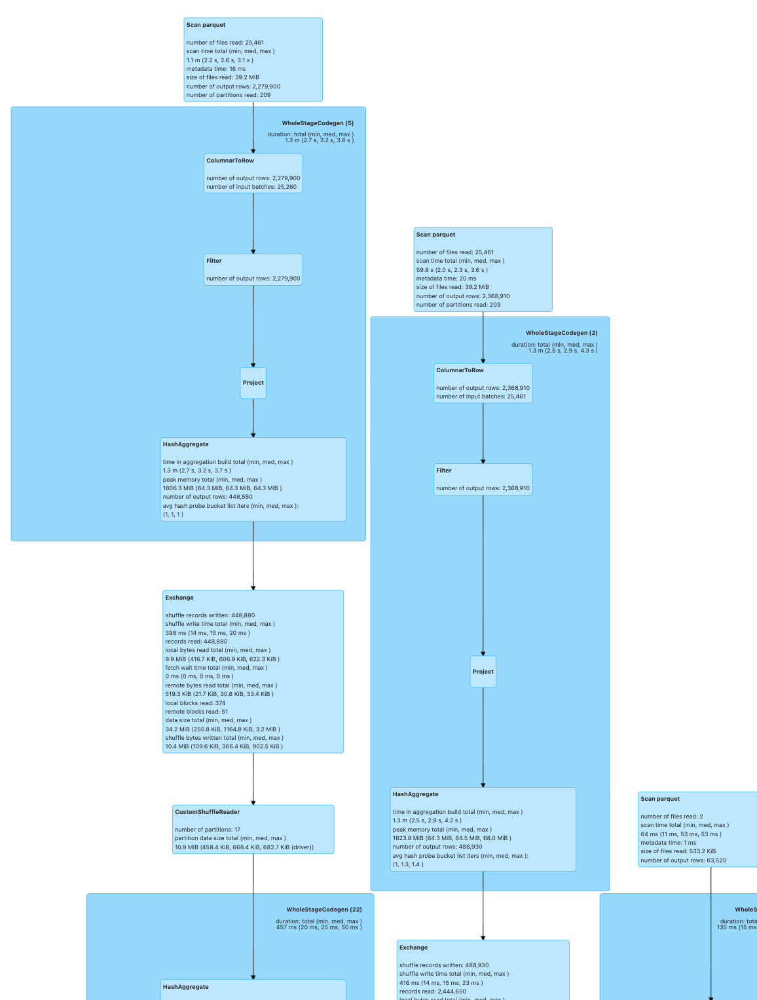

<!--
 Copyright 2022-2023 NVIDIA Corporation.
 
 Licensed under the Apache License, Version 2.0 (the "License");
 you may not use this file except in compliance with the License.
 You may obtain a copy of the License at
 
     http://www.apache.org/licenses/LICENSE-2.0
 
 Unless required by applicable law or agreed to in writing, software
 distributed under the License is distributed on an "AS IS" BASIS,
 WITHOUT WARRANTIES OR CONDITIONS OF ANY KIND, either express or implied.
 See the License for the specific language governing permissions and
 limitations under the License.
-->

# spark-rapids-dataproc-lab

## Run CPU Churn Spark Job

Modify `cpu.env.sh` to allocate the resources in the cluster, default resources is based 2 n1-standard-8 worker nodes. Run `cpu_etl.sh` to kick off the CPU churn spark job.

Below show part of the CPU SQL plan, which validates the job runs on CPU only.

 
