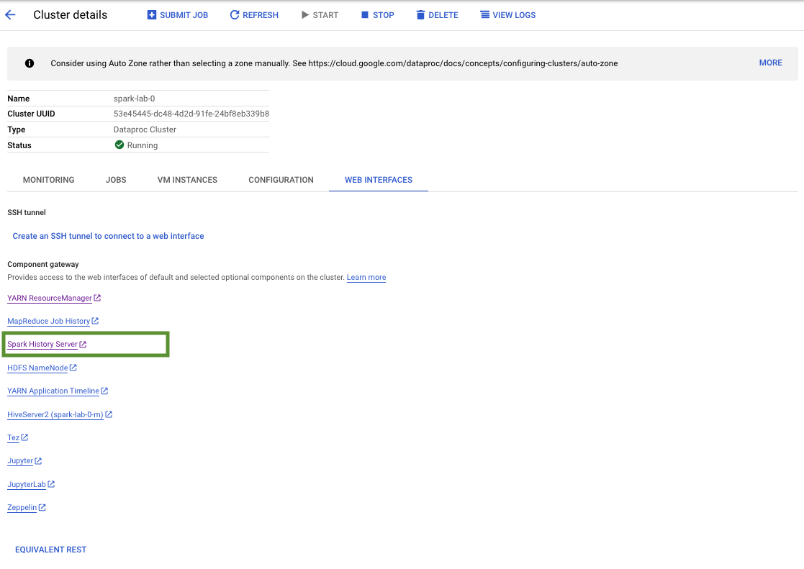
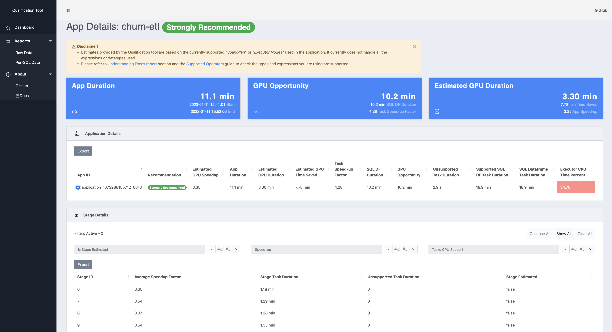

<!--
 Copyright 2022-2023 NVIDIA Corporation.
 
 Licensed under the Apache License, Version 2.0 (the "License");
 you may not use this file except in compliance with the License.
 You may obtain a copy of the License at
 
     http://www.apache.org/licenses/LICENSE-2.0
 
 Unless required by applicable law or agreed to in writing, software
 distributed under the License is distributed on an "AS IS" BASIS,
 WITHOUT WARRANTIES OR CONDITIONS OF ANY KIND, either express or implied.
 See the License for the specific language governing permissions and
 limitations under the License.
-->

# spark-rapids-dataproc-lab

## Spark RAPIDS Qualification Tool

Find the Spark History Server in Dataproc and download the spark log from the Churn CPU run.



Following NVIDIA Spark RAPIDS qualification tool [instruction](https://nvidia.github.io/spark-rapids/docs/spark-qualification-tool.html#running-the-qualification-tool-standalone-on-spark-event-logs) to set up the environment on your local system. 

Example commands to run the qualification tool
```
export SPARK_HOME='/spark-3.3.1-bin-hadoop3'

java ${QUALIFICATION_HEAP} -cp "rapids-4-spark-tools_2.12-22.12.0.jar:$SPARK_HOME/jars/*" \
          com.nvidia.spark.rapids.tool.qualification.QualificationMain \
          /spark_log/application_1673288155712_0012
```

Example output from qualification tool, which shows the Churn application will benefits greatly from GPU

