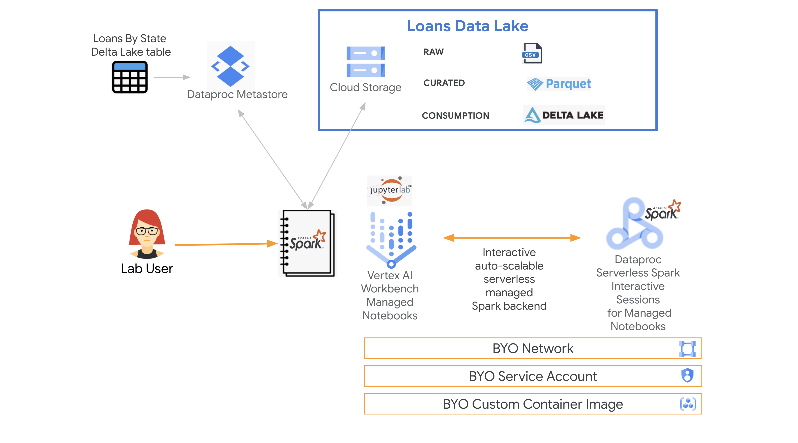
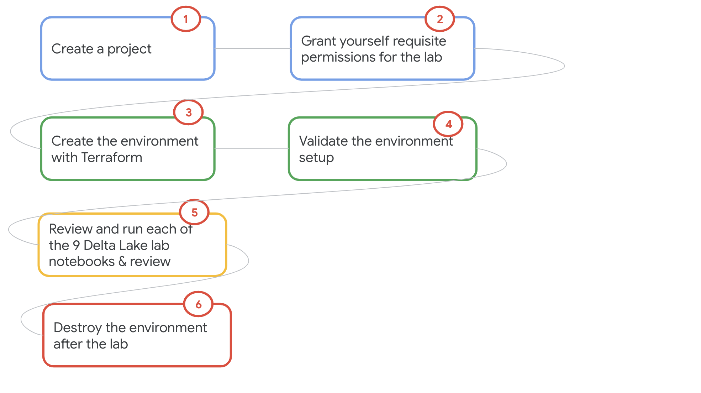
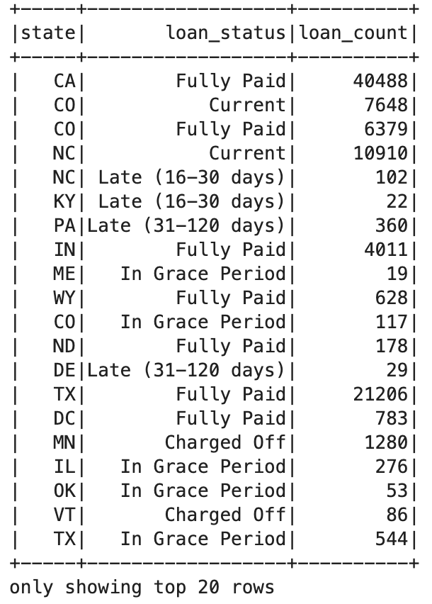

<!---->
  Copyright 2022 Google LLC
 
  Licensed under the Apache License, Version 2.0 (the "License");
  you may not use this file except in compliance with the License.
  You may obtain a copy of the License at
 
       http://www.apache.org/licenses/LICENSE-2.0
 
  Unless required by applicable law or agreed to in writing, software
  distributed under the License is distributed on an "AS IS" BASIS,
  WITHOUT WARRANTIES OR CONDITIONS OF ANY KIND, either express or implied.
  See the License for the specific language governing permissions and
  limitations under the License.
 <!---->
 
# Delta Lake with Spark on GCP powered by Dataproc Serverless 

## A) Lab introduction

### A1. About Delta Lake in a nutshell
Delta Lake is an open source table format that brings relational database & warehouse like capabilities such as ACID transactions, CRUD operations, schema validation + enforcement + evolution & more to structured data assets in data lakes. Learn more at [delta.io](https://delta.io)

### A2. About the lab

#### Summary
This lab aims to demystify Delta Lake with Apache Spark on Cloud Dataproc, with a minimum viable sample of the core features of the table format on a Data Lake on Cloud Storage. The dataset leveraged is the Kaggle Lending Club loan dataset, and the lab features a set of nine Spark notebooks, each covering a feature or a set of features. The lab is fully scripted (no challenges) and is for pure instructional purpose. 

#### Automation
The lab includes Terraform automation for GCP environment provisioning and detailed instructions including commands and configuration. 

#### Features Covered
Delta Lake Features covered in Spark notebooks:

| # | Feature/Step | Notebook |
| -- | :--- | :--- |
| 1. | Create curated Parquet table off of CSV files in the data lake backed by Cloud Storage | DeltaLakeLab-1.ipynb |
| 2. | a) Create and persist to Delta Lake tables from a Parquet based table b) Create partitioned and unpartitioned tables | DeltaLakeLab-2.ipynb  |
| 3. | a) Review Delta table details b) Review Delta table history c) Create a manifest file d) Review Hive metastore entries| DeltaLakeLab-3.ipynb  |
| 4. | a) Delete a record and study the delta log  b) Insert a record and study the delta log  c) Update a record and study the delta log  c) Upsert to the table and study the delta log | DeltaLakeLab-4.ipynb  |
| 5. | a) Schema validation & enforcement  b) Schema evolution  | DeltaLakeLab-5.ipynb  |
| 6. | Time travel with Delta Lake | DeltaLakeLab-6.ipynb  |
| 7. | a) Data skipping and   b) OPTIMIZE ZORDER in Delta Lake | DeltaLakeLab-7.ipynb  |
| 8. | Table clone | DeltaLakeLab-8.ipynb  |
| 9. | a) Table restore to point in time snapshot  b) Performance optimization with OPTIMIZE (bin packing)  c) Storage optimization with VACUUM | DeltaLakeLab-9.ipynb  

### A3. Key products used in the lab

1. Cloud Storage - as data lake + storage for raw data & notebook, storage for Dataproc - temp bucket and staging bucket
2. Vertex AI Workbench - managed (Jupyter) notebooks
3. Dataproc Serverless Spark interactive - interactive Spark infrastructure fronted by Vertex AI managed notebooks

### A4. Technology & Libraries
1. Distributed computing engine -  Apache Spark version 3.3.0 (Dataproc Serverless Spark version 2.0.2)
2. Flavor of Spark: PySpark
3. Table format - Delta Lake (delta-core_2.13:2.1.0)

### A5. Lab Architecture
The lab architecture is as follows-
 

Note: Due to storage limits in git, we have created parquet files that are a subset of the original CSV files.  

About Dataproc Serverless Spark Interactive: 
Fully managed, autoscalable, secure Spark infrastructure as a service for use with Jupyter notebooks on Vertex AI Workbench managed notebooks. Use as an interactive Spark IDE, for accelerating development and speed to production.

### A6. Lab Flow
 

### A7. Lab Dataset

##### Dataset 
Kaggle Lending Club public dataset

##### Rows
740,121

##### Curated data used in the lab
 

### A8. Lab Use Case:
Data engineering for Loan analysis on loan data in a data lake.

### A9. Lab Goals
1. Just enough knowledge of Delta Lake & its core capabilities
2. Just enough knowledge of using Delta Lake with Dataproc Serverless Spark on GCP via Jupyter notebooks on Vertex AI Workbench managed notebooks
3. Ability to demo Delta Lake on Dataproc Serverless Spark 
4. Just enough Terraform for automating provisioning, that can be repurposed for your workloads

### A10. Lab Duration
~ 90 minutes or less

### A11. Lab Format
Fully scripted, with detailed instructions intended for learning, not necessarily challenging

### A12. Lab Approximate Cost
< $100

### A13. Credits

| # | Google Cloud Collaborators | Contribution  | 
| -- | :--- | :--- |
| 1. | Anagha Khanolkar, Customer Engineer | Creator |
| 2. | TEKsystems |  |

### A14. Contributions welcome
Community contribution to improve the lab is very much appreciated.  

### A15. Getting help
If you have any questions or if you found any problems with this repository, please report through GitHub issues.

